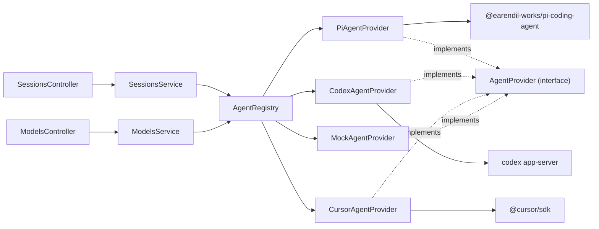

# System Architecture

## Overview

Nuncio is a self-hosted web app for delegating tasks to AI agents. The backend (`apps/server`, NestJS) exposes sessions over HTTP; each session is run by an **agent provider** selected per session. The agent layer is provider-neutral: Pi, Codex, Cursor, and future agent SDKs plug in by implementing one interface.

## Agent provider abstraction

```
apps/server/src/agents/
  agents.types.ts            AgentProvider interface, AgentRunContext, EventEmitter
  agents.base-provider.ts    BaseAgentProvider — template-method run/steer + shared event/error handling
  agents.registry.ts         AgentRegistry — resolves providers, availability, default
  agents.module.ts           Nest wiring
  providers/
    pi-agent.provider.ts     Pi SDK (createAgentSession, AuthStorage, ModelRegistry)
    codex-app-server.client.ts  JSON-RPC client for `codex app-server`
    codex-agent.provider.ts  Codex CLI app-server provider
    cursor-agent.provider.ts Cursor SDK local runtime provider
    mock-agent.provider.ts   Local fallback, always available
```



### Interface

```typescript
interface AgentProvider {
  readonly id: string;          // 'pi' | 'mock' | ...
  readonly name: string;
  isAvailable(): Promise<boolean>;
  listModels(): Promise<ModelProviderDto[]>;
  run(sessionId, prompt, ctx: AgentRunContext): Promise<void>;
  steer(sessionId, message, ctx: AgentRunContext): Promise<void>;
  dispose(sessionId): void;
}
```

`BaseAgentProvider` implements the shared `run`/`steer` orchestration (status RUNNING → user/steer_message → `executePrompt()` → status IDLE, plus error → ERROR) via a template method. Concrete providers implement only `executePrompt()`, `isAvailable()`, `listModels()`, and (optionally) `dispose()`.

`AgentRegistry` holds all providers, exposes `all()`, `available()` (async, filters by `isAvailable`), `get(id)` (sync), `getAvailable(id)` (async, throws `BadRequestException` if unavailable), and `defaultId()` (Cursor if configured, then Codex, then Pi, else Mock).

### Per-session selection flow

1. `POST /api/sessions { prompt, provider?, model? }` → `SessionsService.create()`
2. `providerId = input.provider || await registry.defaultId()`; `await registry.getAvailable(providerId)` validates
3. `sessions` row created with `provider` + `model`; `startRun()` calls `registry.getAvailable(provider).run(id, prompt, { emit, model })`
4. `steer`/`archive` resolve the provider from the stored session row. Providers retain or restore their own runtime handle where possible.

## Pi authentication

Pi credentials live in `~/.pi/agent/auth.json` and are read by the Pi SDK's `AuthStorage`, which supports **both**:

- **API key** credentials, and
- **OAuth / subscription** credentials (e.g. ChatGPT Plus/Pro, Anthropic Pro/Max) — tokens auto-refreshed by the SDK with file locking.

`PiAgentProvider.isAvailable()` does NOT use a crude `existsSync` check. It mirrors the synara pattern:

```typescript
const pi = await loadSdk();                       // cached dynamic import
const agentDir = pi.getAgentDir();                // PI_CODING_AGENT_DIR or ~/.pi/agent
const authStorage = pi.AuthStorage.create(join(agentDir, 'auth.json'));
const registry = pi.ModelRegistry.create(authStorage, join(agentDir, 'models.json'));
this.cachedAvailable = registry.getAvailable().length > 0;   // models with configured auth
```

- `getAvailable()` returns models that have auth configured — the accurate "Pi can actually run a model" gate.
- Env override is `PI_CODING_AGENT_DIR` (the SDK's own variable, not a nuncio-invented one).
- The SDK is lazy-loaded (cached promise) so startup stays light; `isAvailable` short-circuits on `NUNCIO_FORCE_MOCK=1` without loading the SDK.
- `createAgentSession` is passed `agentDir`, `authStorage`, `modelRegistry`, and the resolved `model` (see below). Availability is cached for the process lifetime.

## Model wiring

`session.model` is stored as `provider:modelId` (e.g. `codex:gpt-5.5`, `cursor:composer-2`, `anthropic:claude-sonnet-4`). `PiAgentProvider.createPiSession` resolves Pi model ids back to a Pi `Model` via `resolveModelId` (handles both `provider/modelId` slash and `provider:modelId` colon conventions) + `registry.find(provider, id)`, then passes it to `createAgentSession({ model })`. `CodexAgentProvider` strips the `codex:` prefix before sending `turn/start` to the Codex app-server. If a provider cannot resolve the requested model, it falls back to its default. `GET /api/models` aggregates `listModels()` across all available providers.

## Codex app-server provider

The Codex provider runs the local Codex CLI app server over stdio. `CodexAppServerClient` owns the JSON-RPC line protocol: request/response correlation, notifications, server-initiated requests, and pending-request cleanup on process exit.

- Availability checks `codex --version` and `codex login status`; it does not make an LLM call.
- Model discovery uses `model/list` after `initialize`, with GPT-5.5/GPT-5.4 fallback rows if discovery is unavailable.
- New sessions call `thread/start`; follow-ups reuse `sessions.provider_thread_id` through `thread/resume`.
- Turns use `turn/start`; dispose/archive sends `turn/interrupt` when a turn is active.
- `item/agentMessage/delta` maps to the shared `assistant_delta`; `turn/completed` emits the final `assistant_message`.
- Runtime state lives on the session row: `provider_thread_id`, `provider_active_turn_id`, and `provider_state_json`.
- Default runtime mode is local `full-access` (`approvalPolicy: "never"`, danger-full-access sandbox). `NUNCIO_CODEX_RUNTIME_MODE=approval-required` switches to read-only/untrusted mode and routes app-server approval requests through the provider-agnostic Nuncio approval flow.
- Provider approval requests are stored in SQLite (`provider_requests`) and emitted as `provider_request` events with a `requestId`; `POST /api/sessions/:id/provider-requests/:requestId/respond` appends `provider_request_resolved` and resolves the provider's pending Promise.
- If the server restarts while a request is pending, the new service instance marks stale pending rows denied with reason `server_restarted`; the transcript gets a resolved event instead of leaving an unanswerable approval card pending forever.

## Sessions domain layout

```
apps/server/src/sessions/
  api/         sessions.controller.ts        HTTP adapter
  domain/      sessions.types.ts, sessions.fsm.ts   types + pure FSM
  persistence/ sessions.repository.ts, events.repository.ts, provider-requests.repository.ts
  sessions.module.ts, sessions.persistence.module.ts, sessions.service.ts
```

Session FSM: `CREATED → RUNNING → IDLE | ERROR | PAUSED`; `IDLE/PAUSED → RUNNING` (steer); `IDLE/PAUSED/ERROR → ARCHIVED` (terminal). FSM, event log, and provider approval request state persist in SQLite; the `provider` and provider-runtime columns are added with idempotent `ALTER TABLE` migrations for existing databases.

## Workspace selection

Session creation can run in a selected repo directly or create an isolated worktree. The frontend exposes this as repo picker → workspace mode picker (`Work locally` or `New worktree`) → branch picker. `Work locally` sends `projectPath`, `workspace = projectPath`, and the selected `baseBranch` as metadata without checking out the repo. `New worktree` sends `useWorktree: true`; the server creates `nuncio/<sessionId>-<slug>` under `NUNCIO_WORKSPACES_DIR` from the selected `baseBranch`, then runs the provider in that worktree.

## Forge authentication (PAT + CLI fallback)

GitHub and GitLab forge providers authenticate via a **two-tier resolver**: a stored Personal Access Token (PAT) takes precedence, falling back automatically to the local `gh` / `glab` CLI session. No new setting is required for CLI fallback.

### Auth resolution flow

- `ForgeAuth { token: string; method: 'token' | 'cli' }` and `ForgeAuthMethod = 'token' | 'cli'` (`apps/server/src/forges/forges.types.ts`).
- Each provider implements `resolveAuth(): Promise<ForgeAuth | null>`:
  - `GithubForgeProvider.resolveAuth()` (`apps/server/src/forges/providers/github-forge.provider.ts`): PAT from `GITHUB_TOKEN` → `method: 'token'`; else `githubCliToken()` → `method: 'cli'`; else `null`.
  - `GitlabForgeProvider.resolveAuth()` (`apps/server/src/forges/providers/gitlab-forge.provider.ts`): PAT from `GITLAB_TOKEN` → `method: 'token'`; else `gitlabCliToken()` → `method: 'cli'`; else `null`.
- The result is cached in `cachedAuth` (tri-state: `undefined` = unresolved, `null` = no auth, value = resolved). `bustCache()` resets it to `undefined`, so a newly-pasted PAT or a fresh `gh auth login` takes effect after the settings-change cache bust (`ForgeRegistry` subscribes to `settings.onChange`).
- `isAvailable()` is `(await resolveAuth()) !== null` — a PAT **or** a CLI session counts as connected.
- `authHeaders()` (private, async) awaits `resolveAuth()` and throws `UnauthorizedException` when `null`. **Both** GitHub and GitLab send `Authorization: Bearer <token>`. GitLab deliberately uses `Authorization: Bearer` (not `PRIVATE-TOKEN`) for both the PAT and the `glab` CLI token — the CLI emits an OAuth token, which only authenticates via the `Bearer` scheme; using it as a `PRIVATE-TOKEN` would fail login/API calls. `getCurrentUser`/`createPullRequest`/`getPullRequest`/`listChecks`/`addComment` all `await this.authHeaders()`.

### CLI auth resolver — `apps/server/src/forges/cli-auth.ts`

- `githubCliToken(run?): Promise<string | null>` — spawns `gh auth token`; returns trimmed stdout if exit 0 and the value is token-like (non-empty, no whitespace), else `null`.
- `gitlabCliToken(run?): Promise<string | null>` — spawns `glab auth status -t` (note: `glab` has **no** `auth token` subcommand); parses combined stdout+stderr for `/Token found:\s*(\S+)/`; returns the token or `null`. (`glab` prints `✓ Token found: <TOKEN>` to stderr.)
- Both accept an injectable `run: CliAuthRunner` (default `runCli`, a `Bun.spawn` wrapper) so unit tests stub the CLI without executing real binaries.
- `runCli` spawns with **array args** (`Bun.spawn([command, ...args])`, no shell), a ~2.5s timeout (`CLI_AUTH_TIMEOUT_MS = 2500`) that `proc.kill()`s and returns `exitCode: -1` on timeout, and reads stdout/stderr only after exit.

**Test seam:** `BaseForgeProvider.cliTokenOverride?: () => Promise<string | null>` (`apps/server/src/forges/forges.base-provider.ts`) mirrors `fetchOverride`. When set, `resolveAuth()` calls it instead of the real `githubCliToken`/`gitlabCliToken`, so provider specs can simulate "no PAT but CLI authed".

**Invariants**

- PAT **always** wins over CLI. CLI fallback is automatic — no setting gates it.
- `cachedAuth` is tri-state; only `bustCache()` (settings change) clears it. A live token change is not observed until the next bust.
- Webhook signature verification is **unchanged** — it uses `*_WEBHOOK_SECRET` (HMAC for GitHub, shared `x-gitlab-token` for GitLab), never the CLI token. The GitLab auth-header change (PAT and CLI both via `Authorization: Bearer`) does not touch the webhook path.
- The CLI token is used **only** as an auth header, exactly like a PAT.

**NEVER**

- NEVER log, echo, or return raw token values (PAT or CLI). `cli-auth.ts` only returns the token string to the provider; nothing logs it.
- NEVER spawn the CLI through a shell or with string interpolation — array args only, short timeout, fail closed (`null`) on missing binary / nonzero exit / timeout.
- NEVER let a slow/missing CLI hang a response — CLI calls are timeout-guarded in both `runCli` and `ForgesService.listStatus()`.

## Forge connection status & Settings UI

The forge layer (`apps/server/src/forges/`) exposes a lightweight connection-status read used by the Settings page to show whether each Source Control provider (GitHub, GitLab) is connected and **which auth method** is in effect.

### Status endpoint

- `GET /api/forges` → `ForgeStatusDto[]` via `ForgeStatusController` (`apps/server/src/forges/api/forge-status.controller.ts:6`, `@Controller('forges')` `@Get()` → `getStatus()`). Registered in `forges.module.ts` `controllers` alongside `ForgesController` (`sessions/:id/forge`) and `WebhooksController` (`webhooks/forge`) — the bare `forges` route does **not** clash with those.
- `ForgesService.listStatus()` (`apps/server/src/forges/forges.service.ts`) iterates `this.registry.all()` and for each provider:
  - resolves `auth = await resolveAuth()` behind a ~2.5s `withTimeout` race (and a `.catch(() => null)`), so a slow/missing CLI never hangs the response; `connected = auth !== null` and `method = auth?.method ?? null`.
  - when connected, resolves `login = (await provider.getCurrentUser()).login` (using the resolved token) behind **both** a try/catch and a ~2.5s `withTimeout`; `null` on failure.
- `ForgeStatusDto { id; name; connected; method: 'token' | 'cli' | null; login: string | null }` (`apps/server/src/forges/forges.types.ts`).

**Invariants**

- `login` is `null` whenever `connected` is false, or when `getCurrentUser()` throws or exceeds the 2.5s timeout. Never assume `connected === true` implies `login !== null`.
- `method` is `null` exactly when `connected` is false; otherwise `'token'` (PAT) or `'cli'` (gh/glab session).
- The endpoint reflects current credential availability only; it performs no writes and exposes no secret values.

**NEVER**

- NEVER return or log the raw token/secret from this endpoint — only `connected`, `method`, and `login`.
- NEVER let `resolveAuth()`/`getCurrentUser()` run unbounded; keep them behind the timeout race.

### Settings UI grouping

`apps/web/src/components/settings-view.tsx` (props unchanged: `{ settings, onUpdate, onClear, onBack }`) renders the catalog-driven `provider`-category settings as per-provider rows grouped into three sections:

- **Providers** → AI agents `cursor`, `pi`, `codex`.
- **Source Control** → `github`, `gitlab`.
- **General** → non-provider keys (e.g. `NUNCIO_PROJECT_ROOTS`, `NUNCIO_WORKSPACES_DIR`) via the existing `SettingRow`.

Each provider row is a single line (monochrome brand glyph + name + status subtitle + right-aligned pill button). Rows are **collapsed by default**; clicking Manage/Connect toggles `aria-expanded` and reveals that provider's underlying setting keys using the unchanged `SettingRow` component (`apps/web/src/components/setting-row.tsx`), preserving all edit/save/clear/mask/source-badge behavior.

- **Source Control** subtitle/button derive from `GET /api/forges`: `connected && login` → "Connected as <login>" + "Manage"; `connected && !login` → "Connected" + "Manage"; not connected → provider description + "Connect". The button is "Manage" when connected by **either** method, "Connect" otherwise.
- When connected, the subtitle appends the active auth method via `sourceControlAuthMethodSuffix(providerId, method)` (`apps/web/src/components/settings-view.tsx:56`): `method==='token'` → ` · via token`; `method==='cli'` → ` · via gh CLI` (github) or ` · via glab CLI` (gitlab). E.g. a CLI-authed row reads "Connected as oscarlehuu · via gh CLI". `method` is added to the `ForgeStatusDto` type in `apps/web/src/lib/forge-status-api.ts`.
- **AI providers** derive connected from the primary credential setting's `hasValue` (cursor→`CURSOR_API_KEY`, pi→`PI_AGENT_DIR`, codex→`NUNCIO_CODEX_BIN`); button is always "Manage".
- Status is fetched internally on mount (`fetchForgeStatus()` in `apps/web/src/lib/forge-status-api.ts`, `GET /api/forges`) and **defaults to `[]` on error** so the view renders without a server (important for tests). Initial render does not block on the fetch.
- Brand glyphs come from `ProviderIcon` (`apps/web/src/components/provider-icon.tsx`); `GitHubIcon`/`GitLabIcon` use simple-icons paths with `fill="currentColor"` so they adapt to light/dark, registered in `SVG_BY_PROVIDER`.

## Tests

| Suite | Command | Scope |
|-------|---------|-------|
| Unit | `bun run --filter @nuncio/server test` (`test/unit/`) | FSM, registry, providers, sessions service, models, DB migration |
| E2E | `bun run --filter @nuncio/server test:e2e` (`test/e2e/`) | HTTP lifecycle via supertest with simulated providers |
| Integration | `bun run --filter @nuncio/server test:integration` (`test/integration/`) | Real provider auth checks and prompts; gated so CI stays safe |

Server tests run on `bun test`. Unit tests use fakes for provider subprocess/SDK boundaries, so they do not require Codex, Cursor, or Pi credentials.

## Known gaps (follow-up)

- **Pi session revival:** `SessionManager.inMemory()` means Pi conversation history is lost on server restart. File-backed `SessionManager.create(cwd)` + lazy revive is planned to make the "resumable sessions" principle true for Pi.
- **Approval continuity:** approval request state is durable, but a request waiting inside the Codex app-server cannot continue across a server/app-server restart; stale pending requests are auto-denied on boot with `server_restarted`.
- **Tool configuration:** Pi tools are hardcoded (`read, bash, grep, find, ls`); env/per-session config is planned.
- **Additional providers:** future SDKs can be added by implementing `AgentProvider` and registering them in `AgentRegistry`.
