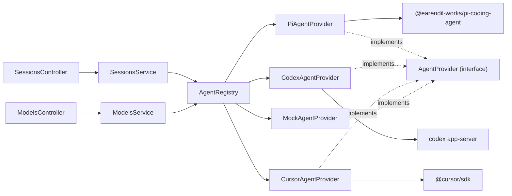

# System Architecture

## Overview

Nuncio is a self-hosted web app for delegating tasks to AI agents. The backend (`apps/server`, NestJS) exposes sessions over HTTP; each session is run by an **agent provider** selected per session. The agent layer is provider-neutral: Pi, Codex, Cursor, and future agent SDKs plug in by implementing one interface.

## Agent provider abstraction

```
apps/server/src/agents/
  agents.types.ts            AgentProvider interface, AgentRunContext, EventEmitter
  agents.base-provider.ts    BaseAgentProvider — template-method run/steer + shared event/error handling
  agents.registry.ts         AgentRegistry — resolves providers, availability, default
  agents.module.ts           Nest wiring
  providers/
    pi-agent.provider.ts     Pi SDK (createAgentSession, AuthStorage, ModelRegistry)
    codex-app-server.client.ts  JSON-RPC client for `codex app-server`
    codex-agent.provider.ts  Codex CLI app-server provider
    cursor-agent.provider.ts Cursor SDK local runtime provider
    mock-agent.provider.ts   Local fallback, always available
```



### Interface

Defined in `apps/server/src/agents/agents.types.ts`.

```typescript
interface AgentCapabilities {
  interrupt: boolean;                          // can abort an in-flight turn
  modelSwitch: 'in-session' | 'restart' | 'none';
  effortSwitch: 'in-session' | 'restart' | 'none';
  images: boolean;                             // accepts image attachments
}

interface AgentProvider {
  readonly id: string;          // 'pi' | 'mock' | ...
  readonly name: string;
  readonly capabilities: AgentCapabilities;
  isAvailable(): Promise<boolean>;
  listModels(): Promise<ModelProviderDto[]>;
  run(sessionId, prompt, ctx: AgentRunContext): Promise<void>;
  steer(sessionId, message, ctx: AgentRunContext): Promise<void>;
  interrupt?(sessionId): Promise<void>;        // present iff capabilities.interrupt
  setModel?(sessionId, model, options?): Promise<void>; // present iff modelSwitch==='in-session'
  dispose(sessionId): void;
  bustCache(): void;
}
```

`AgentRunContext.attachments?: AgentAttachment[]` carries `{ kind: 'image', mimeType, data }` (base64) into a run/steer for providers that declare `images`.

`BaseAgentProvider` (`agents.base-provider.ts`) implements the shared `run`/`steer` orchestration (status RUNNING → user/steer_message → `executePrompt()` → status IDLE, plus error → ERROR) via a template method. Concrete providers implement only `executePrompt()`, `isAvailable()`, `listModels()`, and (optionally) `dispose()`/`interrupt()`/`setModel()`.

### Capabilities (invariants)

`BaseAgentProvider.capabilities` defaults to **all-off**: `{ interrupt: false, modelSwitch: 'none', effortSwitch: 'none', images: false }`. Providers opt in by overriding the field.

| Provider | interrupt | modelSwitch | effortSwitch | images | Notes |
|----------|-----------|-------------|--------------|--------|-------|
| Pi | true | in-session | in-session | true | `pi-agent.provider.ts` overrides all four |
| Codex | false | none | none | false | inherits base defaults |
| Cursor (SDK) | false | none | none | false | inherits base defaults |
| Cursor CLI | false | none | none | false | inherits base defaults |
| Mock | false | none | none | false | inherits base defaults |

- **NEVER** call `provider.interrupt()`/`setModel()` without first checking the matching capability — the methods are optional and absent on providers that don't support them. `SessionsService` guards every call (see below).
- **NEVER** assume a capability is on by default; new providers inherit all-off until they explicitly override.


`AgentRegistry` holds all providers, exposes `all()`, `available()` (async, filters by `isAvailable`), `get(id)` (sync), `getAvailable(id)` (async, throws `BadRequestException` if unavailable), and `defaultId()` (Cursor if configured, then Codex, then Pi, else Mock).

### Per-session selection flow

1. `POST /api/sessions { prompt, provider?, model? }` → `SessionsService.create()`
2. `providerId = input.provider || await registry.defaultId()`; `await registry.getAvailable(providerId)` validates
3. `sessions` row created with `provider` + `model`; `startRun()` calls `registry.getAvailable(provider).run(id, prompt, { emit, model })`
4. `steer`/`archive` resolve the provider from the stored session row. Providers retain or restore their own runtime handle where possible.

## Pi authentication

Pi credentials live in `~/.pi/agent/auth.json` and are read by the Pi SDK's `AuthStorage`, which supports **both**:

- **API key** credentials, and
- **OAuth / subscription** credentials (e.g. ChatGPT Plus/Pro, Anthropic Pro/Max) — tokens auto-refreshed by the SDK with file locking.

`PiAgentProvider.isAvailable()` does NOT use a crude `existsSync` check. It mirrors the synara pattern:

```typescript
const pi = await loadSdk();                       // cached dynamic import
const agentDir = pi.getAgentDir();                // PI_CODING_AGENT_DIR or ~/.pi/agent
const authStorage = pi.AuthStorage.create(join(agentDir, 'auth.json'));
const registry = pi.ModelRegistry.create(authStorage, join(agentDir, 'models.json'));
this.cachedAvailable = registry.getAvailable().length > 0;   // models with configured auth
```

- `getAvailable()` returns models that have auth configured — the accurate "Pi can actually run a model" gate.
- Env override is `PI_CODING_AGENT_DIR` (the SDK's own variable, not a nuncio-invented one).
- The SDK is lazy-loaded (cached promise) so startup stays light; `isAvailable` short-circuits on `NUNCIO_FORCE_MOCK=1` without loading the SDK.
- `createAgentSession` is passed `agentDir`, `authStorage`, `modelRegistry`, and the resolved `model` (see below). Availability is cached for the process lifetime.

## Model wiring

`session.model` is stored as `provider:modelId` (e.g. `codex:gpt-5.5`, `cursor:composer-2`, `anthropic:claude-sonnet-4`). `PiAgentProvider.createPiSession` resolves Pi model ids back to a Pi `Model` via `resolveModelId` (handles both `provider/modelId` slash and `provider:modelId` colon conventions) + `registry.find(provider, id)`, then passes it to `createAgentSession({ model })`. `CodexAgentProvider` strips the `codex:` prefix before sending `turn/start` to the Codex app-server. If a provider cannot resolve the requested model, it falls back to its default. `GET /api/models` aggregates `listModels()` across all available providers.

`GET /api/models` also exposes `capabilities` per provider entry: `ModelsService.list()` (`models.service.ts`) sets `capabilities: entry.capabilities ?? provider.capabilities` on every `ModelProviderDto`, so the frontend can show/hide interrupt, in-session model/effort switch, and image-upload affordances per provider.

### Model context window (real vs. fallback)

`ModelItemDto.contextWindow?: number` (`apps/server/src/models/models.types.ts:16`) carries each model's real token budget through `GET /api/models` to the web client (mirrored as `ModelInfo.contextWindow` in `apps/web/src/lib/model-providers.ts:15`). It powers the per-session context-usage gauge instead of a hard-coded default.

- **Source (Pi).** `PiAgentProvider.fromRegistry` (`pi-agent.provider.ts:284`) reads `registryModel?.contextWindow ?? model.contextWindow` from the Pi `ModelRegistry`. **Sanitize invariant:** the field is emitted **only** when the value is a finite number `> 0` (`validContextWindow`); otherwise it is omitted so the client falls back rather than dividing by a bogus window. NEVER forward `0`, `NaN`, or a negative window onto the DTO.
- **Consumption (web).** `session-detail.tsx:129` resolves the session's model row via `modelById(catalog)[session.model]` and passes `entry?.contextWindow` into `useContextUsage(events, entry?.contextWindow)` (`apps/web/src/lib/use-context-usage.ts:103`).
- **Fallback invariant.** `calculateContextUsage` (`use-context-usage.ts:49`) uses `contextWindow && contextWindow > 0 ? contextWindow : DEFAULT_CONTEXT_WINDOW` where `DEFAULT_CONTEXT_WINDOW = 200_000` (`use-context-usage.ts:7`). An unknown/absent model, or a model whose provider does not report a window, degrades to 200K tokens — the gauge always renders. `percentage` is clamped to `[0, 100]`.
- Static fallback catalog rows (`FALLBACK_PROVIDERS`) carry no `contextWindow`, so offline/test renders use the 200K default by design.

## Pi capabilities (interrupt / live model switch / images)

`PiAgentProvider` (`pi-agent.provider.ts`) declares `{ interrupt: true, modelSwitch: 'in-session', effortSwitch: 'in-session', images: true }` and implements the matching optional methods against the live Pi SDK session handle held in `activeSessions: Map<sessionId, PiSessionHandle>`.

- **`interrupt(sessionId)`** → `session.abort()`. If `session.isStreaming` is false, abort best-effort and return without flagging. If streaming, add the id to `interruptedSessions` *before* awaiting `abort()`; on abort failure the flag is removed and the error rethrown.
- **Stale-flag invariant:** `executePrompt` clears `interruptedSessions.delete(sessionId)` at the **top** (before awaiting the prompt) so a leftover flag from a prior turn can never swallow a later real error. The `catch` only suppresses an error when `interruptedSessions.delete(sessionId)` returns true (i.e. an interrupt for *this* turn). NEVER move that top-of-turn clear below the `await handle.prompt(...)`.
- **`setModel(sessionId, modelId, options?)`** → live `session.setModel(...)` then `session.setThinkingLevel(...)` (effort). No-op when the session isn't active or the model id can't be resolved.
- **Images:** `context.attachments` of `kind: 'image'` are mapped to Pi `{ type: 'image', data, mimeType }` prompt content. Mapped only when present.

**Product intent (do NOT change):** Pi's `setModel` persists to the global `~/.pi/agent/settings.json` (Pi is single-config). The integration suite snapshots and restores that file in `beforeAll`/`afterAll`, so a test run leaves it byte-identical.

## Codex app-server provider

The Codex provider runs the local Codex CLI app server over stdio. `CodexAppServerClient` owns the JSON-RPC line protocol: request/response correlation, notifications, server-initiated requests, and pending-request cleanup on process exit.

- Availability checks `codex --version` and `codex login status`; it does not make an LLM call.
- Model discovery uses `model/list` after `initialize`, with GPT-5.5/GPT-5.4 fallback rows if discovery is unavailable.
- New sessions call `thread/start`; follow-ups reuse `sessions.provider_thread_id` through `thread/resume`.
- Turns use `turn/start`; dispose/archive sends `turn/interrupt` when a turn is active.
- `item/agentMessage/delta` maps to the shared `assistant_delta`; `turn/completed` emits the final `assistant_message`.
- Runtime state lives on the session row: `provider_thread_id`, `provider_active_turn_id`, and `provider_state_json`.
- Default runtime mode is local `full-access` (`approvalPolicy: "never"`, danger-full-access sandbox). `NUNCIO_CODEX_RUNTIME_MODE=approval-required` switches to read-only/untrusted mode and routes app-server approval requests through the provider-agnostic Nuncio approval flow.
- Provider approval requests are stored in SQLite (`provider_requests`) and emitted as `provider_request` events with a `requestId`; `POST /api/sessions/:id/provider-requests/:requestId/respond` appends `provider_request_resolved` and resolves the provider's pending Promise.
- If the server restarts while a request is pending, the new service instance marks stale pending rows denied with reason `server_restarted`; the transcript gets a resolved event instead of leaving an unanswerable approval card pending forever.

## Sessions domain layout

```
apps/server/src/sessions/
  api/         sessions.controller.ts        HTTP adapter
  domain/      sessions.types.ts, sessions.fsm.ts   types + pure FSM
  persistence/ sessions.repository.ts, events.repository.ts, provider-requests.repository.ts
  sessions.module.ts, sessions.persistence.module.ts, sessions.service.ts
```

Session FSM: `CREATED → RUNNING → IDLE | ERROR | PAUSED`; `IDLE/PAUSED → RUNNING` (steer); `IDLE/PAUSED/ERROR → ARCHIVED` (terminal). FSM, event log, and provider approval request state persist in SQLite; the `provider` and provider-runtime columns are added with idempotent `ALTER TABLE` migrations for existing databases.

### Capability-guarded session endpoints

`sessions.controller.ts` / `sessions.service.ts`:

- **`POST /api/sessions/:id/interrupt`** → `SessionsService.interrupt(id)`. Resolves the provider for the stored session row and throws `BadRequestException` unless `provider.capabilities.interrupt && provider.interrupt`; otherwise calls `provider.interrupt(id)`.
- **`PATCH /api/sessions/:id/model`** (body `{ model, options? }`) → `SessionsService.setSessionModel(id, model, options)`. **Order invariant:** when `capabilities.modelSwitch === 'in-session' && provider.setModel`, the live switch (`provider.setModel`) runs **BEFORE** persisting the row via `sessions.updateModel(...)`. NEVER persist the model row before the live switch — a failed live switch must not leave the DB pointing at a model the running session never adopted.
- **Attachments** are threaded through `POST /api/sessions` (create) and `POST /api/sessions/:id/steer` as `attachments?: AgentAttachment[]`, passed into `run`/`steer` via `AgentRunContext.attachments`.
- **Body limit:** `main.ts` sets the Nest `json`/`urlencoded` body limit to `25mb` via `app.useBodyParser(...)` so base64 image attachments fit. Native Nest body-parser config is used (not `import 'express'`) because `express` is only a transitive dep and is not resolvable as a bare specifier under Bun's isolated module store.

## App bootstrap (`main.ts`)

`NestFactory.create<NestExpressApplication>(AppModule, { rawBody: true })` (`main.ts:42`). The bootstrap composes **two independent concerns** that must coexist:

- **`rawBody: true`** preserves the exact request bytes on `req.rawBody` so inbound forge webhooks can verify their signature over the unmodified payload (`webhooks.controller.ts` reads `req.rawBody`). NEVER remove `rawBody: true` — webhook HMAC/`x-gitlab-token` verification depends on byte-exact bodies, and a re-serialized JSON body will fail verification.
- **Body-parser limit** (`useBodyParser('json' | 'urlencoded', { limit: '25mb' })`) for base64 image attachments.

Order is `create({ rawBody })` → `setGlobalPrefix('api')` → `enableCors({ origin: true })` → `useBodyParser(...)`. Both the global `/api` prefix and CORS stay as-is; webhook routes live under `/api/webhooks/forge/:provider`.

## Continue on mobile (session handoff)

A "handoff" imports an in-progress CLI/IDE agent chat from the host machine into a
Nuncio session so the user can continue it from the phone PWA. `POST /api/sessions/handoff`
(`sessions.controller.ts:51`) → `SessionsService.handoff()` (`sessions.service.ts:146`)
takes a **discriminated** `HandoffSessionDto` (`sessions.types.ts:115`):

- **Cursor CLI** — `{ cursorChatId, workspace, title? }` → spawns `agent` as a subprocess
  and reparses `stream-json` (the Cursor SDK cannot resume IDE/CLI chats; separate store).
- **Pi** — `{ piSessionPath, workspace, title? }` → in-process resume via the Pi SDK
  `SessionManager`, which reads the *same* JSONL store the pi CLI writes
  (`~/.pi/agent/sessions/<encoded-cwd>/<ts>_<uuid>.jsonl`). No subprocess, no new provider code.

The two branches are keyed by `'piSessionPath' in input` (`sessions.service.ts:150`);
`handoffPi()` (`sessions.service.ts:182`) handles the Pi lane.

### Pi handoff design (invariants)

- **Zero new provider code.** `PiAgentProvider.createPiSession` (`pi-agent.provider.ts:229`)
  already resumes when `providerThreadId` is set (`SessionManager.open`) and streams via
  `session.subscribe`. A handoff row simply sets `provider: 'pi'`, `providerThreadId = piSessionPath`,
  `cursorBackend: null` so `AgentRegistry.resolveForSession` (`agents.registry.ts:54`) — `cursorBackend === 'cli'`
  is false — falls through to `get(session.provider)` = the Pi SDK provider. **NEVER** set
  `cursorBackend` on a Pi handoff; that would misroute it to the Cursor CLI subprocess.
- **Dedup key = `provider_thread_id`.** `SessionsRepository.findByProviderThreadId()`
  (`sessions.repository.ts:87`) looks up an existing import by the jsonl path stored in
  `provider_thread_id`. Import is **idempotent**: `handoffPi` returns the existing session if
  found (`sessions.service.ts:190`). **NEVER** add a migration or overload `cursor_chat_id`
  for Pi — `provider_thread_id` already holds `session.sessionFile`.
- **Resume in place.** Nuncio opens the *same* session file (one continuous append-only
  session), not a fork. `SessionManager.forkFrom` is out of scope.
- **No collision guards, no dialogs.** Import always succeeds silently. If the pi agent is
  mid-turn the composer's send button reflects live state (steer/stop) exactly as for a
  native Nuncio session — there is no `assertNotRecentlyActive` equivalent on the Pi path.
- **Row shape.** `SessionsRepository.createHandoff()` (`sessions.repository.ts:125`) is a
  discriminated union: `provider: 'pi'` → `{ provider_thread_id, cursor_backend: null }`;
  otherwise `provider: 'cursor'` → `{ cursor_backend: 'cli', cursor_chat_id }`. Handoff rows
  start in status `IDLE` (already checkpointed, not a fresh run).

### Local session discovery

`apps/server/src/pi-local/` mirrors `cursor-local/`:

```
apps/server/src/pi-local/
  pi-local-sessions.service.ts   PiLocalSessionsService — list/read via SessionManager
  pi-local-sessions.types.ts     LocalPiSessionDto
  pi-transcript-hydrate.ts       piEntriesToSessionEvents — getEntries() → Nuncio events
  pi-local.controller.ts         GET /api/pi/local-sessions
  pi-local.module.ts             Nest wiring (registered in app.module.ts + sessions.module.ts)
```

- **`GET /api/pi/local-sessions?workspace=<abs>&limit=?`** (`pi-local.controller.ts`) →
  `{ items: LocalPiSessionDto[] }`. `workspace` is required (400 otherwise); `limit` clamps
  to `[1, 50]`, default 20, newest-first by `updatedAt`.
- `PiLocalSessionsService.listForWorkspace` calls `SessionManager.list(cwd)` and maps each
  `SessionInfo` (`id, path, name, firstMessage, messageCount, modified, cwd`) to
  `LocalPiSessionDto { sessionId, path, workspace, title, preview, updatedAt, messageCount,
  alreadyImported, nuncioSessionId? }`. `alreadyImported` / `nuncioSessionId` come from
  `findByProviderThreadId(info.path)`.
- The SDK is lazy-loaded via `loadSdk` and `SessionManager.open` via `openSession`; both are
  instance fields overridable in unit tests. A failed `SessionManager.list` returns `[]`
  (empty, not an error) so discovery degrades gracefully when the store is absent.

### Transcript hydration (Pi + Cursor)

`SessionsService.hydrateIfNeeded` (`sessions.service.ts:414`) backfills the event log once on
import (guarded by `events.count === 0`); `refreshTranscriptIfNeeded` (`sessions.service.ts:424`)
appends only *new* entries on later reads/steers, keyed by transcript mtime. Both dispatch
through `readTranscriptEvents` (`sessions.service.ts:444`) and `transcriptMtime`
(`sessions.service.ts:454`), which are now **provider-aware**:

- Cursor CLI (`cursorBackend === 'cli' && cursorChatId`) → `cursorLocal.readTranscript(...)`.
- Pi (`provider === 'pi' && providerThreadId`) → `piLocal.readTranscriptEvents(providerThreadId)`.

`piEntriesToSessionEvents` (`pi-transcript-hydrate.ts`) builds events from the SDK's parsed
`SessionManager.open(path).getEntries()` — **NEVER** hand-parse the JSONL. Mapping:

| Pi entry | Nuncio event |
|----------|--------------|
| message `role: user`, `text` block | `user_message` |
| message `role: assistant`, `text` block | `assistant_message` |
| message `role: assistant`, `toolCall` block (`id`, `name`, `arguments`) | `tool_start` (payload `callId`, `tool`, parsed `input`) |
| message `role: toolResult`, `text` block | `tool_end` (matched to a pending `tool_start` FIFO) |
| message `role: assistant`, `thinking` block | skipped |

Pi uses `toolCall` / role `toolResult` (NOT Cursor's `tool_use` / `tool_result`), so it needs
its own mapper. Tool payloads pass through `truncatePayload`. Pending `toolCall`s are matched
to `toolResult`s in FIFO order to recover `callId`/`tool` on the `tool_end`.

## Workspace selection

Session creation can run in a selected repo directly or create an isolated worktree. The frontend exposes this as repo picker → workspace mode picker (`Work locally` or `New worktree`) → branch picker. `Work locally` sends `projectPath`, `workspace = projectPath`, and the selected `baseBranch` as metadata without checking out the repo. `New worktree` sends `useWorktree: true`; the server creates `nuncio/<sessionId>-<slug>` under `NUNCIO_WORKSPACES_DIR` from the selected `baseBranch`, then runs the provider in that worktree.

## Forge authentication (PAT + CLI fallback)

GitHub and GitLab forge providers authenticate via a **two-tier resolver**: a stored Personal Access Token (PAT) takes precedence, falling back automatically to the local `gh` / `glab` CLI session. No new setting is required for CLI fallback.

### Auth resolution flow

- `ForgeAuth { token: string; method: 'token' | 'cli' }` and `ForgeAuthMethod = 'token' | 'cli'` (`apps/server/src/forges/forges.types.ts`).
- Each provider implements `resolveAuth(): Promise<ForgeAuth | null>`:
  - `GithubForgeProvider.resolveAuth()` (`apps/server/src/forges/providers/github-forge.provider.ts`): PAT from `GITHUB_TOKEN` → `method: 'token'`; else `githubCliToken()` → `method: 'cli'`; else `null`.
  - `GitlabForgeProvider.resolveAuth()` (`apps/server/src/forges/providers/gitlab-forge.provider.ts`): PAT from `GITLAB_TOKEN` → `method: 'token'`; else `gitlabCliToken()` → `method: 'cli'`; else `null`.
- The result is cached in `cachedAuth` (tri-state: `undefined` = unresolved, `null` = no auth, value = resolved). `bustCache()` resets it to `undefined`, so a newly-pasted PAT or a fresh `gh auth login` takes effect after the settings-change cache bust (`ForgeRegistry` subscribes to `settings.onChange`).
- `isAvailable()` is `(await resolveAuth()) !== null` — a PAT **or** a CLI session counts as connected.
- `authHeaders()` (private, async) awaits `resolveAuth()` and throws `UnauthorizedException` when `null`. **Both** GitHub and GitLab send `Authorization: Bearer <token>`. GitLab deliberately uses `Authorization: Bearer` (not `PRIVATE-TOKEN`) for both the PAT and the `glab` CLI token — the CLI emits an OAuth token, which only authenticates via the `Bearer` scheme; using it as a `PRIVATE-TOKEN` would fail login/API calls. `getCurrentUser`/`createPullRequest`/`getPullRequest`/`listChecks`/`addComment` all `await this.authHeaders()`.

### CLI auth resolver — `apps/server/src/forges/cli-auth.ts`

- `githubCliToken(run?): Promise<string | null>` — spawns `gh auth token`; returns trimmed stdout if exit 0 and the value is token-like (non-empty, no whitespace), else `null`.
- `gitlabCliToken(run?): Promise<string | null>` — spawns `glab auth status -t` (note: `glab` has **no** `auth token` subcommand); parses combined stdout+stderr for `/Token found:\s*(\S+)/`; returns the token or `null`. (`glab` prints `✓ Token found: <TOKEN>` to stderr.)
- Both accept an injectable `run: CliAuthRunner` (default `runCli`, a `Bun.spawn` wrapper) so unit tests stub the CLI without executing real binaries.
- `runCli` spawns with **array args** (`Bun.spawn([command, ...args])`, no shell), a ~2.5s timeout (`CLI_AUTH_TIMEOUT_MS = 2500`) that `proc.kill()`s and returns `exitCode: -1` on timeout, and reads stdout/stderr only after exit.

**Test seam:** `BaseForgeProvider.cliTokenOverride?: () => Promise<string | null>` (`apps/server/src/forges/forges.base-provider.ts`) mirrors `fetchOverride`. When set, `resolveAuth()` calls it instead of the real `githubCliToken`/`gitlabCliToken`, so provider specs can simulate "no PAT but CLI authed".

**Invariants**

- PAT **always** wins over CLI. CLI fallback is automatic — no setting gates it.
- `cachedAuth` is tri-state; only `bustCache()` (settings change) clears it. A live token change is not observed until the next bust.
- Webhook signature verification is **unchanged** — it uses `*_WEBHOOK_SECRET` (HMAC for GitHub, shared `x-gitlab-token` for GitLab), never the CLI token. The GitLab auth-header change (PAT and CLI both via `Authorization: Bearer`) does not touch the webhook path.
- The CLI token is used **only** as an auth header, exactly like a PAT.

**NEVER**

- NEVER log, echo, or return raw token values (PAT or CLI). `cli-auth.ts` only returns the token string to the provider; nothing logs it.
- NEVER spawn the CLI through a shell or with string interpolation — array args only, short timeout, fail closed (`null`) on missing binary / nonzero exit / timeout.
- NEVER let a slow/missing CLI hang a response — CLI calls are timeout-guarded in both `runCli` and `ForgesService.listStatus()`.

## Forge connection status & Settings UI

The forge layer (`apps/server/src/forges/`) exposes a lightweight connection-status read used by the Settings page to show whether each Source Control provider (GitHub, GitLab) is connected and **which auth method** is in effect.

### Status endpoint

- `GET /api/forges` → `ForgeStatusDto[]` via `ForgeStatusController` (`apps/server/src/forges/api/forge-status.controller.ts:6`, `@Controller('forges')` `@Get()` → `getStatus()`). Registered in `forges.module.ts` `controllers` alongside `ForgesController` (`sessions/:id/forge`) and `WebhooksController` (`webhooks/forge`) — the bare `forges` route does **not** clash with those.
- `ForgesService.listStatus()` (`apps/server/src/forges/forges.service.ts`) iterates `this.registry.all()` and for each provider:
  - resolves `auth = await resolveAuth()` behind a ~2.5s `withTimeout` race (and a `.catch(() => null)`), so a slow/missing CLI never hangs the response; `connected = auth !== null` and `method = auth?.method ?? null`.
  - when connected, resolves `login = (await provider.getCurrentUser()).login` (using the resolved token) behind **both** a try/catch and a ~2.5s `withTimeout`; `null` on failure.
- `ForgeStatusDto { id; name; connected; method: 'token' | 'cli' | null; login: string | null }` (`apps/server/src/forges/forges.types.ts`).

**Invariants**

- `login` is `null` whenever `connected` is false, or when `getCurrentUser()` throws or exceeds the 2.5s timeout. Never assume `connected === true` implies `login !== null`.
- `method` is `null` exactly when `connected` is false; otherwise `'token'` (PAT) or `'cli'` (gh/glab session).
- The endpoint reflects current credential availability only; it performs no writes and exposes no secret values.

**NEVER**

- NEVER return or log the raw token/secret from this endpoint — only `connected`, `method`, and `login`.
- NEVER let `resolveAuth()`/`getCurrentUser()` run unbounded; keep them behind the timeout race.

### Settings UI grouping

`apps/web/src/components/settings-view.tsx` (props unchanged: `{ settings, onUpdate, onClear, onBack }`) renders the catalog-driven `provider`-category settings as per-provider rows grouped into three sections:

- **Providers** → AI agents `cursor`, `pi`, `codex`.
- **Source Control** → `github`, `gitlab`.
- **General** → non-provider keys (e.g. `NUNCIO_PROJECT_ROOTS`, `NUNCIO_WORKSPACES_DIR`) via the existing `SettingRow`.

Each provider row is a single line (monochrome brand glyph + name + status subtitle + right-aligned pill button). Rows are **collapsed by default**; clicking Manage/Connect toggles `aria-expanded` and reveals that provider's underlying setting keys using the unchanged `SettingRow` component (`apps/web/src/components/setting-row.tsx`), preserving all edit/save/clear/mask/source-badge behavior.

- **Source Control** subtitle/button derive from `GET /api/forges`: `connected && login` → "Connected as <login>" + "Manage"; `connected && !login` → "Connected" + "Manage"; not connected → provider description + "Connect". The button is "Manage" when connected by **either** method, "Connect" otherwise.
- When connected, the subtitle appends the active auth method via `sourceControlAuthMethodSuffix(providerId, method)` (`apps/web/src/components/settings-view.tsx:56`): `method==='token'` → ` · via token`; `method==='cli'` → ` · via gh CLI` (github) or ` · via glab CLI` (gitlab). E.g. a CLI-authed row reads "Connected as oscarlehuu · via gh CLI". `method` is added to the `ForgeStatusDto` type in `apps/web/src/lib/forge-status-api.ts`.
- **AI providers** derive connected from the primary credential setting's `hasValue` (cursor→`CURSOR_API_KEY`, pi→`PI_AGENT_DIR`, codex→`NUNCIO_CODEX_BIN`); button is always "Manage".
- Status is fetched internally on mount (`fetchForgeStatus()` in `apps/web/src/lib/forge-status-api.ts`, `GET /api/forges`) and **defaults to `[]` on error** so the view renders without a server (important for tests). Initial render does not block on the fetch.
- Brand glyphs come from `ProviderIcon` (`apps/web/src/components/provider-icon.tsx`); `GitHubIcon`/`GitLabIcon` use simple-icons paths with `fill="currentColor"` so they adapt to light/dark, registered in `SVG_BY_PROVIDER`.

## Local git ops + Review-changes UI

`GitService` (`apps/server/src/git/git.service.ts`) extends the local git layer with working-tree operations, all routed through the private `git()` `Bun.spawn` helper and `resolveRepoRoot(path)` (`git.service.ts:160`):

- `status(path)` (`git.service.ts:265`) → `GitStatusDto { branch; ahead; behind; clean; files: GitFileChange[] }`.
- `diff(path, { staged?, base? })` (`git.service.ts:283`) → `GitDiffDto { diff; truncated }`.
- `stageAll(path)` (`git.service.ts:306`) → `git add -A`.
- `commit(path, message)` (`git.service.ts:311`) → `CommitResultDto { sha; committed }`.
- `remoteInfo(path)` (`git.service.ts:328`) → `RemoteInfoDto { host; owner; repo }`, parsing `git remote get-url origin` (ssh + https forms). Used to auto-pick the forge provider by host.
- `push(path, branch, { force? })` (`git.service.ts:344`) → `PushResultDto`; force uses `--force-with-lease`.

Session-scoped HTTP routes live in `GitSessionController` (`apps/server/src/sessions/api/git-session.controller.ts:23`, `@Controller('sessions/:id/git')`), registered in `SessionsModule` to avoid a Git→Sessions circular import (Sessions already imports Git):

| Method | Path | Returns |
|--------|------|---------|
| GET | `/api/sessions/:id/git/status` | `GitStatusDto` |
| GET | `/api/sessions/:id/git/diff?staged=1&base=<ref>` | `GitDiffDto` |
| POST | `/api/sessions/:id/git/commit` (`{ message, stageAll? }`) | `CommitResultDto` |
| POST | `/api/sessions/:id/git/push` (`{ force? }`) | `PushResultDto` |

The web client calls these via `fetchGitStatus`/`fetchGitDiff`/`commitSession`/`pushSession` (`apps/web/src/lib/api.ts`). `<ReviewChanges sessionId=… />` (`apps/web/src/components/review-changes.tsx`) renders the file list + diff viewer with Commit/Push, mounted in `session-detail.tsx` alongside `<PrPanel session=… />`.

## Forge session metadata + outbound PR/MR flow

Session rows carry forge provenance (snake_case `SessionRow`, camelCase `SessionDto` in `apps/server/src/sessions/domain/sessions.types.ts`): `forge_provider`/`forgeProvider`, `pull_request_url`/`pullRequestUrl`, `pull_request_number`/`pullRequestNumber`, `pull_request_state`/`pullRequestState`, `forge_status`/`forgeStatus` (`none|opening|open|merged|closed|error`).

**DTO invariants**

- The forge fields on `SessionDto` are **optional** (`forgeProvider?`, `pullRequestUrl?`, `pullRequestNumber?`, `pullRequestState?`, `forgeStatus?`).
- `toDto` (`sessions.repository.ts`) coerces with `?? null` for the nullable forge fields and `?? 'none'` for `forge_status`/`forgeStatus`; `pull_request_number` is normalized through `parsePullRequestNumber` (string|number → `number | null`).
- `updateForgeState(id, { … })` (`sessions.repository.ts`) mirrors `updateProviderRuntimeState`: `undefined` keeps the current value, an explicit value (including `null`) overwrites. NEVER widen the INSERT column list / VALUES / positional args inconsistently — `insertRow`, `create`, and `createHandoff` must all carry the five forge columns (`forge_provider, pull_request_url, pull_request_number, pull_request_state, forge_status`) defaulting to `null`/`'none'`.

`ForgesService` (`apps/server/src/forges/forges.service.ts`) is the session-facing facade:

- `openPullRequestForSession(id, opts)` (`forges.service.ts:28`): requires `session.branch` and a working dir (`worktreePath ?? projectPath`), resolves the provider via `remoteInfo(repoPath).host`, calls `provider.createPullRequest(...)`, then persists via `updateForgeState({ forgeProvider, pullRequestUrl, pullRequestNumber, pullRequestState, forgeStatus: 'open' })`.
- `getPullRequestForSession(id)` (`forges.service.ts:64`): refreshes state + checks, persists `{ pullRequestState, forgeStatus: pr.state }`.
- `addCommentForSession(id, body)` (`forges.service.ts:91`).

Routes (`apps/server/src/forges/api/forges.controller.ts:11`, `@Controller('sessions/:id/forge')`):

| Method | Path | Returns |
|--------|------|---------|
| POST | `/api/sessions/:id/forge/pull-request` (`{ title?, body?, draft?, base? }`) | `ForgePullRequest` |
| GET | `/api/sessions/:id/forge/pull-request` | `ForgePullRequest` (refreshed status + checks) |
| POST | `/api/sessions/:id/forge/pull-request/comment` (`{ body }`) | `{ ok }` |

Web helpers `openPullRequest(id)`/`fetchPullRequest(id)` (`apps/web/src/lib/api.ts`) back `<PrPanel>`. The `Session` type in `api.ts` carries the forge fields.

## Inbound webhooks (issue/PR → session)

`WebhooksController` (`apps/server/src/forges/webhooks/webhooks.controller.ts:21`, `@Controller('webhooks/forge')`) exposes a single `@Post(':provider')` returning `202`. It reads `req.rawBody` (enabled by `rawBody: true` in `main.ts`), verifies `registry.get(provider).verifyWebhookSignature(headers, rawBody)` (`401` on failure), parses via `provider.parseWebhookEvent(headers, payload)` (ignored events return `{ ok, ignored }`), then delegates to `WebhooksService.handleEvent`.

`WebhooksService.handleEvent` (`webhooks.service.ts:30`):

- **Refuses header-less deliveries:** no `event.deliveryId` → `{ created: false, reason: 'missing-delivery-id' }` (cannot dedupe a replay safely).
- **Idempotency:** `recordDelivery(provider, deliveryId)` is an `INSERT OR IGNORE` into `forge_webhook_deliveries(provider, delivery_id, created_at)`; a replay returns `false` and no session is created.
- On a fresh known event, calls `SessionsService.create({ prompt, projectPath, baseBranch, useWorktree: true })`.

**NEVER** verify a webhook against a re-serialized JSON body — always the raw bytes; GitHub uses HMAC-SHA256 over `x-hub-signature-256`, GitLab compares the shared `x-gitlab-token` (handled inside each provider so the `ForgeProvider` interface stays uniform).

## Tests

| Suite | Command | Scope |
|-------|---------|-------|
| Unit | `bun run --filter @nuncio/server test` (`test/unit/`) | FSM, registry, providers, sessions service, models, DB migration |
| E2E | `bun run --filter @nuncio/server test:e2e` (`test/e2e/`) | HTTP lifecycle via supertest with simulated providers |
| Integration | `bun run --filter @nuncio/server test:integration` (`test/integration/`) | Real provider auth checks and prompts; gated so CI stays safe |

The Pi integration suite (`test/integration/pi-agent.integration.spec.ts`) exercises the real capabilities: in-session model switch, interrupt-and-resume, cwd tool-use pinned to `cliproxyapi:claude-opus-4-8`, and persist/resume. **Invariant:** it snapshots `~/.pi/agent/settings.json` in `beforeAll` and restores it in `afterAll`, so a run leaves that file byte-identical even though Pi's `setModel` intentionally writes to it.

Server tests run on `bun test`. Unit tests use fakes for provider subprocess/SDK boundaries, so they do not require Codex, Cursor, or Pi credentials. Pi handoff is covered by `test/unit/pi-local/` (`pi-local-sessions.service.spec.ts`, `pi-transcript-hydrate.spec.ts`) plus `sessions.handoff.spec.ts` and `sessions.repository.spec.ts` (`findByProviderThreadId`, discriminated `createHandoff`); the `PiLocalSessionsService` SDK boundary is faked via its `loadSdk`/`openSession` overrides.

## Known gaps (follow-up)

- **Pi session revival:** `SessionManager.inMemory()` means Pi conversation history is lost on server restart. File-backed `SessionManager.create(cwd)` + lazy revive is planned to make the "resumable sessions" principle true for Pi. (Note: **imported** Pi handoff sessions are already file-backed — they resume the on-disk jsonl via `providerThreadId` — so they survive restart.)
- **Approval continuity:** approval request state is durable, but a request waiting inside the Codex app-server cannot continue across a server/app-server restart; stale pending requests are auto-denied on boot with `server_restarted`.
- **Tool configuration:** Pi tools are hardcoded (`read, bash, grep, find, ls`); env/per-session config is planned.
- **Additional providers:** future SDKs can be added by implementing `AgentProvider` and registering them in `AgentRegistry`.
