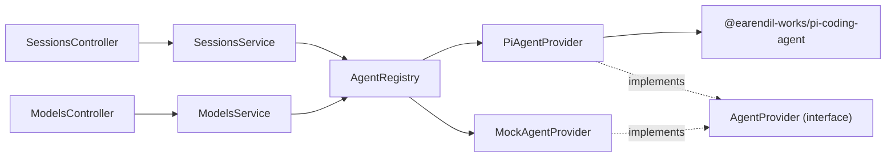

# System Architecture

## Overview

Nuncio is a self-hosted web app for delegating tasks to AI agents. The backend (`apps/server`, NestJS) exposes sessions over HTTP; each session is run by an **agent provider** selected per session. The agent layer is provider-neutral: Pi today, any future agent SDK (Cursor, …) plugs in by implementing one interface.

## Agent provider abstraction

```
apps/server/src/agents/
  agents.types.ts            AgentProvider interface, AgentRunContext, EventEmitter
  agents.base-provider.ts    BaseAgentProvider — template-method run/steer + shared event/error handling
  agents.registry.ts         AgentRegistry — resolves providers, availability, default
  agents.module.ts           Nest wiring
  providers/
    pi-agent.provider.ts     Pi SDK (createAgentSession, AuthStorage, ModelRegistry)
    mock-agent.provider.ts   Local fallback, always available
```



### Interface

```typescript
interface AgentProvider {
  readonly id: string;          // 'pi' | 'mock' | ...
  readonly name: string;
  isAvailable(): Promise<boolean>;
  listModels(): Promise<ModelProviderDto[]>;
  run(sessionId, prompt, ctx: AgentRunContext): Promise<void>;
  steer(sessionId, message, ctx: AgentRunContext): Promise<void>;
  dispose(sessionId): void;
}
```

`BaseAgentProvider` implements the shared `run`/`steer` orchestration (status RUNNING → user/steer_message → `executePrompt()` → status IDLE, plus error → ERROR) via a template method. Concrete providers implement only `executePrompt()`, `isAvailable()`, `listModels()`, and (optionally) `dispose()`.

`AgentRegistry` holds all providers, exposes `all()`, `available()` (async, filters by `isAvailable`), `get(id)` (sync), `getAvailable(id)` (async, throws `BadRequestException` if unavailable), and `defaultId()` (Pi if available, else Mock).

### Per-session selection flow

1. `POST /api/sessions { prompt, provider?, model? }` → `SessionsService.create()`
2. `providerId = input.provider || await registry.defaultId()`; `await registry.getAvailable(providerId)` validates
3. `sessions` row created with `provider` + `model`; `startRun()` calls `registry.getAvailable(provider).run(id, prompt, { emit, model })`
4. `steer`/`archive` resolve the provider from the stored session row (steer reuses the retained Pi session handle for in-conversation follow-ups)

## Pi authentication

Pi credentials live in `~/.pi/agent/auth.json` and are read by the Pi SDK's `AuthStorage`, which supports **both**:

- **API key** credentials, and
- **OAuth / subscription** credentials (e.g. ChatGPT Plus/Pro, Anthropic Pro/Max) — tokens auto-refreshed by the SDK with file locking.

`PiAgentProvider.isAvailable()` does NOT use a crude `existsSync` check. It mirrors the synara pattern:

```typescript
const pi = await loadSdk();                       // cached dynamic import
const agentDir = pi.getAgentDir();                // PI_CODING_AGENT_DIR or ~/.pi/agent
const authStorage = pi.AuthStorage.create(join(agentDir, 'auth.json'));
const registry = pi.ModelRegistry.create(authStorage, join(agentDir, 'models.json'));
this.cachedAvailable = registry.getAvailable().length > 0;   // models with configured auth
```

- `getAvailable()` returns models that have auth configured — the accurate "Pi can actually run a model" gate.
- Env override is `PI_CODING_AGENT_DIR` (the SDK's own variable, not a nuncio-invented one).
- The SDK is lazy-loaded (cached promise) so startup stays light; `isAvailable` short-circuits on `NUNCIO_FORCE_MOCK=1` without loading the SDK.
- `createAgentSession` is passed `agentDir`, `authStorage`, `modelRegistry`, and the resolved `model` (see below). Availability is cached for the process lifetime.

## Model wiring

`session.model` is stored as `provider:modelId` (e.g. `openai-codex:gpt-5.5`, `anthropic:claude-sonnet-4`). `PiAgentProvider.createPiSession` resolves it back to a Pi `Model` via `resolveModelId` (handles both `provider/modelId` slash and `provider:modelId` colon conventions) + `registry.find(provider, id)`, then passes it to `createAgentSession({ model })`. If the id can't be resolved, Pi falls back to its default model. `GET /api/models` aggregates `listModels()` across all available providers.

## Sessions domain layout

```
apps/server/src/sessions/
  api/         sessions.controller.ts        HTTP adapter
  domain/      sessions.types.ts, sessions.fsm.ts   types + pure FSM
  persistence/ sessions.repository.ts, events.repository.ts
  sessions.module.ts, sessions.persistence.module.ts, sessions.service.ts
```

Session FSM: `CREATED → RUNNING → IDLE | ERROR | PAUSED`; `IDLE/PAUSED → RUNNING` (steer); `IDLE/PAUSED/ERROR → ARCHIVED` (terminal). FSM + event log persist in SQLite; the `provider` column was added with an idempotent `ALTER TABLE` migration for existing databases.

## Tests

| Suite | Command | Scope |
|-------|---------|-------|
| Unit | `npm test -w apps/server` (`test/unit/**/*.spec.ts`) | FSM, registry, providers, sessions service, models, DB migration — 55 tests, mock provider |
| E2E | `npm run test:e2e -w apps/server` (`test/e2e/`) | HTTP lifecycle via supertest with mock provider — 4 tests |
| Integration | `npm run test:integration -w apps/server` (`test/integration/`) | Real Pi auth: `isAvailable`, `listModels`, a real prompt. **Skips** when `~/.pi/agent/auth.json` is absent (CI-safe). |

Integration tests run jest with `NODE_OPTIONS=--experimental-vm-modules` because jest's CJS runtime cannot dynamically `import()` an ESM package (the Pi SDK) without that flag. The unit/e2e suites never load the Pi SDK (mock provider + `NUNCIO_FORCE_MOCK` short-circuit), so they stay on plain CJS jest.

## Known gaps (follow-up)

- **Pi session revival:** `SessionManager.inMemory()` means Pi conversation history is lost on server restart. File-backed `SessionManager.create(cwd)` + lazy revive is planned to make the "resumable sessions" principle true for Pi.
- **Availability cache refresh:** `isAvailable` caches once per process; credentials configured after startup require a restart.
- **Tool configuration:** Pi tools are hardcoded (`read, bash, grep, find, ls`); env/per-session config is planned.
- **Additional providers:** a real Cursor provider can be added by implementing `AgentProvider` and registering it in `AgentRegistry`.
