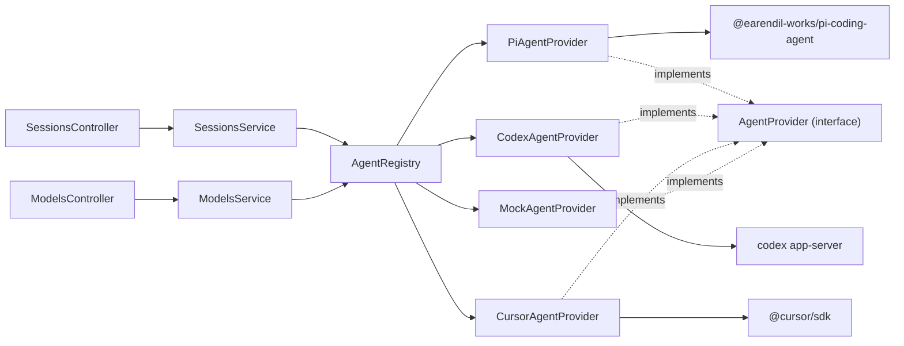

# System Architecture

## Overview

Nuncio is a self-hosted web app for delegating tasks to AI agents. The backend (`apps/server`, NestJS) exposes sessions over HTTP; each session is run by an **agent provider** selected per session. The agent layer is provider-neutral: Pi, Codex, Cursor, and future agent SDKs plug in by implementing one interface.

## Agent provider abstraction

```
apps/server/src/agents/
  agents.types.ts            AgentProvider interface, AgentRunContext, EventEmitter
  agents.base-provider.ts    BaseAgentProvider — template-method run/steer + shared event/error handling
  agents.registry.ts         AgentRegistry — resolves providers, availability, default
  agents.module.ts           Nest wiring
  providers/
    pi-agent.provider.ts     Pi SDK (createAgentSession, AuthStorage, ModelRegistry)
    codex-app-server.client.ts  JSON-RPC client for `codex app-server`
    codex-agent.provider.ts  Codex CLI app-server provider
    cursor-agent.provider.ts Cursor SDK local runtime provider
    mock-agent.provider.ts   Local fallback, always available
```



### Interface

Defined in `apps/server/src/agents/agents.types.ts`.

```typescript
interface AgentCapabilities {
  interrupt: boolean;                          // can abort an in-flight turn
  modelSwitch: 'in-session' | 'restart' | 'none';
  effortSwitch: 'in-session' | 'restart' | 'none';
  images: boolean;                             // accepts image attachments
}

interface AgentProvider {
  readonly id: string;          // 'pi' | 'mock' | ...
  readonly name: string;
  readonly capabilities: AgentCapabilities;
  isAvailable(): Promise<boolean>;
  listModels(): Promise<ModelProviderDto[]>;
  run(sessionId, prompt, ctx: AgentRunContext): Promise<void>;
  steer(sessionId, message, ctx: AgentRunContext): Promise<void>;
  interrupt?(sessionId): Promise<void>;        // present iff capabilities.interrupt
  setModel?(sessionId, model, options?): Promise<void>; // present iff modelSwitch==='in-session'
  dispose(sessionId): void;
  bustCache(): void;
}
```

`AgentRunContext.attachments?: AgentAttachment[]` carries `{ kind: 'image', mimeType, data }` (base64) into a run/steer for providers that declare `images`.

`BaseAgentProvider` (`agents.base-provider.ts`) implements the shared `run`/`steer` orchestration (status RUNNING → user/steer_message → `executePrompt()` → status IDLE, plus error → ERROR) via a template method. Concrete providers implement only `executePrompt()`, `isAvailable()`, `listModels()`, and (optionally) `dispose()`/`interrupt()`/`setModel()`.

### Capabilities (invariants)

`BaseAgentProvider.capabilities` defaults to **all-off**: `{ interrupt: false, modelSwitch: 'none', effortSwitch: 'none', images: false }`. Providers opt in by overriding the field.

| Provider | interrupt | modelSwitch | effortSwitch | images | Notes |
|----------|-----------|-------------|--------------|--------|-------|
| Pi | true | in-session | in-session | true | `pi-agent.provider.ts` overrides all four |
| Codex | false | none | none | false | inherits base defaults |
| Cursor (SDK) | false | none | none | false | inherits base defaults |
| Cursor CLI | false | none | none | false | inherits base defaults |
| Mock | false | none | none | false | inherits base defaults |

- **NEVER** call `provider.interrupt()`/`setModel()` without first checking the matching capability — the methods are optional and absent on providers that don't support them. `SessionsService` guards every call (see below).
- **NEVER** assume a capability is on by default; new providers inherit all-off until they explicitly override.


`AgentRegistry` holds all providers, exposes `all()`, `available()` (async, filters by `isAvailable`), `get(id)` (sync), `getAvailable(id)` (async, throws `BadRequestException` if unavailable), and `defaultId()` (Cursor if configured, then Codex, then Pi, else Mock).

### Per-session selection flow

1. `POST /api/sessions { prompt, provider?, model? }` → `SessionsService.create()`
2. `providerId = input.provider || await registry.defaultId()`; `await registry.getAvailable(providerId)` validates
3. `sessions` row created with `provider` + `model`; `startRun()` calls `registry.getAvailable(provider).run(id, prompt, { emit, model })`
4. `steer`/`archive` resolve the provider from the stored session row. Providers retain or restore their own runtime handle where possible.

## Pi authentication

Pi credentials live in `~/.pi/agent/auth.json` and are read by the Pi SDK's `AuthStorage`, which supports **both**:

- **API key** credentials, and
- **OAuth / subscription** credentials (e.g. ChatGPT Plus/Pro, Anthropic Pro/Max) — tokens auto-refreshed by the SDK with file locking.

`PiAgentProvider.isAvailable()` does NOT use a crude `existsSync` check. It mirrors the synara pattern:

```typescript
const pi = await loadSdk();                       // cached dynamic import
const agentDir = pi.getAgentDir();                // PI_CODING_AGENT_DIR or ~/.pi/agent
const authStorage = pi.AuthStorage.create(join(agentDir, 'auth.json'));
const registry = pi.ModelRegistry.create(authStorage, join(agentDir, 'models.json'));
this.cachedAvailable = registry.getAvailable().length > 0;   // models with configured auth
```

- `getAvailable()` returns models that have auth configured — the accurate "Pi can actually run a model" gate.
- Env override is `PI_CODING_AGENT_DIR` (the SDK's own variable, not a nuncio-invented one).
- The SDK is lazy-loaded (cached promise) so startup stays light; `isAvailable` short-circuits on `NUNCIO_FORCE_MOCK=1` without loading the SDK.
- `createAgentSession` is passed `agentDir`, `authStorage`, `modelRegistry`, and the resolved `model` (see below). Availability is cached for the process lifetime.

## Model wiring

`session.model` is stored as `provider:modelId` (e.g. `codex:gpt-5.5`, `cursor:composer-2`, `anthropic:claude-sonnet-4`). `PiAgentProvider.createPiSession` resolves Pi model ids back to a Pi `Model` via `resolveModelId` (handles both `provider/modelId` slash and `provider:modelId` colon conventions) + `registry.find(provider, id)`, then passes it to `createAgentSession({ model })`. `CodexAgentProvider` strips the `codex:` prefix before sending `turn/start` to the Codex app-server. If a provider cannot resolve the requested model, it falls back to its default. `GET /api/models` aggregates `listModels()` across all available providers.

`GET /api/models` also exposes `capabilities` per provider entry: `ModelsService.list()` (`models.service.ts`) sets `capabilities: entry.capabilities ?? provider.capabilities` on every `ModelProviderDto`, so the frontend can show/hide interrupt, in-session model/effort switch, and image-upload affordances per provider.

## Pi capabilities (interrupt / live model switch / images)

`PiAgentProvider` (`pi-agent.provider.ts`) declares `{ interrupt: true, modelSwitch: 'in-session', effortSwitch: 'in-session', images: true }` and implements the matching optional methods against the live Pi SDK session handle held in `activeSessions: Map<sessionId, PiSessionHandle>`.

- **`interrupt(sessionId)`** → `session.abort()`. If `session.isStreaming` is false, abort best-effort and return without flagging. If streaming, add the id to `interruptedSessions` *before* awaiting `abort()`; on abort failure the flag is removed and the error rethrown.
- **Stale-flag invariant:** `executePrompt` clears `interruptedSessions.delete(sessionId)` at the **top** (before awaiting the prompt) so a leftover flag from a prior turn can never swallow a later real error. The `catch` only suppresses an error when `interruptedSessions.delete(sessionId)` returns true (i.e. an interrupt for *this* turn). NEVER move that top-of-turn clear below the `await handle.prompt(...)`.
- **`setModel(sessionId, modelId, options?)`** → live `session.setModel(...)` then `session.setThinkingLevel(...)` (effort). No-op when the session isn't active or the model id can't be resolved.
- **Images:** `context.attachments` of `kind: 'image'` are mapped to Pi `{ type: 'image', data, mimeType }` prompt content. Mapped only when present.

**Product intent (do NOT change):** Pi's `setModel` persists to the global `~/.pi/agent/settings.json` (Pi is single-config). The integration suite snapshots and restores that file in `beforeAll`/`afterAll`, so a test run leaves it byte-identical.

## Codex app-server provider

The Codex provider runs the local Codex CLI app server over stdio. `CodexAppServerClient` owns the JSON-RPC line protocol: request/response correlation, notifications, server-initiated requests, and pending-request cleanup on process exit.

- Availability checks `codex --version` and `codex login status`; it does not make an LLM call.
- Model discovery uses `model/list` after `initialize`, with GPT-5.5/GPT-5.4 fallback rows if discovery is unavailable.
- New sessions call `thread/start`; follow-ups reuse `sessions.provider_thread_id` through `thread/resume`.
- Turns use `turn/start`; dispose/archive sends `turn/interrupt` when a turn is active.
- `item/agentMessage/delta` maps to the shared `assistant_delta`; `turn/completed` emits the final `assistant_message`.
- Runtime state lives on the session row: `provider_thread_id`, `provider_active_turn_id`, and `provider_state_json`.
- Default runtime mode is local `full-access` (`approvalPolicy: "never"`, danger-full-access sandbox). `NUNCIO_CODEX_RUNTIME_MODE=approval-required` switches to read-only/untrusted mode and routes app-server approval requests through the provider-agnostic Nuncio approval flow.
- Provider approval requests are stored in SQLite (`provider_requests`) and emitted as `provider_request` events with a `requestId`; `POST /api/sessions/:id/provider-requests/:requestId/respond` appends `provider_request_resolved` and resolves the provider's pending Promise.
- If the server restarts while a request is pending, the new service instance marks stale pending rows denied with reason `server_restarted`; the transcript gets a resolved event instead of leaving an unanswerable approval card pending forever.

## Sessions domain layout

```
apps/server/src/sessions/
  api/         sessions.controller.ts        HTTP adapter
  domain/      sessions.types.ts, sessions.fsm.ts   types + pure FSM
  persistence/ sessions.repository.ts, events.repository.ts, provider-requests.repository.ts
  sessions.module.ts, sessions.persistence.module.ts, sessions.service.ts
```

Session FSM: `CREATED → RUNNING → IDLE | ERROR | PAUSED`; `IDLE/PAUSED → RUNNING` (steer); `IDLE/PAUSED/ERROR → ARCHIVED` (terminal). FSM, event log, and provider approval request state persist in SQLite; the `provider` and provider-runtime columns are added with idempotent `ALTER TABLE` migrations for existing databases.

### Capability-guarded session endpoints

`sessions.controller.ts` / `sessions.service.ts`:

- **`POST /api/sessions/:id/interrupt`** → `SessionsService.interrupt(id)`. Resolves the provider for the stored session row and throws `BadRequestException` unless `provider.capabilities.interrupt && provider.interrupt`; otherwise calls `provider.interrupt(id)`.
- **`PATCH /api/sessions/:id/model`** (body `{ model, options? }`) → `SessionsService.setSessionModel(id, model, options)`. **Order invariant:** when `capabilities.modelSwitch === 'in-session' && provider.setModel`, the live switch (`provider.setModel`) runs **BEFORE** persisting the row via `sessions.updateModel(...)`. NEVER persist the model row before the live switch — a failed live switch must not leave the DB pointing at a model the running session never adopted.
- **Attachments** are threaded through `POST /api/sessions` (create) and `POST /api/sessions/:id/steer` as `attachments?: AgentAttachment[]`, passed into `run`/`steer` via `AgentRunContext.attachments`.
- **Body limit:** `main.ts` sets the express `json`/`urlencoded` body limit to `25mb` so base64 image attachments fit.

## Workspace selection

Session creation can run in a selected repo directly or create an isolated worktree. The frontend exposes this as repo picker → workspace mode picker (`Work locally` or `New worktree`) → branch picker. `Work locally` sends `projectPath`, `workspace = projectPath`, and the selected `baseBranch` as metadata without checking out the repo. `New worktree` sends `useWorktree: true`; the server creates `nuncio/<sessionId>-<slug>` under `NUNCIO_WORKSPACES_DIR` from the selected `baseBranch`, then runs the provider in that worktree.

## Tests

| Suite | Command | Scope |
|-------|---------|-------|
| Unit | `bun run --filter @nuncio/server test` (`test/unit/`) | FSM, registry, providers, sessions service, models, DB migration |
| E2E | `bun run --filter @nuncio/server test:e2e` (`test/e2e/`) | HTTP lifecycle via supertest with simulated providers |
| Integration | `bun run --filter @nuncio/server test:integration` (`test/integration/`) | Real provider auth checks and prompts; gated so CI stays safe |

The Pi integration suite (`test/integration/pi-agent.integration.spec.ts`) exercises the real capabilities: in-session model switch, interrupt-and-resume, cwd tool-use pinned to `cliproxyapi:claude-opus-4-8`, and persist/resume. **Invariant:** it snapshots `~/.pi/agent/settings.json` in `beforeAll` and restores it in `afterAll`, so a run leaves that file byte-identical even though Pi's `setModel` intentionally writes to it.

Server tests run on `bun test`. Unit tests use fakes for provider subprocess/SDK boundaries, so they do not require Codex, Cursor, or Pi credentials.

## Known gaps (follow-up)

- **Pi session revival:** `SessionManager.inMemory()` means Pi conversation history is lost on server restart. File-backed `SessionManager.create(cwd)` + lazy revive is planned to make the "resumable sessions" principle true for Pi.
- **Approval continuity:** approval request state is durable, but a request waiting inside the Codex app-server cannot continue across a server/app-server restart; stale pending requests are auto-denied on boot with `server_restarted`.
- **Tool configuration:** Pi tools are hardcoded (`read, bash, grep, find, ls`); env/per-session config is planned.
- **Additional providers:** future SDKs can be added by implementing `AgentProvider` and registering them in `AgentRegistry`.
