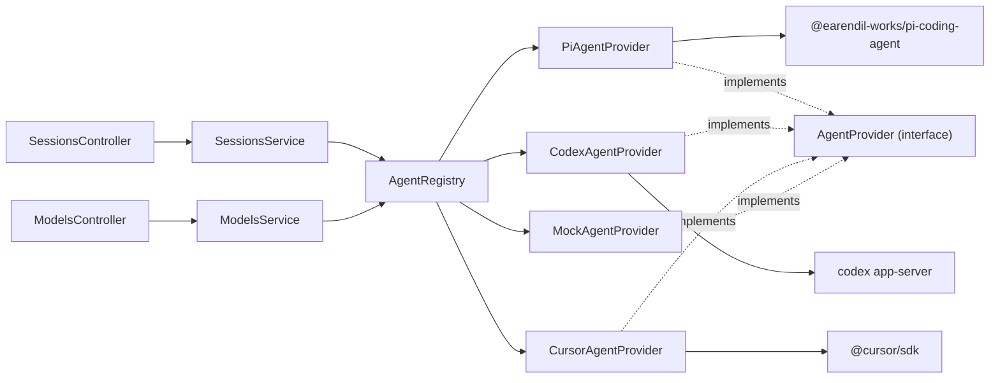

# System Architecture

## Overview

Nuncio is a self-hosted web app for delegating tasks to AI agents. The backend (`apps/server`, NestJS) exposes sessions over HTTP; each session is run by an **agent provider** selected per session. The agent layer is provider-neutral: Pi, Codex, Cursor, and future agent SDKs plug in by implementing one interface.

## Agent provider abstraction

```
apps/server/src/agents/
  agents.types.ts            AgentProvider interface, AgentRunContext, EventEmitter
  agents.base-provider.ts    BaseAgentProvider — template-method run/steer + shared event/error handling
  agents.registry.ts         AgentRegistry — resolves providers, availability, default
  agents.module.ts           Nest wiring
  providers/
    pi-agent.provider.ts     Pi SDK (createAgentSession, AuthStorage, ModelRegistry)
    codex-app-server.client.ts  JSON-RPC client for `codex app-server`
    codex-agent.provider.ts  Codex CLI app-server provider
    cursor-agent.provider.ts Cursor SDK local runtime provider
    mock-agent.provider.ts   Deterministic zero-credential test provider — registered only when NUNCIO_FORCE_MOCK=1, never on a normal boot
```


```mermaid
flowchart LR
    Controller["SessionsController"] --> Service["SessionsService"]
    Service --> Registry["AgentRegistry"]
    ModelsCtrl["ModelsController"] --> ModelsSvc["ModelsService"]
    ModelsSvc --> Registry
    Registry --> Pi["PiAgentProvider"]
    Registry --> Codex["CodexAgentProvider"]
    Registry --> Cursor["CursorAgentProvider"]
    Registry --> Mock["MockAgentProvider"]
    Pi --> PiSDK["@earendil-works/pi-coding-agent"]
    Codex --> CodexCLI["codex app-server"]
    Cursor --> CursorSDK["@cursor/sdk"]
    Pi -.implements.-> Iface["AgentProvider (interface)"]
    Codex -.implements.-> Iface
    Cursor -.implements.-> Iface
    Mock -.implements.-> Iface
```

### Interface

Defined in `apps/server/src/agents/agents.types.ts`.

```typescript
interface AgentCapabilities {
  interrupt: boolean;                          // can abort an in-flight turn
  modelSwitch: 'in-session' | 'restart' | 'none';
  effortSwitch: 'in-session' | 'restart' | 'none';
  images: boolean;                             // accepts image attachments
}

interface AgentProvider {
  readonly id: string;          // 'pi' | 'mock' | ...
  readonly name: string;
  readonly capabilities: AgentCapabilities;
  isAvailable(): Promise<boolean>;
  listModels(): Promise<ModelProviderDto[]>;
  run(sessionId, prompt, ctx: AgentRunContext): Promise<void>;
  steer(sessionId, message, ctx: AgentRunContext): Promise<void>;
  interrupt?(sessionId): Promise<void>;        // present iff capabilities.interrupt
  setModel?(sessionId, model, options?): Promise<void>; // present iff modelSwitch==='in-session'
  dispose(sessionId): void;
  bustCache(): void;
}
```

`AgentRunContext.attachments?: AgentAttachment[]` carries `{ kind: 'image', mimeType, data }` (base64) into a run/steer for providers that declare `images`.

`BaseAgentProvider` (`agents.base-provider.ts`) implements the shared `run`/`steer` orchestration (status RUNNING → user/steer_message → `executePrompt()` → status IDLE, plus error → ERROR) via a template method. Concrete providers implement only `executePrompt()`, `isAvailable()`, `listModels()`, and (optionally) `dispose()`/`interrupt()`/`setModel()`.

### Capabilities (invariants)

`BaseAgentProvider.capabilities` defaults to **all-off**: `{ interrupt: false, modelSwitch: 'none', effortSwitch: 'none', images: false }`. Providers opt in by overriding the field.

| Provider | interrupt | modelSwitch | effortSwitch | images | Notes |
|----------|-----------|-------------|--------------|--------|-------|
| Pi | true | in-session | in-session | true | `pi-agent.provider.ts` overrides all four |
| Codex | false | none | none | false | inherits base defaults |
| Cursor (SDK) | false | none | none | false | inherits base defaults |
| Cursor CLI | false | none | none | false | inherits base defaults |
| Mock | false | none | none | false | inherits base defaults |

- **NEVER** call `provider.interrupt()`/`setModel()` without first checking the matching capability — the methods are optional and absent on providers that don't support them. `SessionsService` guards every call (see below).
- **NEVER** assume a capability is on by default; new providers inherit all-off until they explicitly override.


`AgentRegistry` holds all providers, exposes `all()`, `available()` (async, filters by `isAvailable`), `get(id)` (sync), `getAvailable(id)` (async, throws `BadRequestException` if unavailable), and `defaultId()` (Cursor if configured, then Codex, then Pi; throws `503` when none is configured — Mock is never a default and must be requested explicitly as `provider: "mock"` under `NUNCIO_FORCE_MOCK=1`).

### Per-session selection flow

1. `POST /api/sessions { prompt, provider?, model? }` → `SessionsService.create()`
2. `providerId = input.provider || await registry.defaultId()`; `await registry.getAvailable(providerId)` validates
3. `sessions` row created with `provider` + `model`; `startRun()` calls `registry.getAvailable(provider).run(id, prompt, { emit, model })`
4. `steer`/`archive` resolve the provider from the stored session row. Providers retain or restore their own runtime handle where possible.

## Pi authentication

Pi credentials live in `~/.pi/agent/auth.json` and are read by the Pi SDK's `AuthStorage`, which supports **both**:

- **API key** credentials, and
- **OAuth / subscription** credentials (e.g. ChatGPT Plus/Pro, Anthropic Pro/Max) — tokens auto-refreshed by the SDK with file locking.

`PiAgentProvider.isAvailable()` does NOT use a crude `existsSync` check. It mirrors the synara pattern:

```typescript
const pi = await loadSdk();                       // cached dynamic import
const agentDir = pi.getAgentDir();                // PI_CODING_AGENT_DIR or ~/.pi/agent
const authStorage = pi.AuthStorage.create(join(agentDir, 'auth.json'));
const registry = pi.ModelRegistry.create(authStorage, join(agentDir, 'models.json'));
this.cachedAvailable = registry.getAvailable().length > 0;   // models with configured auth
```

- `getAvailable()` returns models that have auth configured — the accurate "Pi can actually run a model" gate.
- Env override is `PI_CODING_AGENT_DIR` (the SDK's own variable, not a nuncio-invented one).
- The SDK is lazy-loaded (cached promise) so startup stays light. Availability is cached for the process lifetime.
- `createAgentSession` is passed `agentDir`, `authStorage`, `modelRegistry`, and the resolved `model` (see below). Availability is cached for the process lifetime.

## Model wiring

`session.model` is stored as `provider:modelId` (e.g. `codex:gpt-5.5`, `cursor:composer-2`, `anthropic:claude-sonnet-4`). `PiAgentProvider.createPiSession` resolves Pi model ids back to a Pi `Model` via `resolveModelId` (handles both `provider/modelId` slash and `provider:modelId` colon conventions) + `registry.find(provider, id)`, then passes it to `createAgentSession({ model })`. `CodexAgentProvider` strips the `codex:` prefix before sending `turn/start` to the Codex app-server. If a provider cannot resolve the requested model, it falls back to its default. `GET /api/models` aggregates `listModels()` across all available providers.

`GET /api/models` also exposes `capabilities` per provider entry: `ModelsService.list()` (`models.service.ts`) sets `capabilities: entry.capabilities ?? provider.capabilities` on every `ModelProviderDto`, so the frontend can show/hide interrupt, in-session model/effort switch, and image-upload affordances per provider.

### Model context window (real vs. fallback)

`ModelItemDto.contextWindow?: number` (`apps/server/src/models/models.types.ts:16`) carries each model's real token budget through `GET /api/models` to the web client (mirrored as `ModelInfo.contextWindow` in `apps/web/src/lib/model-providers.ts:15`). It powers the per-session context-usage gauge instead of a hard-coded default.

- **Source (Pi).** `PiAgentProvider.fromRegistry` (`pi-agent.provider.ts:284`) reads `registryModel?.contextWindow ?? model.contextWindow` from the Pi `ModelRegistry`. **Sanitize invariant:** the field is emitted **only** when the value is a finite number `> 0` (`validContextWindow`); otherwise it is omitted so the client falls back rather than dividing by a bogus window. NEVER forward `0`, `NaN`, or a negative window onto the DTO.
- **Consumption (web).** `session-detail.tsx:129` resolves the session's model row via `modelById(catalog)[session.model]` and passes `entry?.contextWindow` into `useContextUsage(events, entry?.contextWindow)` (`apps/web/src/lib/use-context-usage.ts:103`).
- **Fallback invariant.** `calculateContextUsage` (`use-context-usage.ts:49`) uses `contextWindow && contextWindow > 0 ? contextWindow : DEFAULT_CONTEXT_WINDOW` where `DEFAULT_CONTEXT_WINDOW = 200_000` (`use-context-usage.ts:7`). An unknown/absent model, or a model whose provider does not report a window, degrades to 200K tokens — the gauge always renders. `percentage` is clamped to `[0, 100]`.
- Static fallback catalog rows (`FALLBACK_PROVIDERS`) carry no `contextWindow`, so offline/test renders use the 200K default by design.

## Pi capabilities (interrupt / live model switch / images)

`PiAgentProvider` (`pi-agent.provider.ts`) declares `{ interrupt: true, modelSwitch: 'in-session', effortSwitch: 'in-session', images: true }` and implements the matching optional methods against the live Pi SDK session handle held in `activeSessions: Map<sessionId, PiSessionHandle>`.

- **`interrupt(sessionId)`** → `session.abort()`. If `session.isStreaming` is false, abort best-effort and return without flagging. If streaming, add the id to `interruptedSessions` *before* awaiting `abort()`; on abort failure the flag is removed and the error rethrown.
- **Stale-flag invariant:** `executePrompt` clears `interruptedSessions.delete(sessionId)` at the **top** (before awaiting the prompt) so a leftover flag from a prior turn can never swallow a later real error. The `catch` only suppresses an error when `interruptedSessions.delete(sessionId)` returns true (i.e. an interrupt for *this* turn). NEVER move that top-of-turn clear below the `await handle.prompt(...)`.
- **`setModel(sessionId, modelId, options?)`** → live `session.setModel(...)` then `session.setThinkingLevel(...)` (effort). No-op when the session isn't active or the model id can't be resolved.
- **Images:** `context.attachments` of `kind: 'image'` are mapped to Pi `{ type: 'image', data, mimeType }` prompt content. Mapped only when present.

**Product intent (do NOT change):** Pi's `setModel` persists to the global `~/.pi/agent/settings.json` (Pi is single-config).

### Pi live session events (`createPiSession` subscribe handler)

`createPiSession` (`pi-agent.provider.ts:214`) wires `session.subscribe` (`pi-agent.provider.ts:275`) to translate live Pi `AgentEvent`s into Nuncio session events, mirroring the working `CursorAgentProvider.handleDelta`. This is the streaming path for a live Pi session (including a `Continue-on-mobile` handoff that is actively streaming). The offline transcript-hydration mapper (`piEntriesToSessionEvents`, below) is the disk/JSONL equivalent; keep the two in sync.

**Per-handle state** (closure vars on the `PiSessionHandle`, reset by `resetAssistantText`): `assistantText`, `accumulatedThinking`, `thinkingOpen`, `thinkingId`, and `openTools: Map<callId, toolName>`.

| Pi `AgentEvent` | Inner type | Nuncio event | Payload |
|-----------------|------------|--------------|---------|
| `message_update` | `text_delta` | `assistant_delta` | `{ delta }` (+ `touchPreview`) |
| `message_update` | `thinking_start` | `thinking_start` | `{ thinkingId }` |
| `message_update` | `thinking_delta` | `thinking_delta` | `{ thinkingId, delta }` (accumulates `accumulatedThinking`) |
| `message_update` | `thinking_end` | `thinking_message` | `{ thinkingId, text }` (`inner.content` ?? `accumulatedThinking`) |
| `tool_execution_start` | — | `tool_start` | `{ callId: toolCallId, tool: toolName, input: truncatePayload(args).value }` |
| `tool_execution_end` | — | `tool_end` | `{ callId: toolCallId, tool: toolName, isError, output: truncatePayload(result).value }` |
| `agent_end` | — | seals open tools | see below |

**Invariants / NEVER**

- **Preserve `callId`.** `tool_start` and `tool_end` MUST carry `callId` (from `toolCallId`) so the web parser's `tool_end` reach-back (`state.out.findIndex(b => b.callId===…)`) can flip the matching row from `Running…` to done. NEVER drop `toolCallId`. A `tool_execution_start` with no string `toolCallId` synthesizes a `crypto.randomUUID()` and registers it in `openTools`.
- **Preserve `args`/`result`.** `input` is emitted **only** when `args !== undefined`; `output` **only** when `result !== undefined` (both through `truncatePayload`). Pi tool arg keys already match `tool-summary.ts` (bash→`command`; read/grep/find/ls→`path`/`pattern`/`offset`/`limit`), so the summary and the expandable command view render without a Pi-specific shim. NEVER emit a bare `tool_start` with no `input` when args are present — the row would show only `Ran` and not expand.
- **Thinking is inline, not appended.** Reasoning is emitted as its own `thinking_*` events **as it streams**, so it renders in chronological position, NOT as a bottom `Thought for Ns` block. `ensureThinkingStarted` (`pi-agent.provider.ts:261`) allocates a stable `thinkingId = crypto.randomUUID()` per segment and emits `thinking_start` before any delta; `thinking_end`/`thinking_message` then `resetThinking()`. NEVER fold thinking into `assistantText` — it must stay OUT of the accumulated assistant text or the final `assistant_message` would duplicate it.
- **Stuck-running safety net (`sealOpenTools`, `pi-agent.provider.ts:268`).** Any `callId` still in `openTools` is sealed by emitting a `tool_end` `{ callId, tool, isError: false }`, then `openTools.clear()`. It fires on the `agent_end` event AND in `executePrompt`'s `finally` (`pi-agent.provider.ts:189`), so an interrupted or missed `tool_execution_end` can never leave a phantom `Running…` row. NEVER return from a turn without sealing open tools.

**Symptom → fix map (shipped):**

| Reported symptom | Cause | Fix |
|------------------|-------|-----|
| Tool row shows only `Ran`, not expandable | `toolCallId`/`args` dropped | emit `callId` + `input` on `tool_start` |
| Row stuck on `Running…` after tool finished | missed/dropped `tool_execution_end` | `sealOpenTools` on `agent_end` + `executePrompt` finally |
| Thinking rendered as bottom `Thought for Ns` block | no `thinking_*` events emitted | emit `thinking_start`/`thinking_delta`/`thinking_message` inline | The integration suite snapshots and restores that file in `beforeAll`/`afterAll`, so a test run leaves it byte-identical.

## Codex app-server provider

The Codex provider runs the local Codex CLI app server over stdio. `CodexAppServerClient` owns the JSON-RPC line protocol: request/response correlation, notifications, server-initiated requests, and pending-request cleanup on process exit.

- Availability resolves the CLI before launch: explicit `NUNCIO_CODEX_BIN` wins; otherwise Nuncio scans common install paths and `PATH`, probes `--version` and `login status`, auto-selects one logged-in install, and rejects multiple logged-in installs until the setting is made explicit. It does not make an LLM call.
- Model discovery uses `model/list` after `initialize`, with GPT-5.5/GPT-5.4 fallback rows if discovery is unavailable.
- New sessions call `thread/start`; follow-ups reuse `sessions.provider_thread_id` through `thread/resume`.
- Turns use `turn/start`; dispose/archive sends `turn/interrupt` when a turn is active.
- `item/agentMessage/delta` maps to the shared `assistant_delta`; `turn/completed` emits the final `assistant_message`.
- Runtime state lives on the session row: `provider_thread_id`, `provider_active_turn_id`, and `provider_state_json`.
- Default runtime mode is local `full-access` (`approvalPolicy: "never"`, danger-full-access sandbox). `NUNCIO_CODEX_RUNTIME_MODE=approval-required` switches to read-only/untrusted mode and routes app-server approval requests through the provider-agnostic Nuncio approval flow.
- Provider approval requests are stored in SQLite (`provider_requests`) and emitted as `provider_request` events with a `requestId`; `POST /api/sessions/:id/provider-requests/:requestId/respond` appends `provider_request_resolved` and resolves the provider's pending Promise.
- If the server restarts while a request is pending, the new service instance marks stale pending rows denied with reason `server_restarted`; the transcript gets a resolved event instead of leaving an unanswerable approval card pending forever.

## Sessions domain layout

```
apps/server/src/sessions/
  api/         sessions.controller.ts        HTTP adapter
  domain/      sessions.types.ts, sessions.fsm.ts   types + pure FSM
  persistence/ sessions.repository.ts, events.repository.ts, provider-requests.repository.ts
  sessions.module.ts, sessions.persistence.module.ts, sessions.service.ts
```

Session FSM: `CREATED → RUNNING → IDLE | ERROR | PAUSED`; `IDLE/PAUSED → RUNNING` (steer); `IDLE/PAUSED/ERROR → ARCHIVED` (terminal). FSM, event log, and provider approval request state persist in SQLite; the `provider` and provider-runtime columns are added with idempotent `ALTER TABLE` migrations for existing databases.

### Capability-guarded session endpoints

`sessions.controller.ts` / `sessions.service.ts`:

- **`POST /api/sessions/:id/interrupt`** → `SessionsService.interrupt(id)`. Resolves the provider for the stored session row and throws `BadRequestException` unless `provider.capabilities.interrupt && provider.interrupt`; otherwise calls `provider.interrupt(id)`.
- **`PATCH /api/sessions/:id/model`** (body `{ model, options? }`) → `SessionsService.setSessionModel(id, model, options)`. **Order invariant:** when `capabilities.modelSwitch === 'in-session' && provider.setModel`, the live switch (`provider.setModel`) runs **BEFORE** persisting the row via `sessions.updateModel(...)`. NEVER persist the model row before the live switch — a failed live switch must not leave the DB pointing at a model the running session never adopted.
- **Attachments** are threaded through `POST /api/sessions` (create) and `POST /api/sessions/:id/steer` as `attachments?: AgentAttachment[]`, passed into `run`/`steer` via `AgentRunContext.attachments`.
- **Body limit:** `main.ts` sets the Nest `json`/`urlencoded` body limit to `25mb` via `app.useBodyParser(...)` so base64 image attachments fit. Native Nest body-parser config is used (not `import 'express'`) because `express` is only a transitive dep and is not resolvable as a bare specifier under Bun's isolated module store.

## App bootstrap (`main.ts`)

`NestFactory.create<NestExpressApplication>(AppModule, { rawBody: true })` (`main.ts:42`). The bootstrap composes **two independent concerns** that must coexist:

- **`rawBody: true`** preserves the exact request bytes on `req.rawBody` so inbound forge webhooks can verify their signature over the unmodified payload (`webhooks.controller.ts` reads `req.rawBody`). NEVER remove `rawBody: true` — webhook HMAC/`x-gitlab-token` verification depends on byte-exact bodies, and a re-serialized JSON body will fail verification.
- **Body-parser limit** (`useBodyParser('json' | 'urlencoded', { limit: '25mb' })`) for base64 image attachments.

Order is `create({ rawBody })` → `setGlobalPrefix('api')` → `enableCors({ origin: true })` → `useBodyParser(...)` → `configureWebAppServing(app)` (`main.ts:54`). Both the global `/api` prefix and CORS stay as-is; webhook routes live under `/api/webhooks/forge/:provider`. **Order invariant:** `configureWebAppServing` runs **after** `setGlobalPrefix`/`enableCors`/`useBodyParser` and its middleware never touches `/api/*` (see below), so rawBody, body-parser limits, CORS, and webhook HMAC-over-rawBody are all unaffected. NEVER move static serving before the body-parser/rawBody wiring.

## Authentication (remote access)

Every `/api` route sits behind a global `AuthGuard` (`apps/server/src/auth/`). The model is
**loopback-exempt token auth**: connections from the same machine (`127.0.0.1` / `::1` /
`::ffff:127.0.0.1`) are always trusted — the desktop app and local dev need zero configuration —
while any non-loopback client must present the server's access token.

```
apps/server/src/auth/
  auth-token.service.ts  AuthTokenService — owns the single access token
  auth-request.ts        pure helpers: bearerToken, cookieToken, isAuthorizedRequest (loopback OR token)
  auth.guard.ts          global APP_GUARD over every /api route
  auth.controller.ts     POST /api/auth/login (sets cookie), GET /api/auth/status — both @Public()
  public.decorator.ts    @Public() opt-out for routes that carry their own auth
```

- **Token resolution** (`AuthTokenService`): `NUNCIO_AUTH_TOKEN` env → persisted `<dataDir>/auth-token`
  → generated (`randomBytes(24).toString('base64url')`) and persisted with mode `0600`. The active
  token and its source are printed once at boot (`main.ts`).
- **Constant-time validation:** both sides are sha256-hashed before `timingSafeEqual`, so an
  arbitrary-length candidate can neither error nor leak timing. NEVER compare the raw token with
  `===` or unhashed `timingSafeEqual`.
- **Cookie flow:** `POST /api/auth/login { token }` sets `nuncio_token` — HttpOnly (script-inaccessible),
  `SameSite=Lax` (the CSRF control for cookie auth), `Path=/`, 1-year `Max-Age`, `Secure` only when
  the request arrived over https. The cookie is what lets EventSource (SSE) and the terminal
  WebSocket authenticate — neither can set an `Authorization` header. Per-request
  `Authorization: Bearer <token>` also works for API clients.
- **`@Public()` routes:** `/api/auth/login` + `/api/auth/status` (auth bootstrap), `/api/health`
  (nothing sensitive; the desktop daemon supervisor polls it), and `/api/webhooks/forge/:provider` —
  the webhook keeps its own HMAC/`x-gitlab-token` verification over the raw body and is called by
  GitHub/GitLab from remote IPs, so the guard must NEVER block it. NEVER add `@Public()` to a new
  route unless it carries its own auth or exposes nothing sensitive.
- **Web client:** `AuthGate` (`apps/web/src/components/auth-gate.tsx`, mounted around `<App/>` in
  `main.tsx`) checks `GET /api/auth/status` on boot; unauthenticated → token form → `login()`
  (`apps/web/src/lib/auth-api.ts`) → cookie → app. If the status check itself fails (server
  unreachable), the gate fails open and lets the app surface its own connection errors — enforcement
  lives on the server regardless.
- Static SPA assets are intentionally **not** guarded (app shell only; all data is behind `/api`).
- **NEVER** store the token in localStorage or expose it to page scripts — the HttpOnly cookie is
  the client-side storage.
- **`GET /api/auth/token`** (guarded, non-public) returns `{ token, source }` so an
  already-authenticated client (the Remote access settings section) can hand the token to another
  device. NEVER make this route `@Public()`.

### Tailscale auto-trust (`apps/server/src/tailscale/`)

A third acceptance path in the same guard chain: a non-loopback request whose address is a tailnet
address (IPv4 CGNAT `100.64.0.0/10` or ULA `fd7a:115c:a1e0::/48`) is trusted **iff** `tailscale
whois --json <ip>` proves the peer node belongs to the **same Tailscale account** as this server
(`whois UserProfile.ID === status Self.UserID`). Identity comes from WireGuard, not from the IP
string. Order in the guard: public → loopback/token (sync) → tailscale trust (async).

```
apps/server/src/tailscale/
  tailscale.service.ts     TailscaleService — CLI discovery, status(), isTrustedRemote(); exec seam for tests
  tailscale.controller.ts  GET /api/tailscale/status (guarded)
  tailscale.types.ts       TailscaleStatusDto / TailscalePeerDto (sameUser flag)
  tailscale.module.ts      imports SettingsModule, exported to AuthModule + main.ts (terminal WS)
```

- **Toggle:** setting `NUNCIO_TAILSCALE_AUTO_TRUST` (registry, boolean, default `'1'`). Resolved
  per request via `SettingsService.resolve` — flipping it in Settings applies immediately, no
  restart. `'0'` disables all tailscale trust.
- **Same-account only.** Peers of other tailnet users (shared nodes, other members) and tagged
  nodes fail the UserID equality and fall back to token auth. NEVER widen to "any tailnet peer".
- **Cheap early-outs:** toggle off, non-tailnet address, or missing CLI return false without
  spawning a subprocess; whois and self-UserID results are cached for 60s per address.
- **CLI discovery:** `NUNCIO_TAILSCALE_BIN` env → PATH `tailscale` → Homebrew/`/usr/bin`/macOS app
  bundle paths; probed once with `<bin> version`, cached for the process lifetime. Absent CLI →
  `status()` reports `installed: false` and trust always refuses.
- The terminal WS upgrade (`isAuthorizedTerminalUpgrade`) takes the same trust checker as an
  optional fourth wire from `main.ts`, so a trusted tailnet device gets the remote terminal
  without a cookie.
- **Web:** `RemoteAccessSettingsSection` (`apps/web/src/components/remote-access-settings-section.tsx`,
  rendered by `settings-view.tsx`) shows the access token (reveal/copy via `GET /api/auth/token`),
  tailscale state, the auto-trust toggle (writes the setting), and the tailnet device list with
  Trusted/Token-required badges; online peers are probed at `http://<dnsName>:3000/api/health`
  (public + CORS) and get an Open link when a nuncio server responds. The
  `NUNCIO_TAILSCALE_AUTO_TRUST` row is filtered out of the General settings list — the section owns it.
- **Tests:** `apps/server/test/unit/tailscale/tailscale.service.spec.ts` (address ranges, status
  parsing with sameUser, trust matrix incl. no-subprocess early-outs and whois caching) and
  `apps/web/src/components/remote-access-settings-section.spec.tsx` (badges, toggle, install hint,
  token reveal).

**Tests:** `apps/server/test/unit/auth/` (token generation/persistence/0600 mode, env override,
constant-time validation, header/cookie parsing, guard allow/deny matrix) and
`apps/server/test/unit/terminal/terminal.ws.auth.spec.ts` (upgrade authorization matrix);
`apps/web/src/components/auth-gate.spec.tsx` (gate render, login success/failure, fail-open).

## Hub mode (reach many machines through one URL)

A nuncio server with **hub mode** on (setting `NUNCIO_HUB_MODE`, default off) also
proxies `/m/<machine>/…` to your other tailnet machines running nuncio — one front door
for N machines. Each machine stays a full, directly-reachable nuncio; the hub is a
convenience layer, not a single point the others depend on.

```
apps/server/src/hub/
  hub-routing.ts          parseHubPath + resolveMachineTarget — pure, SSRF-guarded
  hub-registry.service.ts auto-discovers same-account tailnet peers running nuncio
  hub.service.ts          enabled() — reads NUNCIO_HUB_MODE
  hub.proxy.ts            configureHubProxy — HTTP + SSE streaming proxy (buildProxyRequest is pure)
  hub.ws-proxy.ts         attachHubWebSocketProxy — terminal WS relay
  hub.controller.ts       GET /api/hub/machines (switcher data)
```

- **Path routing, not cookies.** The machine lives in the URL path (`/m/<machine>/api/…`),
  so per-tab parallelism is natural (two tabs = two machines) and SSE/WebSocket carry the
  target automatically — `EventSource`/`WebSocket` cannot set a routing header. This is why
  routing is path-based.
- **SSRF guard (the review priority).** `<machine>` is untrusted URL input. `parseHubPath`
  charset-validates it; `resolveMachineTarget` maps it **only** against the discovered
  registry — an unknown name resolves to null (404), never to a constructed URL. NEVER build
  a proxy target from the path segment directly.
- **Auto-discovery.** `HubRegistryService` lists same-account, online tailnet peers (from
  `TailscaleService.status`) that answer `GET /api/health`, plus self; cached ~15s. This
  registry is the sole source of proxy targets. Machine id = MagicDNS first label.
- **Hub→machine auth = tailnet identity, client auth at the hub edge.** The hub dials the
  target over its MagicDNS name, so the target sees the hub's tailnet address and trusts it
  via whois (same-account). Because of that trust, the hub itself authorizes every proxied
  request and WS upgrade (same loopback/token/whois rule as `/api`; `isAuthorizedHubRequest`
  in `hub.proxy.ts`) before relaying — otherwise an unauthenticated client could reach any
  machine through the hub. Target paths that are `@Public` on the machine (`/api/auth/login`,
  `/api/health`, `/api/webhooks/*`) pass the edge without credentials.
- **Streaming.** `configureHubProxy` reads the upstream `fetch` body with a reader and
  `res.write`s chunks as they arrive — SSE must not be buffered. `attachHubWebSocketProxy`
  relays terminal AND session-relay frames (`/api/terminal`, `/api/sessions/ws` — see
  docs/ws-relay-contract.md) verbatim both ways (buffering client frames until the upstream
  WS opens). Both run before static serving / the local WS handlers and ignore non-hub
  paths, so the hub is also a normal nuncio for its own machine at the root.
- **Frontend base path.** `apps/web/src/lib/api-base.ts`: `resolveBasePath(location.pathname)`
  yields `/m/<machine>` (or `''` when served directly). `installApiBaseFetch` wraps `fetch`
  once to prefix `/api` calls; SSE/WS use `withBase`/`toWsUrl`; `BrowserRouter` gets the
  basename. `MachineSwitcher` (sidebar) queries the **hub itself** (origin-absolute, bypassing
  the rewrite) so it persists at `/m/<machine>/`, and links each machine at `/m/<name>/` as a
  plain anchor (cmd-click → parallel tab).
- **Deferred:** a single aggregated session list across machines (one pane for all). The
  current model is per-machine context, which matches how delegation works.
- **Tests:** `apps/server/test/unit/hub/*` (routing/SSRF, registry discovery, request build);
  `apps/web/src/lib/api-base.spec.ts` + `machine-switcher.spec.tsx`. Live-verified end to end
  through a real browser (switcher, proxy, SSE, terminal WS, SSRF 404).

## Single-port web serving (`web-static-assets.ts`)

`configureWebAppServing(app, distPath?)` (`apps/server/src/web-static-assets.ts:16`) makes the daemon serve the built Vite SPA (`apps/web/dist`) as same-origin static assets, so the UI and API share one port with no Vite dev proxy. This is the keystone for the Electron shell (loads `http://localhost:PORT` directly) and a future remote web deployment.

- **Dist path resolution.** `resolveWebDistPath()` (`web-static-assets.ts:8`) returns `resolve(__dirname, '../../web/dist')` — an absolute path anchored to the **module location**, NOT `process.cwd()`. This survives dev, a different cwd, and later Electron packaging. NEVER switch this to a `process.cwd()`-relative path.
- **No-op guard.** `configureWebAppServing` returns `false` and wires nothing when `rootPath` or `rootPath/index.html` is absent (`existsSync`). So in local dev (`bun run dev`, no build) and any environment without a built web app, static serving is inert and `/api` boots normally. Returns `true` when serving is active.
- **Two middlewares, both `/api`-guarded.**
  1. `express.static(rootPath, { fallthrough: true, index: false })` gated by `!isApiRequest(req)` — serves real files (`/assets/*.js`, etc.). `fallthrough: true` lets a non-matching path continue to the SPA fallback.
  2. SPA fallback: for non-`/api` `GET`/`HEAD` requests, `res.sendFile(indexPath)` returns `index.html` so react-router deep-links and hard refreshes resolve client-side.
- **`/api` precedence invariant.** `isApiRequest(req)` (`web-static-assets.ts:12`) is true when `req.path === '/api'` or starts with `/api/`. **Both** middlewares `next()` immediately for API requests, so static serving can NEVER shadow or intercept a Nest route. A missing `/api/*` route still returns the Nest JSON 404 (`Cannot GET /api/...`), NOT `index.html`. NEVER let the SPA fallback answer an `/api` path — a build fixture may contain an `api/health` file, and it must still be shadowed by the live Nest handler.

**State transitions (per request, when dist present):**

| Request | Outcome |
|---------|---------|
| `GET /api/*` (known) | Nest controller (JSON) |
| `GET /api/*` (unknown) | Nest JSON 404 — never HTML |
| `GET /assets/app.js` (file exists) | static file, real content-type |
| `GET /sessions/deep-link` (no file) | `index.html`, `text/html` (SPA) |
| `POST` non-`/api` | falls through (no SPA rewrite for non-GET/HEAD) |

**Tests.** `apps/server/test/unit/web-static-assets.spec.ts` (bun test) uses a temp fixture dist to prove: (a) app route → `index.html`/`text/html`, (b) static asset served, (c) `/api` route stays on the Nest handler even when a matching static file exists, (d) missing `/api` route → JSON 404 (not HTML), (e) dist absent → app still boots and `/api` works.

## Persistent browser profile dock

`BrowserPanel` (`apps/web/src/components/browser-panel.tsx`) is desktop-only. If
`window.nuncioDesktop?.browser` exists, the panel asks the Electron main process
to mount a native `BrowserView` over the measured React viewport rectangle. The
desktop bridge lives in `apps/desktop/src/preload.js` and exposes only `show`,
`navigate`, `reload`, `resize`, and `hide`; the main process owns `BrowserView`
instances in `apps/desktop/src/main.js`.

All desktop browser views share Electron's persistent
`persist:nuncio-browser` partition, giving the dock real cookies, cache,
localStorage, and session storage without using the user's daily Chrome profile.
The session header only shows the Browser toggle when that desktop bridge is
available. The web/PWA surface does not expose a browser dock because browsers
cannot iframe or embed arbitrary sites as a real browser child, and Nuncio does
not present a streamed remote-browser viewport there.

**Invariant:** never use the user's daily Chrome profile and never launch a
normal external Chrome window for the dock. The browser dock is available only
through the desktop bridge.

## Desktop server profiles (connect the shell to a remote nuncio)

The Electron shell can load either its own local daemon or a saved remote nuncio server
(`apps/desktop/src/server-profiles.js` + wiring in `main.js`). Profiles persist at
`<userData>/servers.json` as `{ lastUsed: 'local' | url, servers: [{ name, url }] }`.

- **Boot:** the local daemon ALWAYS starts (it is the permanent fallback); then the shell loads
  `lastUsed` — the remembered remote if set, else the local URL.
- **Escape hatch invariant:** `did-fail-load` on the main frame (ignoring `-3`/ERR_ABORTED) while a
  remote target is active falls back to `connectToServer('local')`. This is mandatory — the web UI
  is served BY the remote server, so a dead remote would otherwise strand the shell on an
  unloadable page with no UI to switch back. NEVER remove the fallback.
- **Native "Server" menu** (`rebuildServerMenu`): radio items for "This Mac (local)" + each saved
  server; rebuilt on every switch. All Menu/`app.getPath` usage is guarded (`Menu?.`, `typeof
  app.getPath === 'function'`) so `main.js` still boots in the bun-test vm sandbox where the
  electron stub provides neither.
- **IPC / preload:** `servers:list` → `{ current, localUrl, servers }`; `servers:connect(target)`
  (`'local'` or a URL — normalized via `normalizeServerUrl`, upserted into profiles, persisted,
  loaded). Exposed as `window.nuncioDesktop.servers = { list, connect }` (type
  `NuncioDesktopServersApi` in `use-session-notifications.ts` — the single `declare global`).
- **Web integration:** in the Remote access settings section, a tailnet peer running nuncio shows
  **Connect** (switch the shell in place via `servers.connect`) when the desktop bridge exists,
  else the plain **Open** link (new tab). Combined with Tailscale auto-trust, switching servers
  inside the desktop app needs no token.
- `server-profiles.js` is pure/filesystem-defensive: missing or corrupt `servers.json`, or a
  missing `userData` path, degrade to in-memory defaults — never a boot failure.
- **Tests:** `apps/desktop/test/server-profiles.test.js` (normalize/load/save/upsert) and the
  `servers:connect` behavior test in `main-dev-mode.test.js` (switch → list → back to local →
  invalid URL refused).

## Integrated terminal (dual backend)

The session view hosts a real interactive terminal with **two independent backends** selected at runtime by the web panel: (A) **desktop** = `node-pty` in the Electron main process over IPC; (B) **browser** = a **Bun-native PTY** exposed over a loopback-only WebSocket. There is **ZERO** shared PTY transport between them — the panel picks one per mount and falls back desktop→browser on failure. This exists because `node-pty` FAILS under Bun (`posix_spawnp failed`), so the server cannot use it; Bun 1.3.14's native `Bun.spawn(..., { terminal })` PTY is used server-side instead, and `node-pty` runs only in Electron main (rebuilt via `@electron/rebuild`).

```
apps/server/src/terminal/
  terminal.module.ts     TerminalModule — provides + exports TerminalService (registered in app.module.ts:28)
  terminal.service.ts    TerminalService — Map<id, {proc, terminal}> over Bun-native PTY
  terminal.ws.ts         attachTerminalWebSocketServer — loopback-only WS bootstrap on /api/terminal
  loopback.ts            isLoopbackAddress — pure, testable security guard
```

### Server backend — Bun-native PTY (`terminal.service.ts`)

`TerminalService` (`terminal.service.ts:34`, `@Injectable`, `OnModuleDestroy`) owns three maps keyed by connection id: `entries` (`{ proc, terminal }`), `outputSinks`, and `exitSinks`. The WS layer registers the sinks **before** `create()` so no output is lost.

- **`create({ id, cwd?, cols?, rows? })`** (`terminal.service.ts:47`) → `this.kill(id)` first (idempotent replace), then `Bun.spawn([shell], { cwd, terminal: { cols, rows, name: 'xterm-256color', data, exit } })`. `shell = process.env.SHELL || 'bash'`. The `data` callback decodes `string | Uint8Array` (via a `TextDecoder`) and forwards to `outputSinks.get(id)`. The `exit` callback fires `exitSinks.get(id)` then deletes all three map entries for the id. Empty `id` is ignored.
- **`write(id, data)`** (`terminal.service.ts:82`) — ignores non-string data and unknown ids.
- **`resize(id, cols?, rows?)`** (`terminal.service.ts:87`) — no-op on unknown id.
- **`kill(id)`** (`terminal.service.ts:93`) — deletes the maps then `terminal.close()` inside try/catch (the exit callback may have closed it already).
- **`killAll()`** (`terminal.service.ts:106`) iterates a copied key list; **`onModuleDestroy()`** (`terminal.service.ts:112`) calls it so Nest shutdown reaps every PTY.

**Validation invariants (pure helpers, exported for tests):**

- **`normalizeCwd(cwd)`** (`terminal.service.ts:116`) — returns `cwd` only when `existsSync(cwd) && statSync(cwd).isDirectory()`; **any** miss or thrown stat falls back to `os.homedir()`. NEVER spawn a PTY in a non-existent/undefined cwd.
- **`coerceDimension(value, fallback)`** (`terminal.service.ts:129`) — coerces to a finite int and clamps to `[1, 1000]` (defaults `DEFAULT_COLS = 80`, `DEFAULT_ROWS = 24`). Non-finite → fallback. All cols/rows entering `create`/`resize` pass through this.

### Transport — auth-guarded WebSocket (`terminal.ws.ts`, `loopback.ts`)

`attachTerminalWebSocketServer(httpServer, terminalService, authTokens)` (`terminal.ws.ts`) is called from `main.ts` **after** `app.listen(...)`, on the raw Node server (`app.getHttpServer()`). It creates `new WebSocketServer({ noServer: true })` and listens for `'upgrade'`.

- **Path scoping.** Only `URL(req.url).pathname === '/api/terminal'` is handled; **all other upgrade paths are left untouched** (early `return`, no `socket.destroy`) so other WS consumers — and the untouched SSE stream — are unaffected. NEVER `handleUpgrade` or destroy a non-`/api/terminal` upgrade.
- **UPGRADE AUTHORIZATION** (`isAuthorizedTerminalUpgrade`, `terminal.ws.ts` + `loopback.ts:1`). `isLoopbackAddress(remoteAddress)` returns `true` **only** for `'127.0.0.1'`, `'::1'`, `'::ffff:127.0.0.1'`; loopback upgrades always pass with no token. A non-loopback upgrade must carry the server access token — auth cookie or `Authorization: Bearer` header, validated by `AuthTokenService` — the same rule the global HTTP `AuthGuard` enforces on `/api` routes (see "Authentication (remote access)"). Anything else → `socket.destroy()` (no handshake). When `attachTerminalWebSocketServer` is called without a token validator, remote upgrades are refused outright. **NEVER** widen `isLoopbackAddress`, and **NEVER** admit a remote upgrade without a valid token.

**Per-connection protocol (JSON text frames), one PTY per socket:**

| Direction | Frame | Effect |
|-----------|-------|--------|
| client→server | `{ type: 'start', cwd?, cols, rows }` | `killTerminal()` any prior, `terminalId = randomUUID()`, wire output/exit sinks to `ws.send`, then `terminalService.create(...)` |
| client→server | `{ type: 'input', data }` | `terminalService.write(id, data)` (string only) |
| client→server | `{ type: 'resize', cols, rows }` | `terminalService.resize(id, cols, rows)` |
| server→client | `{ type: 'data', data }` | streamed PTY output (only when `ws.readyState === OPEN`) |
| server→client | `{ type: 'exit', code }` | PTY exit |

- **Pre-`start` / malformed guard** (`terminal.ws.ts:49`, `:79`): a `JSON.parse` failure is swallowed (`return`); any `input`/`resize` before a successful `start` is dropped (`if (!terminalId) return`). One id is generated per connection; a second `start` kills and replaces the prior PTY.
- **Lifecycle:** `ws` `'close'` and `'error'` both call `killTerminal()` → `terminalService.kill(id)`, so a dropped socket never leaks a PTY.

### Desktop backend — node-pty over IPC (`apps/desktop/src/main.js`, `preload.js`)

Independent of the server WS. Mirrors the existing `registerNotifyHandler` pattern; `registerTerminalHandlers()` (`apps/desktop/src/main.js:169`) is wired in `app.whenReady()` (`main.js:236`). A module-level `terminalPtys = new Map()` (`main.js:13`) holds one `node-pty` handle per id.

- **`ipcMain.handle('terminal:create', ...)`** (`main.js:170`) **LAZY-requires** `node-pty` **inside the handler** (`main.js:181`). This is mandatory: `main.js` must load under `bun test` where the native addon is absent, so `node-pty` is NEVER required at module top-level. A require failure throws `node-pty unavailable: …`; a spawn failure throws `node-pty spawn failed: …` — either rejection lets the renderer fall back to the server WS.
- `shell = process.env.SHELL || (process.platform === 'win32' ? 'powershell.exe' : 'bash')`. Inputs validated by `normalizeTerminalCwd` (`main.js:130`, existing-dir-or-`os.homedir()`) and `coerceTerminalDimension` (`main.js:146`, finite-int clamp, defaults 80/24). PTY `onData`/`onExit` forward to the renderer via `mainWindow.webContents.send('terminal:data' | 'terminal:exit', { id, ... })` (`main.js:205`).
- **`terminal:write` / `terminal:resize` / `terminal:kill`** (`main.js:216`/`:221`/`:228`) ignore unknown ids and non-string ids; resize re-coerces dimensions.
- **Reaping:** `killAllTerminalPtys()` (`main.js:163`) runs on window `'closed'` (`main.js:29`) AND in the existing `before-quit` path (`main.js:281`). NEVER leave a desktop PTY running past window close/quit.
- **Preload bridge** (`apps/desktop/src/preload.js:7`) extends the existing `contextBridge.exposeInMainWorld('nuncioDesktop', {...})` object with `terminal: { create, write, resize, kill, onData(cb)→unsubscribe, onExit(cb)→unsubscribe }`. Commands use `ipcRenderer.invoke`; `onData`/`onExit` wrap `ipcRenderer.on` and return `removeListener` unsubscribers. **Electron posture unchanged:** `contextIsolation: true`, `nodeIntegration: false`, no remote module — all native PTY access stays in main, the renderer only sees IPC.

### Web panel (`terminal-panel.tsx`) — backend selection + fallback

`<TerminalPanel cwd?={string} />` (`apps/web/src/components/terminal-panel.tsx:13`) mounts an `@xterm/xterm` `Terminal` + `@xterm/addon-fit` `FitAddon` into a ref div, with a unique `terminalId` per mount (`createTerminalId`, crypto UUID with a `Date.now()`+random fallback). Input/resize are routed through `sendInputRef`/`sendResizeRef` so the same xterm wiring drives either backend. A `ResizeObserver` calls `fitAddon.fit()` then sends a resize.

**Backend selection (state transition):**

1. If `window.nuncioDesktop?.terminal` exists **AND** `shouldUseDesktopTerminal(location.hostname)` (loopback hostnames only: `localhost`/`127.0.0.1`/`::1`/`[::1]`) → subscribe `onData`/`onExit` (filtered by `payload.id === terminalId`), then `create({ id, cwd, cols, rows })`. On resolve, wire `sendInput`/`sendResize` to IPC `write`/`resize`. **On reject/throw → `cleanupBackend()` then `startWebSocketBackend()`** (desktop→browser fallback). **Remote-origin invariant:** when the desktop shell is connected to a remote server (non-loopback origin), the node-pty backend would open a shell on the WRONG machine (the client, not the machine holding the project) — the WS backend MUST win. NEVER pick the IPC backend on a non-loopback origin.
2. Otherwise (or on fallback) → `new WebSocket(location.origin.replace(/^http/, 'ws') + '/api/terminal')`; `onopen` sends `{ type: 'start', cwd, cols, rows }`; `onmessage` dispatches `data`→`term.write` and `exit`→notice; `term.onData`→`ws.send({ type: 'input' })`.

**Invariants / NEVER**

- **The desktop placeholder is NO LONGER the default** — the browser now has a real PTY, so a non-desktop mount opens the WS terminal rather than showing a "desktop only" message.
- A **non-fatal notice** ("Terminal disconnected — the in-browser terminal only works on this machine") renders ONLY on WS `error`/`close`/`exit`; it never blocks the panel.
- **jsdom-safe:** FitAddon only. NEVER load the WebGL/canvas addon — tests run under jsdom with no canvas/WebGL. The spec (`terminal-panel.spec.tsx`) `vi.mock`s `@xterm/xterm` and `@xterm/addon-fit` to keep jsdom clean.
- On unmount: dispose the xterm, run `backendCleanup` (kill IPC PTY / close WS), disconnect the observer, dispose the input listener, and reset the send refs.

### Session-view integration (`session-detail.tsx`) — strictly additive

The terminal wiring in `session-detail.tsx` is **ADDITIVE ONLY** and MUST NOT touch the SCM aside, review-changes, or pr-panel usage: one import (`SquareTerminal`, `session-detail.tsx:2` + `TerminalPanel`, `:16`), one `terminalOpen` state (`:89`), one header toggle Button mirroring the `scmOpen`/`GitBranch` button (`:267`, with `aria-label`/`aria-pressed`/Tooltip), and one bottom-docked conditional panel (`:520`) mounting `<TerminalPanel cwd={session.worktreePath ?? session.workspace ?? session.projectPath ?? undefined} />`. The single `declare global { interface Window { nuncioDesktop?: {...} } }` in `apps/web/src/lib/use-session-notifications.ts:19` is the **single source of truth** for the optional `terminal` API type (`NuncioDesktopTerminalApi`); NEVER add a duplicate `declare global` elsewhere.

### Dependencies & build

- Server: `ws` (dependency, pure-JS, Bun-compatible) + `@types/ws` (devDep).
- Web: `@xterm/xterm` + `@xterm/addon-fit`.
- Desktop: `node-pty` (dependency) + `@electron/rebuild` (devDep); `postinstall` and `rebuild` scripts run `electron-rebuild -w node-pty` so the native addon matches the Electron (Node 24) ABI.

### Tests

- **Server** (`apps/server/test/unit/terminal/terminal.service.spec.ts`, bun test): drives a real Bun PTY with a known cwd, echoes `NUNCIO_PTY_OK`, asserts the streamed data contains it; asserts `resize()`/`kill()` don't throw; asserts `isLoopbackAddress` accepts `127.0.0.1`/`::1`/`::ffff:127.0.0.1` and rejects `192.168.1.5`. Fast, small timeout, always kills.
- **Web** (`apps/web/src/components/terminal-panel.spec.tsx`, vitest): `vi.mock`s xterm + fit-addon; (a) with a mock `window.nuncioDesktop.terminal`, asserts `create()` called on mount and `onData` subscribed; (b) with no desktop bridge, asserts a mocked global `WebSocket` is built at `/api/terminal` and a `{ type: 'start' }` frame is sent on open.
- **Desktop** bun tests stay green because `node-pty` is lazy-required inside the handler (never at load); desktop lint remains a no-op.

**NEVER (terminal):** NEVER use `node-pty` in `apps/server` (fails under Bun); NEVER require `node-pty` at `main.js` top-level (breaks bun tests); NEVER change the `0.0.0.0` bind — remote terminal upgrades require the nuncio access token while loopback stays token-free (see "Authentication (remote access)"); NEVER modify the SSE stream; NEVER touch git code paths — the terminal feature ships with zero git changes.

## Session File Explorer (root-confined file API + side panel)

An IDE-style file tree scoped to a session's working directory, with view / edit+save / create / rename / delete — every operation server-mediated and **HARD-CONFINED** to the session root. The backend lives **alongside** the pre-existing whole-host folder picker in the same `fs` module; the two are independent and must not be conflated.

```
apps/server/src/fs/
  fs.service.ts            FsService.listDirectories — EXISTING whole-host DIR picker (GET /api/fs/dirs). UNCHANGED.
  file-explorer.service.ts FileExplorerService — NEW root-confined file API (entries/file/dir/rename/delete).
  fs.controller.ts         FsController — /dirs (picker) + new /entries,/file,/dir,/rename,/entry routes.
  fs.types.ts              DirEntryDto/DirListingDto (picker) + FileEntryDto/FileListingDto/FileReadDto/... (explorer).
  fs.module.ts             providers+exports: [FsService, FileExplorerService].
```

- **Two independent surfaces, one module.** `FsService.listDirectories` / `GET /api/fs/dirs` is the **whole-host, dirs-only** picker that `folder-browser.tsx` depends on (starts at home dir, hides dotfiles + `node_modules`). `FileExplorerService` is the **root-confined** file API. **NEVER** repurpose or route the picker through the explorer or vice-versa; they filter differently (the explorer SHOWS dotfiles except `.git`) and confine differently (the picker is whole-host by design; the explorer refuses to escape the declared root).

### Confinement model (`file-explorer.service.ts`) — the review priority

Every request carries a `root` (absolute session dir, supplied by the client) and a `path` **relative to root**. Confinement is enforced on **EVERY** op through a small set of private helpers; the same approach mirrors `GitService.isInsideRepo` + `realpathSync.native`.

- **`isInsideRoot(root, candidate)`** (`file-explorer.service.ts:27`) — `candidate === root || candidate.startsWith(root + sep)` (root-`sep` special-cased). This is the containment predicate for every resolved/real path.
- **`validateRoot(root)`** (`file-explorer.service.ts:137`) — `root` must be a non-empty **absolute** path whose `realpathSync.native` resolves to an existing **directory**; else `BadRequestException` (400). Returns the realpath'd root that all containment checks use.
- **`validateRelativePath(path)`** (`file-explorer.service.ts:156`) — **defense-in-depth BEFORE resolving:** reject a `path` containing a NUL, that `isAbsolute`, or whose `/`-or-`\`-split segments include `..`. Runs on every op.
- **`resolveExisting(root, path, { allowRoot })`** (`file-explorer.service.ts:164`) — for ops on a path that must already exist (entries/read/rename-source/delete): `resolve(realRoot, rel)` → `realpathSync.native` (400 if missing) → `isInsideRoot` (400 if escapes) → when `!allowRoot`, `real === realRoot` is refused (400). `allowRoot` is `true` **only** for `listEntries` (tree listing of the root itself); **never** for read/rename/delete.
- **`resolveForCreate(root, path, { parentMustExist })`** (`file-explorer.service.ts:179`) — for ops whose leaf may not exist yet (write/mkdir/rename-target): rejects empty/`.` (that IS the root), containment-checks the resolved `abs`, realpaths `abs` if it already exists AND confines it, then realpaths the **parent** (or nearest existing ancestor for recursive mkdir via `findExistingAncestor`, `file-explorer.service.ts:205`) and confines THAT — so a symlinked parent escaping root is refused before any write. `parentMustExist` additionally requires the parent to be an existing directory.

**Symlink-escape invariant.** Because containment is checked against `realpathSync.native` (not the lexical path) on both the target and, for creates, the parent, a symlink **inside** root that points outside is refused on read/write/delete/rename — the resolved real path fails `isInsideRoot`. `listEntries` also per-entry realpaths each child and **skips** (does not list) any whose real path escapes root.

**Noise filter (`SKIP_NAMES`, `file-explorer.service.ts:24`).** `listEntries` skips `.git` and `node_modules` only. Unlike the dir picker, the explorer **DOES** show dotfiles (except `.git`). Entries are sorted **dirs-first then name**; `size` is emitted for files, `isSymlink: true` when the entry is a symlink.

**NEVER**
- **NEVER** operate on (delete/rename/create) the workspace root itself, or anything whose real path equals root — `resolveExisting({ allowRoot:false })` / `resolveForCreate` reject it.
- **NEVER** confine on the lexical resolved path alone — always `realpathSync.native` the existing target (and the parent for creates) so a `..` traversal OR a symlink escape is caught.
- **NEVER** leak that a path outside root exists — confinement violations throw the generic `'Path escapes workspace root'`.
- **NEVER** stream raw binary/oversized content as utf8 (see reads).

### Routes (`fs.controller.ts`, all under `/api/fs`)

`FsController` injects **both** `FsService` (picker) and `FileExplorerService` (explorer). Every explorer handler wraps the call in the existing try/catch → `BadRequestException` pattern (re-throw `BadRequestException` as-is; wrap unexpected errors as 400).

| Method | Path | Body / Query | Returns |
|--------|------|--------------|---------|
| GET | `/api/fs/dirs` | `?path=` | `DirListingDto` — **EXISTING picker, UNCHANGED** |
| GET | `/api/fs/entries` | `?root=&path=` | `FileListingDto` `{ root, path, parent, entries }` (dirs-first) |
| GET | `/api/fs/file` | `?root=&path=` | `FileReadDto` — `{ content, encoding:'utf8', truncated:false, size }` OR `{ truncated:true, size }` OR `{ binary:true, size }` |
| PUT | `/api/fs/file` | `{ root, path, content }` | `{ path, size }` — write/overwrite utf8; parent must exist |
| POST | `/api/fs/dir` | `{ root, path }` | `{ path }` — recursive mkdir; 400 if exists |
| POST | `/api/fs/rename` | `{ root, from, to }` | `{ from, to }` — 400 if `to` exists or `from` missing |
| DELETE | `/api/fs/entry` | `{ root, path }` | `{ path }` — recursive for dirs; refuses root |

**Read caps (`readFile`, `file-explorer.service.ts:86`).** `MAX_FILE_BYTES = 1 MiB`. A file over the cap returns `{ truncated: true, size }` (no content); a buffer containing a NUL byte returns `{ binary: true, size }`. Only a within-cap, NUL-free file returns `content`. This is the binary/huge-file guard — the client shows a placeholder, never an editor.

### Frontend client (`apps/web/src/lib/fs-api.ts`)

Existing `fetchDirectories` (picker) is untouched. New fns mirror its `fetchJson` + `parseFsError` error handling (a 404 hints "restart the backend to pick up the new route"; a network failure hints ":3000"): `listEntries(root, path)`, `readFile(root, path)`, `writeFile(root, path, content)`, `makeDir(root, path)`, `renameEntry(root, from, to)`, `deleteEntry(root, path)`. Types: `FileEntry`, `FileListing`, `FileReadResult` (discriminated on `binary`/`truncated`).

### Panel (`apps/web/src/components/file-explorer-panel.tsx`)

`<FileExplorerPanel root?={string} />` is self-contained and scoped to `root` (no global store). Left = lazy tree, right = viewer/editor.

- **Lazy tree.** `entriesByPath: Record<relPath, FileEntry[]>` caches each expanded dir's children; expanding a folder (`handleToggle`) calls `listEntries(root, path)` only when not already cached; the root (`''`) loads on mount / `root` change. Icons via lucide `File`/`Folder`/`FolderOpen`. Selecting a file (`handleSelect`) `readFile`s it into `draft`/`saved`.
- **Edit + save.** A monospace `<Textarea>` prefilled with `content`; `dirty = draft !== saved` gates the **Save** button; `handleSave` calls `writeFile(root, path, draft)` then refreshes the parent dir. `.md`/`.mdx` files get a **Preview** toggle rendering `<MarkdownView>` (reused — no new syntax-highlight dep). Binary → "Binary file"; oversized → "File too large to preview" — **no editor** in either case.
- **Mutations.** New file (`writeFile` empty), New folder (`makeDir`), Rename (`renameEntry`), Delete (`deleteEntry`). Delete confirms via `window.confirm`; server errors render inline. Each mutation refreshes the affected dir node; expansion state is preserved where practical.
- **No `root`** → "No working directory for this session." placeholder.

### Session-view integration (`session-detail.tsx`) — mirrors Browser/SCM

Strictly additive, following the exact SCM/Browser side-panel + right-rail pattern:

- `workingDir = session.worktreePath ?? session.workspace ?? session.projectPath ?? undefined` (`session-detail.tsx:139`) is the explorer ROOT (same expression `TerminalDock` uses).
- State `fileExplorerOpen` / `fileExplorerMounted` (`session-detail.tsx:93`); the `<aside>` (~360px, header "Files" + close X) renders `<FileExplorerPanel root={workingDir} />` (`session-detail.tsx:425`).
- Right-rail toggle `Button` (lucide `FolderTree` + Tooltip + `aria-pressed`) is shown **only when `workingDir` exists** (`session-detail.tsx:487`). **Mutual exclusion:** opening it `setScmOpen(false)` + `setBrowserOpen(false)`; opening SCM or Browser `setFileExplorerOpen(false)` — the three side panels are mutually exclusive exactly like SCM↔Browser already were.

### Tests

- **Server** (`apps/server/test/unit/fs/file-explorer.service.spec.ts`, bun test, real `mkdtemp` temp dirs). Confinement suite asserts `..` traversal, absolute paths, and **symlink-escape** (a symlink inside root pointing outside) all 400 for **entries / read / write / mkdir / rename / delete**, plus **rename-of-root** and **delete-of-root** are refused, and `root` must be an existing directory. Happy paths: dirs-first listing with `.git`/`node_modules` hidden + other dotfiles shown, nested-dir parent paths, utf8 read, binary + oversized return the flag (not raw content), write create/overwrite, mkdir, rename move, recursive delete, and write requires an existing parent. The pre-existing `fs.service.spec.ts` (dir picker) stays green — `listDirectories` is unchanged.
- **Web:** `apps/web/src/components/file-explorer-panel.spec.tsx` (mocks `../lib/fs-api`) — tree from mocked `listEntries`, lazy-load on expand, select→content in editor, edit enables Save and `writeFile` called with `(root, path, newContent)`, binary/too-large placeholder (no editor), delete calls `deleteEntry` after confirm + refresh. `session-detail.spec.tsx` extended: Files toggle appears when a working dir exists and toggling opens the panel while closing SCM+Browser (mutual exclusion).

## Continue on mobile (session handoff)

A "handoff" imports an in-progress CLI/IDE agent chat from the host machine into a
Nuncio session so the user can continue it from the phone PWA. `POST /api/sessions/handoff`
(`sessions.controller.ts:51`) → `SessionsService.handoff()` (`sessions.service.ts:146`)
takes a **discriminated** `HandoffSessionDto` (`sessions.types.ts:115`):

- **Cursor CLI** — `{ cursorChatId, workspace, title? }` → spawns `agent` as a subprocess
  and reparses `stream-json` (the Cursor SDK cannot resume IDE/CLI chats; separate store).
- **Pi** — `{ piSessionPath, workspace, title? }` → in-process resume via the Pi SDK
  `SessionManager`, which reads the *same* JSONL store the pi CLI writes
  (`~/.pi/agent/sessions/<encoded-cwd>/<ts>_<uuid>.jsonl`). No subprocess, no new provider code.

The two branches are keyed by `'piSessionPath' in input` (`sessions.service.ts:150`);
`handoffPi()` (`sessions.service.ts:182`) handles the Pi lane.

### Pi handoff design (invariants)

- **Zero new provider code.** `PiAgentProvider.createPiSession` (`pi-agent.provider.ts:229`)
  already resumes when `providerThreadId` is set (`SessionManager.open`) and streams via
  `session.subscribe`. A handoff row simply sets `provider: 'pi'`, `providerThreadId = piSessionPath`,
  `cursorBackend: null` so `AgentRegistry.resolveForSession` (`agents.registry.ts:54`) — `cursorBackend === 'cli'`
  is false — falls through to `get(session.provider)` = the Pi SDK provider. **NEVER** set
  `cursorBackend` on a Pi handoff; that would misroute it to the Cursor CLI subprocess.
- **Dedup key = `provider_thread_id`.** `SessionsRepository.findByProviderThreadId()`
  (`sessions.repository.ts:87`) looks up an existing import by the jsonl path stored in
  `provider_thread_id`. Import is **idempotent**: `handoffPi` returns the existing session if
  found (`sessions.service.ts:190`). **NEVER** add a migration or overload `cursor_chat_id`
  for Pi — `provider_thread_id` already holds `session.sessionFile`.
- **Resume in place.** Nuncio opens the *same* session file (one continuous append-only
  session), not a fork. `SessionManager.forkFrom` is out of scope.
- **No collision guards, no dialogs.** Import always succeeds silently. If the pi agent is
  mid-turn the composer's send button reflects live state (steer/stop) exactly as for a
  native Nuncio session — there is no `assertNotRecentlyActive` equivalent on the Pi path.
- **Row shape.** `SessionsRepository.createHandoff()` (`sessions.repository.ts:125`) is a
  discriminated union: `provider: 'pi'` → `{ provider_thread_id, cursor_backend: null }`;
  otherwise `provider: 'cursor'` → `{ cursor_backend: 'cli', cursor_chat_id }`. Handoff rows
  start in status `IDLE` (already checkpointed, not a fresh run).

### Local session discovery

`apps/server/src/pi-local/` mirrors `cursor-local/`:

```
apps/server/src/pi-local/
  pi-local-sessions.service.ts   PiLocalSessionsService — list/read via SessionManager
  pi-local-sessions.types.ts     LocalPiSessionDto
  pi-transcript-hydrate.ts       piEntriesToSessionEvents — getEntries() → Nuncio events
  pi-local.controller.ts         GET /api/pi/local-sessions
  pi-local.module.ts             Nest wiring (registered in app.module.ts + sessions.module.ts)
```

- **`GET /api/pi/local-sessions?workspace=<abs>&limit=?`** (`pi-local.controller.ts`) →
  `{ items: LocalPiSessionDto[] }`. `workspace` is required (400 otherwise); `limit` clamps
  to `[1, 50]`, default 20, newest-first by `updatedAt`.
- `PiLocalSessionsService.listForWorkspace` calls `SessionManager.list(cwd)` and maps each
  `SessionInfo` (`id, path, name, firstMessage, messageCount, modified, cwd`) to
  `LocalPiSessionDto { sessionId, path, workspace, title, preview, updatedAt, messageCount,
  alreadyImported, nuncioSessionId? }`. `alreadyImported` / `nuncioSessionId` come from
  `findByProviderThreadId(info.path)`.
- The SDK is lazy-loaded via `loadSdk` and `SessionManager.open` via `openSession`; both are
  instance fields overridable in unit tests. A failed `SessionManager.list` returns `[]`
  (empty, not an error) so discovery degrades gracefully when the store is absent.

### Transcript hydration (Pi + Cursor)

`SessionsService.hydrateIfNeeded` (`sessions.service.ts:414`) backfills the event log once on
import (guarded by `events.count === 0`); `refreshTranscriptIfNeeded` (`sessions.service.ts:424`)
appends only *new* entries on later reads/steers, keyed by transcript mtime. Both dispatch
through `readTranscriptEvents` (`sessions.service.ts:444`) and `transcriptMtime`
(`sessions.service.ts:454`), which are now **provider-aware**:

- Cursor CLI (`cursorBackend === 'cli' && cursorChatId`) → `cursorLocal.readTranscript(...)`.
- Pi (`provider === 'pi' && providerThreadId`) → `piLocal.readTranscriptEvents(providerThreadId)`.

`piEntriesToSessionEvents` (`pi-transcript-hydrate.ts`) builds events from the SDK's parsed
`SessionManager.open(path).getEntries()` — **NEVER** hand-parse the JSONL. Mapping:

| Pi entry | Nuncio event |
|----------|--------------|
| message `role: user`, `text` block | `user_message` |
| message `role: assistant`, `text` block | `assistant_message` |
| message `role: assistant`, `toolCall` block (`id`, `name`, `arguments`) | `tool_start` (payload `callId`, `tool`, parsed `input`) |
| message `role: toolResult`, `text` block | `tool_end` (matched to a pending `tool_start` FIFO) |
| message `role: assistant`, `thinking` block | skipped |

Pi uses `toolCall` / role `toolResult` (NOT Cursor's `tool_use` / `tool_result`), so it needs
its own mapper. Tool payloads pass through `truncatePayload`. Pending `toolCall`s are matched
to `toolResult`s in FIFO order to recover `callId`/`tool` on the `tool_end`.

### Live transcript file watcher (external CLI → open transcript)

An externally-running CLI (Cursor CLI or Pi CLI) keeps appending to the **same** on-disk
transcript `.jsonl` while a handoff session is open in Nuncio. `SessionsService` watches that
file so those writes stream into the open transcript live over the existing per-session SSE bus
— **without** a manual refresh/reload. The watcher only changes *what triggers*
`refreshTranscriptIfNeeded`; it does NOT change how the transcript reconciles.

**Anchors** (`apps/server/src/sessions/sessions.service.ts`): `transcriptPath` (`:500`),
`startTranscriptWatch` (`:511`), `stopTranscriptWatch` (`:547`), `subscribe` (`:369`),
`onModuleDestroy` (`:380`), `transcriptWatchers` map field, `locallyProducing` Set field
(`:54`), `startRun` (`:659`), `steer` (`:225`). Helper:
`CursorLocalSessionsService.transcriptPath(chatId, workspace)`
(`apps/server/src/cursor-local/cursor-local-sessions.service.ts:73`).

- **Absolute path resolution — `transcriptPath(session)` (`:494`).** Pi
  (`provider === 'pi' && providerThreadId`) → `providerThreadId` (already an absolute
  `.jsonl` path). Cursor CLI (`cursorBackend === 'cli' && cursorChatId && workspace`) →
  `cursorLocal.transcriptPath(cursorChatId, worktreePath ?? workspace)`, which joins
  `transcriptDirForChat(homeDir, toProjectSlug(workspace), chatId)` + `${chatId}.jsonl`
  (the same join `transcriptMtime`/`readTranscript`/`readTranscriptModel` now share). Anything
  else → `null`. **Pure SDK-run sessions have NO external file → `null` → no watcher.**
- **Ref-counted watcher map.** `transcriptWatchers: Map<id, { watcher: FSWatcher; count;
  debounce? }>` shares **one** `fs.watch` across multiple SSE subscribers of the same session.
  `startTranscriptWatch` re-fetches a fresh session (`sessions.findById`), returns early on no
  session / no `transcriptPath` / `!existsSync(path)` (nothing to watch yet — do NOT crash on a
  not-yet-created file), otherwise `fs.watch(path, …)` **inside try/catch** (`fs.watch` can
  throw on unsupported filesystems). An existing entry just `count++`.
- **Debounce invariant (~150ms).** A single write emits multiple `change`/`rename` fs events;
  the handler debounces `DEBOUNCE = 150ms` then calls
  `refreshTranscriptIfNeeded(this.requireSession(id))` (re-fetch fresh session each fire)
  **inside try/catch** so a transient bad/partial read never breaks the stream. Half-written
  trailing JSONL lines are already ignored by the parsers — no special handling.
- **Local-producer guard — `locallyProducing: Set<string>` (`:54`).** When nuncio itself is the
  **in-process live producer** for a session (a native SDK run, e.g. a live Pi turn), the file
  watcher must NOT re-hydrate the very file the live provider is actively writing — the live
  provider is already the source of truth for those events. The id is **added** to
  `locallyProducing` in `startRun` (`:661`) *before* `provider.run(...)` and in `steer` (`:246`)
  *before* `provider.steer(...)`, and **removed** in the `finally` of each (`:677` / `:254`) once the
  run settles (idle/error). The debounced watcher callback (`:533`) **returns early** when
  `this.locallyProducing.has(id)` — so the watcher is a no-op for the duration of an in-process
  run. See the confirmed-bug detail below.
- **Wiring — `subscribe(id, listener)` (`:363`).** After attaching the bus `event` handler,
  calls `startTranscriptWatch(id)`; the returned unsubscribe calls `stopTranscriptWatch(id)`
  alongside `bus.off`. Existing bus behavior is unchanged. `stopTranscriptWatch` `count--`,
  and only when `count === 0` clears the debounce, `watcher.close()` (try/catch), and deletes
  the map entry.
- **Lifecycle.** `SessionsService implements OnModuleDestroy`; `onModuleDestroy` (`:374`)
  clears every debounce, `watcher.close()`s each entry (try/catch), and clears the map —
  mirroring `TerminalService`/`BrowserService`.

**NEVER**

- **NEVER** start a watcher for a session with no external transcript path (pure SDK-run
  sessions). `subscribe` still calls `startTranscriptWatch` for them, but it **no-ops** because
  `transcriptPath` returns `null` — subscribe/unsubscribe semantics for SDK sessions are
  unchanged.
- **NEVER** double-emit. Dedup is owned by the existing content-based `missingTranscriptEvents`
  (`:561`) inside `refreshTranscriptIfNeeded`; the watcher only triggers it. The redundant
  Cursor 5s frontend poll (`apps/web/src/lib/use-active-run.ts`) can safely coexist as a
  fallback because the same dedup absorbs both triggers.
- **NEVER** run the watcher refresh against a session nuncio is producing in-process. The
  content-based `missingTranscriptEvents` dedup is NOT sufficient for a live in-process run
  because the live provider and the hydrate mapper serialize the *same* turn differently
  (untrimmed concatenated vs. trimmed per-block) — keys never match, so the watcher would
  re-append text the live stream already delivered. The `locallyProducing` guard (above) is
  the boundary; keep the id in the Set for the whole `run`/`steer` lifetime. NEVER remove the
  guard and rely on `missingTranscriptEvents` alone for the live path.
- **NEVER** crash on a missing/partial file. Missing file → no watcher (returned early); a bad
  read inside the debounced refresh is swallowed.
- **NEVER** change the SSE controller, event shapes, `missingTranscriptEvents`, or the frontend
  — the client already consumes streamed events + `transcript_refreshed`
  (`use-session-stream.ts` / `use-context-usage.ts`).

**State transitions (per session id):**

| Event | Watcher state |
|-------|---------------|
| first `subscribe`, external path + file exists | create `fs.watch`, `count = 1` |
| first `subscribe`, no external path OR file absent | no-op (no entry) |
| additional `subscribe` (same id) | share watcher, `count++` |
| fs `change`/`rename`, id NOT in `locallyProducing` | debounce 150ms → `refreshTranscriptIfNeeded` (dedup + emit new events + `transcript_refreshed`) |
| fs `change`/`rename`, id IN `locallyProducing` (in-process live run) | debounce 150ms → **no-op** (live provider is source of truth; guard returns early) |
| `unsubscribe`, `count > 1` | `count--`, watcher kept |
| `unsubscribe`, `count === 1` | clear debounce, `watcher.close()`, delete entry |
| `onModuleDestroy` | close all watchers, clear map |

**Confirmed bug this guard fixes (live Pi run × watcher double-render).** During a LIVE Pi run
*on web*, `PiAgentProvider` sets `session.providerThreadId` to its own SDK session `.jsonl`
(`apps/server/src/agents/providers/pi-agent.provider.ts`), so `transcriptPath(session)` resolves
to the very file the live SDK is actively writing. Two producers then feed the same session:
(a) the **live** path emits one `assistant_message` per turn with `handle.getAssistantText()` —
the UNTRIMMED concatenation of all text deltas; (b) the **watcher→hydrate** path
(`pi-transcript-hydrate.ts`, `piEntriesToSessionEvents`) emits one `assistant_message` PER text
block, each `blockText.trim()`ed. `missingTranscriptEvents` dedups by the EXACT key
`` `${type}:${JSON.stringify(payload)}` ``, so the untrimmed concatenation and the N trimmed
per-block messages never match → the watcher re-appends assistant text the live stream already
delivered → the user sees DUPLICATED / fragmented assistant messages. The `locallyProducing`
guard fixes this by making the watcher refresh a no-op while nuncio is the in-process live
producer; the non-live handoff/external-CLI path is behavior-preserving (the guard is never set
for sessions nuncio does not run in-process).

**Tests.**
- `apps/server/test/unit/sessions/sessions.transcript-watch.spec.ts` (external real-time sync)
  uses a real temp dir + real transcript file: subscribes via `service.subscribe`, appends a new
  turn to the file on disk, and asserts the subscriber receives new transcript event(s) /
  `transcript_refreshed` within a short timeout **without** calling `refreshTranscript` manually;
  also asserts unsubscribing stops the watcher. `sessions.service.subscribe.spec.ts` stays green
  — SDK sessions no-op the watcher.
- `apps/server/test/unit/sessions/sessions.live-watch-dedup.spec.ts` (regression for the confirmed
  bug) drives the two-producer race: an in-process live producer emits deltas then a final
  UNTRIMMED `assistant_message` while the on-disk transcript holds the same turn as TRIMMED
  per-block messages; triggering the watcher refresh asserts the assistant text appears EXACTLY
  ONCE. The inverse case — a handoff/external session NOT produced in-process — asserts appending
  to the file STILL streams new events (the guard must not over-suppress). **This spec fails
  WITHOUT the guard and passes WITH it.**

The seam coverage for the same streaming pipeline continues on the web side:
`apps/web/src/lib/transcript-build-blocks.spec.ts` (delta→message→hydrate reconciliation — an
identical replayed `assistant_message`, incl. trailing-whitespace variant, must not create a
second bubble), `apps/web/src/lib/use-session-stream.spec.tsx` (SSE resume: mid-stream drop +
`since`-cursor reconnect yields a gap-free, duplicate-free, monotonic-seq event array), and
`apps/web/src/lib/streaming-pipe.spec.tsx` (end-to-end ordered burst renders assistant text
assembled once, tools resolved not stuck `Running…`, thinking inline). These are the render-layer
backstops against the two historical bugs; they require no production change beyond the guard.

## Workspace selection

Session creation can run in a selected repo directly or create an isolated worktree. The frontend exposes this as repo picker → workspace mode picker (`Work locally` or `New worktree`) → branch picker. `Work locally` sends `projectPath`, `workspace = projectPath`, and the selected `baseBranch` as metadata without checking out the repo. `New worktree` sends `useWorktree: true`; the server creates `nuncio/<sessionId>-<slug>` under `NUNCIO_WORKSPACES_DIR` from the selected `baseBranch`, then runs the provider in that worktree.

## Forge authentication (PAT + CLI fallback)

GitHub and GitLab forge providers authenticate via a **two-tier resolver**: a stored Personal Access Token (PAT) takes precedence, falling back automatically to the local `gh` / `glab` CLI session. No new setting is required for CLI fallback.

### Auth resolution flow

- `ForgeAuth { token: string; method: 'token' | 'cli' }` and `ForgeAuthMethod = 'token' | 'cli'` (`apps/server/src/forges/forges.types.ts`).
- Each provider implements `resolveAuth(): Promise<ForgeAuth | null>`:
  - `GithubForgeProvider.resolveAuth()` (`apps/server/src/forges/providers/github-forge.provider.ts`): PAT from `GITHUB_TOKEN` → `method: 'token'`; else `githubCliToken()` → `method: 'cli'`; else `null`.
  - `GitlabForgeProvider.resolveAuth()` (`apps/server/src/forges/providers/gitlab-forge.provider.ts`): PAT from `GITLAB_TOKEN` → `method: 'token'`; else `gitlabCliToken()` → `method: 'cli'`; else `null`.
- The result is cached in `cachedAuth` (tri-state: `undefined` = unresolved, `null` = no auth, value = resolved). `bustCache()` resets it to `undefined`, so a newly-pasted PAT or a fresh `gh auth login` takes effect after the settings-change cache bust (`ForgeRegistry` subscribes to `settings.onChange`).
- `isAvailable()` is `(await resolveAuth()) !== null` — a PAT **or** a CLI session counts as connected.
- `authHeaders()` (private, async) awaits `resolveAuth()` and throws `UnauthorizedException` when `null`. **Both** GitHub and GitLab send `Authorization: Bearer <token>`. GitLab deliberately uses `Authorization: Bearer` (not `PRIVATE-TOKEN`) for both the PAT and the `glab` CLI token — the CLI emits an OAuth token, which only authenticates via the `Bearer` scheme; using it as a `PRIVATE-TOKEN` would fail login/API calls. `getCurrentUser`/`createPullRequest`/`getPullRequest`/`listChecks`/`addComment` all `await this.authHeaders()`.

### CLI auth resolver — `apps/server/src/forges/cli-auth.ts`

- `githubCliToken(run?): Promise<string | null>` — spawns `gh auth token`; returns trimmed stdout if exit 0 and the value is token-like (non-empty, no whitespace), else `null`.
- `gitlabCliToken(run?): Promise<string | null>` — spawns `glab auth status -t` (note: `glab` has **no** `auth token` subcommand); parses combined stdout+stderr for `/Token found:\s*(\S+)/`; returns the token or `null`. (`glab` prints `✓ Token found: <TOKEN>` to stderr.)
- Both accept an injectable `run: CliAuthRunner` (default `runCli`, a `Bun.spawn` wrapper) so unit tests stub the CLI without executing real binaries.
- `runCli` spawns with **array args** (`Bun.spawn([command, ...args])`, no shell), a ~2.5s timeout (`CLI_AUTH_TIMEOUT_MS = 2500`) that `proc.kill()`s and returns `exitCode: -1` on timeout, and reads stdout/stderr only after exit.

**Test seam:** `BaseForgeProvider.cliTokenOverride?: () => Promise<string | null>` (`apps/server/src/forges/forges.base-provider.ts`) mirrors `fetchOverride`. When set, `resolveAuth()` calls it instead of the real `githubCliToken`/`gitlabCliToken`, so provider specs can simulate "no PAT but CLI authed".

**Invariants**

- PAT **always** wins over CLI. CLI fallback is automatic — no setting gates it.
- `cachedAuth` is tri-state; only `bustCache()` (settings change) clears it. A live token change is not observed until the next bust.
- Webhook signature verification is **unchanged** — it uses `*_WEBHOOK_SECRET` (HMAC for GitHub, shared `x-gitlab-token` for GitLab), never the CLI token. The GitLab auth-header change (PAT and CLI both via `Authorization: Bearer`) does not touch the webhook path.
- The CLI token is used **only** as an auth header, exactly like a PAT.

**NEVER**

- NEVER log, echo, or return raw token values (PAT or CLI). `cli-auth.ts` only returns the token string to the provider; nothing logs it.
- NEVER spawn the CLI through a shell or with string interpolation — array args only, short timeout, fail closed (`null`) on missing binary / nonzero exit / timeout.
- NEVER let a slow/missing CLI hang a response — CLI calls are timeout-guarded in both `runCli` and `ForgesService.listStatus()`.

## Provider CLI update checks

`apps/server/src/provider-updates/` exposes optional update metadata for local provider CLIs. It is separate from `AgentProvider` execution so version checks and update commands do not affect session availability or agent runs.

- `GET /api/provider-updates` returns `ProviderUpdatesDto { enabled, providers }` for Pi and Codex.
- `POST /api/provider-updates/:provider/update` runs an allowlisted update only after explicit user action.
- `NUNCIO_PROVIDER_UPDATE_CHECKS=0` disables both checks and notifications; the endpoint returns `{ enabled: false, providers: [] }`.
- Pi uses `NUNCIO_PI_BIN` (default `pi`) and updates via `pi update`.
- Codex uses `NUNCIO_CODEX_BIN` (default `codex`) for version checks. If the resolved binary path looks package-manager installed, the update action is `npm install -g @openai/codex@latest`, `bun i -g @openai/codex@latest`, `pnpm add -g @openai/codex@latest`, or `brew upgrade --cask codex`. Standalone installs return the official installer command as manual-only.
- Latest versions come from the public npm registry entries for `@earendil-works/pi-coding-agent` and `@openai/codex`; failures degrade to `status: "unknown"` instead of blocking the Settings page.

**Invariants**

- NEVER auto-run update commands from a version check. Updates only run from `POST /api/provider-updates/:provider/update` after a user clicks Update.
- NEVER execute user-supplied command strings. The backend constructs the executable and args from a fixed provider definition and detected install source.
- NEVER treat update status as provider availability. A stale CLI can still be usable; the advisory is informational.

**Frontend**

- `useProviderUpdateNotifications()` performs a delayed startup check and hourly refresh, deduped by provider/latest version, then links users to Settings.
- `ProviderUpdateSettingsSection` renders under Settings -> Providers -> Tool updates. It shows current/latest versions, the command Nuncio will run, and manual-only commands when one-click update is not safe.

## Forge connection status & Settings UI

The forge layer (`apps/server/src/forges/`) exposes a lightweight connection-status read used by the Settings page to show whether each Source Control provider (GitHub, GitLab) is connected and **which auth method** is in effect.

### Status endpoint

- `GET /api/forges` → `ForgeStatusDto[]` via `ForgeStatusController` (`apps/server/src/forges/api/forge-status.controller.ts:6`, `@Controller('forges')` `@Get()` → `getStatus()`). Registered in `forges.module.ts` `controllers` alongside `ForgesController` (`sessions/:id/forge`) and `WebhooksController` (`webhooks/forge`) — the bare `forges` route does **not** clash with those.
- `ForgesService.listStatus()` (`apps/server/src/forges/forges.service.ts`) iterates `this.registry.all()` and for each provider:
  - resolves `auth = await resolveAuth()` behind a ~2.5s `withTimeout` race (and a `.catch(() => null)`), so a slow/missing CLI never hangs the response; `connected = auth !== null` and `method = auth?.method ?? null`.
  - when connected, resolves `login = (await provider.getCurrentUser()).login` (using the resolved token) behind **both** a try/catch and a ~2.5s `withTimeout`; `null` on failure.
- `ForgeStatusDto { id; name; connected; method: 'token' | 'cli' | null; login: string | null }` (`apps/server/src/forges/forges.types.ts`).

**Invariants**

- `login` is `null` whenever `connected` is false, or when `getCurrentUser()` throws or exceeds the 2.5s timeout. Never assume `connected === true` implies `login !== null`.
- `method` is `null` exactly when `connected` is false; otherwise `'token'` (PAT) or `'cli'` (gh/glab session).
- The endpoint reflects current credential availability only; it performs no writes and exposes no secret values.

**NEVER**

- NEVER return or log the raw token/secret from this endpoint — only `connected`, `method`, and `login`.
- NEVER let `resolveAuth()`/`getCurrentUser()` run unbounded; keep them behind the timeout race.

### Settings UI grouping

`apps/web/src/components/settings-view.tsx` (props unchanged: `{ settings, onUpdate, onClear, onBack }`) renders the catalog-driven `provider`-category settings as per-provider rows grouped into three sections:

- **Providers** → AI agents `cursor`, `pi`, `codex`, plus the Provider CLI update section.
- **Source Control** → `github`, `gitlab`.
- **General** → non-provider keys (e.g. `NUNCIO_PROJECT_ROOTS`, `NUNCIO_WORKSPACES_DIR`) via the existing `SettingRow`.

Each provider row is a single line (monochrome brand glyph + name + status subtitle + right-aligned pill button). Rows are **collapsed by default**; clicking Manage/Connect toggles `aria-expanded` and reveals that provider's underlying setting keys using the unchanged `SettingRow` component (`apps/web/src/components/setting-row.tsx`), preserving all edit/save/clear/mask/source-badge behavior.

- **Source Control** subtitle/button derive from `GET /api/forges`: `connected && login` → "Connected as <login>" + "Manage"; `connected && !login` → "Connected" + "Manage"; not connected → provider description + "Connect". The button is "Manage" when connected by **either** method, "Connect" otherwise.
- When connected, the subtitle appends the active auth method via `sourceControlAuthMethodSuffix(providerId, method)` (`apps/web/src/components/settings-view.tsx:56`): `method==='token'` → ` · via token`; `method==='cli'` → ` · via gh CLI` (github) or ` · via glab CLI` (gitlab). E.g. a CLI-authed row reads "Connected as oscarlehuu · via gh CLI". `method` is added to the `ForgeStatusDto` type in `apps/web/src/lib/forge-status-api.ts`.
- **AI providers** derive connected from the primary credential setting's `hasValue` (cursor→`CURSOR_API_KEY`, pi→`PI_AGENT_DIR`, codex→`NUNCIO_CODEX_BIN`); button is always "Manage".
- Status is fetched internally on mount (`fetchForgeStatus()` in `apps/web/src/lib/forge-status-api.ts`, `GET /api/forges`) and **defaults to `[]` on error** so the view renders without a server (important for tests). Initial render does not block on the fetch.
- Brand glyphs come from `ProviderIcon` (`apps/web/src/components/provider-icon.tsx`); `GitHubIcon`/`GitLabIcon` use simple-icons paths with `fill="currentColor"` so they adapt to light/dark, registered in `SVG_BY_PROVIDER`.

## Local git ops + Review-changes UI

`GitService` (`apps/server/src/git/git.service.ts`) extends the local git layer with working-tree operations, all routed through the private `git()` `Bun.spawn` helper and `resolveRepoRoot(path)`:

- `status(path)` (`git.service.ts` `status`) → `GitStatusDto { branch; ahead; behind; clean; files: GitFileChange[] }`. Each `GitFileChange` (`git.types.ts`) now carries **`insertions: number` and `deletions: number`** (default `0`), populated by `populateFileStats()` (see below).
- `diff(path, { staged?, base?, path? })` (`git.service.ts` `diff`) → `GitDiffDto { diff; truncated }`. The optional **`path`** option returns a single file's diff (see per-file diff below).
- `stageAll(path)` → `git add -A`.
- `commit(path, message)` → `CommitResultDto { sha; committed }`.
- `remoteInfo(path)` → `RemoteInfoDto { host; owner; repo }`, parsing `git remote get-url origin` (ssh + https forms). Used to auto-pick the forge provider by host.
- `push(path, branch, { force? })` → `PushResultDto`; force uses `--force-with-lease`.

### Per-file line stats (`GitService.populateFileStats`)

`status()` fills `insertions`/`deletions` per file without ever throwing:

- **Tracked changes** — one `git diff --numstat HEAD --` in `repoRoot`, parsed by `parseNumstat` into a `path → { insertions, deletions }` map. Binary files report `-`/`-` and are coerced to `0`. Rename numstat forms are handled defensively by matching the porcelain path; **no match ⇒ `0`** (renames are not over-engineered).
- **Untracked files** (`index === '?'`) are absent from numstat, so `countUntrackedLines()` reads the file and counts lines (`lineCount`: newline count, `+1` when non-empty with no trailing newline) → `insertions = lineCount`, `deletions = 0`. Directory entries (trailing `/`) are skipped.
- **Unborn branch / no commits.** `git diff HEAD` fails with no `HEAD`; the numstat call is wrapped in try/catch and falls back to an empty map (tracked stats `0`, untracked still counted). **Invariant:** `status()` NEVER throws due to stats.
- **File-read guard (`countUntrackedLines`).** Only regular files whose `realpathSync.native` resolves **inside `repoRoot`** (`isInsideRepo` = `startsWith(repoRoot + sep)`) are read; any error falls back to `0`. NEVER read a symlink target that escapes `repoRoot`.

### Per-file diff + path validation (`GitService.diff({ path })`)

When `path` is supplied, `diff()` returns only that file's diff. **SECURITY-SENSITIVE** — the path is user-supplied and reaches `git diff`:

- **Strict validation first** (`validateGitPath`, throws `BadRequestException('Invalid path')`): reject when the trimmed path is empty, starts with `-` (option injection), starts with `/` (absolute), contains a `..` segment (split on `/`), or contains a NUL. POSIX paths only.
- **Tracked file** (`diffPath`): `git diff HEAD -- <path>` when `HEAD` exists, else `git diff -- <path>` (unborn branch). The literal `--` **always** precedes `<path>` so it is a pathspec, never a flag.
- **Untracked file:** the tracked diff is empty, so `diffPath` confirms untracked via `git status --porcelain -- <path>` (`?? ` prefix), then synthesizes an add-diff with `git diff --no-index -- /dev/null <path>`. **`--no-index` can read arbitrary files**, so this branch runs ONLY after (a) strict validation and (b) confirming `realpathSync.native(resolve(repoRoot, path))` is inside `repoRoot` (`isInsideRepo`); otherwise `BadRequestException`. `--no-index` exits `1` when differences exist — `gitAllowExit(..., [0, 1])` treats exit `1` as success and only `>1` as error.
- Output goes through `truncateDiff` (200 KB cap). Whole-repo behavior (no `path`) is unchanged.

**NEVER** pass a user path to `git diff` without `validateGitPath` + `--` pathspec, and NEVER reach `--no-index` before the repoRoot-containment check.

Session-scoped HTTP routes live in `GitSessionController` (`apps/server/src/sessions/api/git-session.controller.ts:23`, `@Controller('sessions/:id/git')`), registered in `SessionsModule` to avoid a Git→Sessions circular import (Sessions already imports Git):

| Method | Path | Returns |
|--------|------|---------|
| GET | `/api/sessions/:id/git/status` | `GitStatusDto` |
| GET | `/api/sessions/:id/git/diff?staged=1&base=<ref>&path=<file>` | `GitDiffDto` (single-file diff when `path` present) |
| POST | `/api/sessions/:id/git/commit` (`{ message, stageAll? }`) | `CommitResultDto` |
| POST | `/api/sessions/:id/git/push` (`{ force? }`) | `PushResultDto` |

`GitSessionController.diff` (`git-session.controller.ts`) forwards the `path` query param straight into `git.diff({ staged, base, path })`; `requireSessionGitDir` behavior is unchanged.

The web client calls these via `fetchGitStatus`/`fetchGitDiff`/`commitSession`/`pushSession` (`apps/web/src/lib/api.ts`). `GitFileChange` mirrors `insertions`/`deletions`; `fetchGitDiff(id, { staged?, base?, path? })` appends `path=<encoded>` when provided (`api.ts` `fetchGitDiff`).

### Source Control dock UI (`review-changes.tsx`)

`<ReviewChanges sessionId=… defaultMessage=… />` (`apps/web/src/components/review-changes.tsx`) is the **only** panel in the Source Control dock — `session-detail.tsx:500` renders it alone (the aside/toggle at `session-detail.tsx:486` is unchanged). **`<PrPanel>` is no longer rendered in the dock**; `pr-panel.tsx` / `pr-panel.spec.tsx` are intentionally kept intact for a future dedicated PR screen. NEVER delete `pr-panel.tsx`.

- **Branch header row** holds the branch name, ahead/behind, and the **Push** button (stays here).
- **Uncommitted-changes header** (`N Uncommitted Change(s)`) keeps its chevron collapse and appends aggregate `+{totalInsertions}` / `-{totalDeletions}` (summed across files) when files exist.
- **Inline accordion diffs.** Each file row is a `<button>` (keeps `title={file.path}`) showing name/dir, per-file `+{insertions}`/`-{deletions}` (a `0` count is hidden), and a `New` tag for untracked (`code === 'U'`). Clicking toggles a single `expandedPath`; on expand it lazily `fetchGitDiff(sessionId, { path })`, caches the result in `diffsByPath` (re-open does not refetch), shows `Loading diff…` while pending, and renders the diff in a `<pre>` under the row. Collapsed by default; the old whole-repo `Show diff/Hide diff` toggle and its mount-time diff fetch are **removed** (only `fetchGitStatus` runs on mount).
- **Commit section** is its own bordered block (`border-t`) below the file list, headed `Commit Message`, containing the `Textarea` (placeholder `Commit message`) + full-width **Commit** button (disabled when `!message.trim() || isClean || committing || pushing`).

## Forge session metadata + outbound PR/MR flow

Session rows carry forge provenance (snake_case `SessionRow`, camelCase `SessionDto` in `apps/server/src/sessions/domain/sessions.types.ts`): `forge_provider`/`forgeProvider`, `pull_request_url`/`pullRequestUrl`, `pull_request_number`/`pullRequestNumber`, `pull_request_state`/`pullRequestState`, `forge_status`/`forgeStatus` (`none|opening|open|merged|closed|error`).

**DTO invariants**

- The forge fields on `SessionDto` are **optional** (`forgeProvider?`, `pullRequestUrl?`, `pullRequestNumber?`, `pullRequestState?`, `forgeStatus?`).
- `toDto` (`sessions.repository.ts`) coerces with `?? null` for the nullable forge fields and `?? 'none'` for `forge_status`/`forgeStatus`; `pull_request_number` is normalized through `parsePullRequestNumber` (string|number → `number | null`).
- `updateForgeState(id, { … })` (`sessions.repository.ts`) mirrors `updateProviderRuntimeState`: `undefined` keeps the current value, an explicit value (including `null`) overwrites. NEVER widen the INSERT column list / VALUES / positional args inconsistently — `insertRow`, `create`, and `createHandoff` must all carry the five forge columns (`forge_provider, pull_request_url, pull_request_number, pull_request_state, forge_status`) defaulting to `null`/`'none'`.

`ForgesService` (`apps/server/src/forges/forges.service.ts`) is the session-facing facade:

- `openPullRequestForSession(id, opts)` (`forges.service.ts:28`): requires `session.branch` and a working dir (`worktreePath ?? projectPath`), resolves the provider via `remoteInfo(repoPath).host`, calls `provider.createPullRequest(...)`, then persists via `updateForgeState({ forgeProvider, pullRequestUrl, pullRequestNumber, pullRequestState, forgeStatus: 'open' })`.
- `getPullRequestForSession(id)` (`forges.service.ts:64`): refreshes state + checks, persists `{ pullRequestState, forgeStatus: pr.state }`.
- `addCommentForSession(id, body)` (`forges.service.ts:91`).

Routes (`apps/server/src/forges/api/forges.controller.ts:11`, `@Controller('sessions/:id/forge')`):

| Method | Path | Returns |
|--------|------|---------|
| POST | `/api/sessions/:id/forge/pull-request` (`{ title?, body?, draft?, base? }`) | `ForgePullRequest` |
| GET | `/api/sessions/:id/forge/pull-request` | `ForgePullRequest` (refreshed status + checks) |
| POST | `/api/sessions/:id/forge/pull-request/comment` (`{ body }`) | `{ ok }` |

Web helpers `openPullRequest(id)`/`fetchPullRequest(id)` (`apps/web/src/lib/api.ts`) back `<PrPanel>`. The `Session` type in `api.ts` carries the forge fields.

## Inbound webhooks (issue/PR → session)

`WebhooksController` (`apps/server/src/forges/webhooks/webhooks.controller.ts:21`, `@Controller('webhooks/forge')`) exposes a single `@Post(':provider')` returning `202`. It reads `req.rawBody` (enabled by `rawBody: true` in `main.ts`), verifies `registry.get(provider).verifyWebhookSignature(headers, rawBody)` (`401` on failure), parses via `provider.parseWebhookEvent(headers, payload)` (ignored events return `{ ok, ignored }`), then delegates to `WebhooksService.handleEvent`.

`WebhooksService.handleEvent` (`webhooks.service.ts:30`):

- **Refuses header-less deliveries:** no `event.deliveryId` → `{ created: false, reason: 'missing-delivery-id' }` (cannot dedupe a replay safely).
- **Idempotency:** `recordDelivery(provider, deliveryId)` is an `INSERT OR IGNORE` into `forge_webhook_deliveries(provider, delivery_id, created_at)`; a replay returns `false` and no session is created.
- On a fresh known event, calls `SessionsService.create({ prompt, projectPath, baseBranch, useWorktree: true })`.

**NEVER** verify a webhook against a re-serialized JSON body — always the raw bytes; GitHub uses HMAC-SHA256 over `x-hub-signature-256`, GitLab compares the shared `x-gitlab-token` (handled inside each provider so the `ForgeProvider` interface stays uniform).

## Web transcript parsing (incremental)

The web transcript is rendered from the session event log by a **resumable parser** so token streaming cost per event depends on the size of the *current* turn, not total session history. `apps/web/src/lib/transcript-build-blocks.ts` is the single source of truth for per-event transcript logic; `apps/web/src/lib/use-transcript-blocks.ts` wraps it in an incremental builder + React hook.

### Resumable parser core (`transcript-build-blocks.ts`)

The parser is split into a state object + three entry points so both the batch and incremental callers share **one** copy of the branch logic (no duplication):

- `interface ParserState` (`transcript-build-blocks.ts:164`) holds everything the per-event loop mutates: `out` (the committed `TranscriptBlock[]`), the streaming buffers `assistantBuf`/`thinkingBuf`/`thinkingOpen`/`thinkingId`, the split-scoping guards `currentTurnHasThinking`/`assistantBufFromDelta` (see below), and the reach-back maps/stacks `openTools`, `pendingInteractive`, `providerRequests`, `legacyStack`, `legacySeq`. `cloneParserState` (`use-transcript-blocks.ts:34`) MUST copy all of these — including the two guards — or the incremental path diverges from `buildTranscriptBlocks`.
- `createParserState()` (`transcript-build-blocks.ts:177`) → a fresh empty state.
- `stepEvent(state, event)` (`transcript-build-blocks.ts:256`) applies one event's effect in place. This is the body of the old `for` loop (all `if (event.type === …)` branches).
- `finalizeBlocks(state)` (`transcript-build-blocks.ts:492`) returns committed blocks **plus** any trailing streaming-tail block for an unterminated assistant/thinking buffer, WITHOUT mutating `state`. It clones `state.out` into a `scratch` before the streaming flush, so it is idempotent and safe to call between `stepEvent`s.

**Imported-thinking split scoping (`splitThinking`) — Cursor-only, never live Pi.** `splitThinking(text)` (`transcript-build-blocks.ts:115`) is an **import-only Cursor-JSONL heuristic**: Cursor's imported transcripts append the model's reasoning to the end of the assistant text, so `flushAssistant` splits a trailing thinking tail into its own `thinking` block. This heuristic MUST NOT reclassify a live Pi (or any live-streamed) assistant answer as trailing thinking — that produced symptom 3 (thinking shown as a bottom `Thought for Ns` block). Two `ParserState` guards scope it (`transcript-build-blocks.ts:167`, cloned in `use-transcript-blocks.ts:46`): `currentTurnHasThinking` (set by any real `thinking_start`/`thinking_delta`/`thinking_message`; reset on each `user_message` turn boundary) and `assistantBufFromDelta` (set by `assistant_delta` live streaming; reset on `user_message` and after every `flushAssistant`). The gate (`flushAssistant`, `transcript-build-blocks.ts:199`) is `shouldSplitImportedThinking = !streaming && !currentTurnHasThinking && !assistantBufFromDelta`; only then does `splitThinking` run, otherwise `{ response, thinking: null }`. A purely imported Cursor message (no `thinking_*`, no `assistant_delta`) still splits — the `splits appended thinking into a separate thinking block` and `splits thinking starting with Let me think patterns` specs stay green. **NEVER** run `splitThinking` on live/streamed content or on a turn with real thinking blocks — it would move inline reasoning to a trailing block and can duplicate answer text.

- `buildTranscriptBlocks(events)` (`transcript-build-blocks.ts:512`) is now just: `createParserState()` → `stepEvent` each event → `finalizeBlocks`. **Its public signature and byte-for-byte output are unchanged**; all `transcript-build-blocks.spec.ts` cases pass untouched.

**Reach-back mutation invariant (why a naive prefix-cache is WRONG).** Several events mutate an *earlier* block already in `state.out`:

- `tool_end` → `state.out.findIndex(b => b.kind==='tool' && b.callId===entry.callId)` and replaces that earlier tool block (`transcript-build-blocks.ts:409`).
- interactive `tool_end` and `user_input_resolved` → `state.out.findIndex` for the matching `user_input` block, set `resolvedBy` (`transcript-build-blocks.ts:323` for `user_input_resolved`, `:386` for interactive `tool_end`).
- `provider_request_resolved` → mutates the matching `provider_request` block via the `providerRequests` map (`transcript-build-blocks.ts:459`, `existing.status = 'resolved'` at `:464`).

So the committed prefix is NOT frozen just because more events arrive. NEVER cache `out` at an arbitrary index and append.

### Incremental builder + hook (`use-transcript-blocks.ts`)

`IncrementalTranscriptBuilder` (`use-transcript-blocks.ts:49`) keeps a persistent `checkpointState` (a `ParserState` folded up to `checkpointIndex`) and `checkpointSeq` (the `seq` of `events[checkpointIndex-1]`).

- **Safe-boundary invariant.** `isSafeBoundary(state)` (`use-transcript-blocks.ts:18`) is true only when NO future event can reach back into `state.out`: `assistantBuf===''` AND `thinkingBuf===''` AND `!thinkingOpen` AND `openTools.size===0` AND `pendingInteractive.size===0` AND `legacyStack.length===0` AND no unresolved `provider_request` AND no unresolved `user_input` block. At a safe boundary every block in `out` is immutable for all future events, so the prefix can be treated as frozen. The checkpoint is advanced/snapshotted **only** at safe boundaries.
- **Hot streaming path.** During a turn the buffers are non-empty ⇒ not a safe boundary ⇒ no snapshot. `update(events)` clones `checkpointState` (`cloneParserState`, `use-transcript-blocks.ts:34`) and replays only `events[checkpointIndex .. end]` — i.e. just the current unfinished turn — then returns `finalizeBlocks(working)`. Cost per streamed token is O(current turn), not O(total history).
- **Cache-extension validation / RESET.** `extendsPriorPrefix` (`use-transcript-blocks.ts:78`) requires `events.length >= checkpointIndex` and `events[checkpointIndex-1].seq === checkpointSeq`. On session switch, refetch that replaces content, shrink, or seq mismatch it fails and `update` RESETs (`reset`, rebuild from scratch). Correctness first — a failed validation always falls back to a fresh parse equal to `buildTranscriptBlocks(events)`.
- **Frozen-prefix sharing.** The frozen prefix is not deep-cloned per token; `finalizeBlocks` produces a fresh array (shallow) for React while the safe-boundary invariant guarantees the prefix is never mutated past the checkpoint.
- `useTranscriptBlocks(events)` (`use-transcript-blocks.ts:93`) holds one builder in a `useRef` and returns `builder.update(events)`. It is a drop-in for `useMemo(() => buildTranscriptBlocks(events), [events])` — **same blocks, cheaper**.

**Why the hook is needed.** `useSessionStream` (`apps/web/src/lib/use-session-stream.ts:37`) creates a NEW `events` array every streamed token (`[...prev, event]`), which would make a `useMemo`-keyed `buildTranscriptBlocks` re-parse the entire history per token. The hook resumes from the last safe checkpoint instead.

**Wiring.** `Transcript` (`apps/web/src/components/session-transcript.tsx:183`) calls `const blocks = useTranscriptBlocks(events)`; `groupConsecutiveTools`/`useMemo(items)` and rendering/grouping are unchanged. The deprecated `buildMessages` export (`session-transcript.tsx:218`) still delegates to `buildTranscriptBlocks` and is untouched.

**NEVER**

- NEVER snapshot the checkpoint when `isSafeBoundary` is false — an in-flight tool/interactive/provider request or a non-empty streaming buffer means a later event still mutates `out`.
- NEVER duplicate the per-event branch logic into the incremental builder; both paths must call `stepEvent`/`finalizeBlocks`.
- NEVER let `finalizeBlocks` permanently mutate `state` — it must remain idempotent so stepping more events afterward stays correct.
- NEVER change `buildTranscriptBlocks`' signature or output; the incremental path must, at every prefix length `k`, deep-equal `buildTranscriptBlocks(events.slice(0, k))`.

**Tests.** `apps/web/src/lib/use-transcript-blocks.spec.ts` proves equivalence: for a battery of sequences (delta streaming, interleaved thinking, concurrent tool reach-back, user_input request/resolve, interactive tool, provider_request with and without a prior request, steer_message, a mixed multi-turn session ending in a streaming tail, and a session-switch RESET) it appends events one at a time and asserts each prefix equals `buildTranscriptBlocks(events.slice(0, k))`. Existing `transcript-build-blocks.spec.ts` cases remain green.

## Client-side appearance preferences

The chat reading experience (theme, chat font size, vertical density) is a
**pure client-side, taste-first** feature: no server, API, or schema changes. It
persists to `localStorage` and drives rendering through CSS custom properties on
`document.documentElement`. **NEVER** add a server endpoint, DB column, or
`settings`-catalog key for appearance — it is intentionally local-only.

### Storage + preference model (`apps/web/src/lib/appearance-preference.ts`)

- `AppearancePreference = { fontScale: number; density: 'compact' | 'comfortable' }`.
- `DEFAULT_APPEARANCE = { fontScale: 1, density: 'comfortable' }`. **Comfortable +
  fontScale 1 is a visual no-op vs. pre-feature rendering** — the converted
  transcript classes compute to their original px at scale 1 (e.g.
  `calc(14px * 1)` = 14px, `--chat-gap: 0.375rem` = the old `gap-1.5`,
  `--chat-msg-py: 0.5rem` = the old `py-2`). NEVER change the comfortable/scale-1
  values without re-verifying this parity.
- `clampFontScale(value)` clamps to `[0.85, 1.4]` (`MIN_FONT_SCALE`/`MAX_FONT_SCALE`)
  and returns the default `1` for a non-finite value. Every write path
  (`setFontScale`, `loadAppearancePreference`) passes through it, so an
  out-of-range or corrupt value can never reach a CSS var.
- `loadAppearancePreference(storage = localStorage)` / `saveAppearancePreference(pref, storage = localStorage)`
  read/write JSON at key `nuncio-appearance` (`APPEARANCE_STORAGE_KEY`). The
  `storage` arg (default `localStorage`) mirrors `model-preference.ts` so specs
  inject a fake store. **Corrupt JSON / missing key / thrown read ⇒
  `DEFAULT_APPEARANCE`** (try/catch, never throws). `density` coerces to
  `'compact'` only on an exact match, else `'comfortable'`.
- **Theme is NOT stored here.** `theme-provider.tsx` (`useTheme`, key
  `nuncio-theme`, `'light' | 'dark' | 'system'`) remains the single owner of theme
  state. NEVER fork theme into `nuncio-appearance` — the Appearance UI drives the
  same `useTheme().setTheme`, so the sidebar `ModeToggle` stays in sync.

### Provider + CSS-var application (`apps/web/src/components/appearance-provider.tsx`)

`<AppearanceProvider>` holds `fontScale` + `density`, and on every change (a)
persists via `saveAppearancePreference` and (b) applies three custom properties to
`document.documentElement` (`applyAppearance`): `--chat-font-scale` (raw number),
`--chat-gap`, `--chat-msg-py`. `DENSITY_VARS` maps `comfortable → { gap: 0.375rem,
msgPy: 0.5rem }`, `compact → { gap: 0.125rem, msgPy: 0.25rem }`. `useAppearance()`
exposes `{ fontScale, setFontScale, density, setDensity }` and throws outside a
provider.

- **First-paint / SSR / provider-less tests.** The same three vars have static
  defaults in `apps/web/src/index.css` `:root` (`--chat-font-scale: 1`,
  `--chat-gap: 0.375rem`, `--chat-msg-py: 0.5rem`), so components render correctly
  before the provider mounts and in specs that don't wrap `<AppearanceProvider>`.
  NEVER remove the `:root` fallbacks.
- **Initial state is SSR-safe:** `useState` seeds from `DEFAULT_APPEARANCE` when
  `window === 'undefined'`, else `loadAppearancePreference()`.
- **Wiring (`apps/web/src/main.tsx:12`):** `<ThemeProvider defaultTheme="system">`
  → `<AppearanceProvider>` → app. Nest Appearance **inside** ThemeProvider so the
  Appearance settings section can call both `useTheme()` and `useAppearance()`.

### Scaling reach (founder decision: scale chat prose, freeze mono/diff)

Hardcoded Tailwind sizes were converted to
`text-[length:calc(<px>*var(--chat-font-scale))]` so chat **prose** scales with
the multiplier, while **preformatted / monospace + diff** blocks stay fixed (they
must not reflow):

| Scales with `--chat-font-scale` | Stays fixed (NEVER scale) |
|---------------------------------|---------------------------|
| `session-transcript.tsx` assistant/user/error text (14px, `:78/:87/:95`), `WorkingIndicator` (13px, `:66`) | `markdown-view.tsx` fenced `CodeBlock` `<pre>` (12.5px mono) + language header (11px) |
| `tool-call-block.tsx` verb (12.5px, `:53`), subject/context (12px, `:57/:62`) | `tool-call-block.tsx` expanded payload/command `<pre>` mono view |
| `thinking-block.tsx` label (12.5px, `:24`) + expanded text (12px) | `thinking-block.tsx` expanded `<pre>` mono view |
| `markdown-view.tsx` prose root (14px, `:75`), headings (18/16/14.5, `:77-79`), table (13px, `:88`), inline `code` (12.5px, `:103`) | — |

**Rule of thumb:** inline `code` scales (it flows with prose); only fenced/`<pre>`
monospace blocks stay fixed. Density applies `--chat-gap` to the transcript
container (`session-transcript.tsx:198`, replacing `gap-1.5`) and `--chat-msg-py`
to the user/assistant bubble vertical padding (`session-transcript.tsx:78`,
`py-[var(--chat-msg-py)]`).

### Settings UI (`apps/web/src/components/appearance-settings-section.tsx`)

`<AppearanceSettingsSection>` is rendered **first** in `SettingsView`
(`settings-view.tsx:168`, above Providers) as a scrolling `<section>` matching the
existing label + bordered-card pattern — NOT a new tab-bar widget. It reads/writes
via `useTheme()` + `useAppearance()` **directly**, NOT through the server
`settings`/`onUpdate` props (which remain for server-side settings only, unchanged
signature `{ settings, onUpdate, onClear, onBack }`).

- **Theme** — segmented Light/Dark/System buttons (`aria-pressed`) calling
  `setTheme`.
- **Chat font size** — a native `<input type="range">` (min 0.85, max 1.4, step
  0.05; no new slider dep) with a live preview line
  (`data-testid="appearance-font-preview"`) whose `fontSize: calc(14px * fontScale)`
  resizes as you drag.
- **Density** — Comfortable/Compact toggle (`aria-pressed`).
- **Reset to defaults** sets theme→`system`, fontScale→`1`, density→`comfortable`.

### Tests (vitest — `bunx vitest run`, NOT bun test; jsdom setup `src/test/setup.ts`)

- `apps/web/src/lib/appearance-preference.spec.ts` — defaults, load/save
  round-trip, clamp out-of-range, corrupt JSON → defaults.
- `apps/web/src/components/appearance-provider.spec.tsx` — `setFontScale`/`setDensity`
  update the `document.documentElement` CSS vars and persist; reload reads the
  persisted value.
- `apps/web/src/components/settings-view.spec.tsx` — Appearance section renders
  theme/font/density controls; moving the slider changes `--chat-font-scale`;
  density toggle switches; theme buttons call `setTheme`; `SettingsView` still
  renders with its existing server-settings props.

## Desktop session notifications

`useSessionNotifications(sessions, activeSessionId)`
(`apps/web/src/lib/use-session-notifications.ts`) fires OS notifications through
the optional Electron bridge (`window.nuncioDesktop?.notify`) on **status
transitions** observed in the polled session list. The pure diff
`computeSessionNotifications(prevMap, sessions, activeSessionId)` is the tested
core; the hook only wires the `prevMap` ref + bridge call.

- **Fires:** `RUNNING → IDLE` ⇒ `kind: 'finished'`; any `→ ERROR` ⇒ `kind: 'error'`.
- **Never fires:** on the **initial load** (`prevMap.size === 0`), for a session
  seen for the **first time** (seed without firing), or for the **active**
  session (`session.id === activeSessionId`) — you don't notify yourself about the
  session you're looking at.
- **Bridge is optional + fail-soft:** the `notify` call is `try`-wrapped and
  no-ops when the desktop bridge is absent (web/PWA) or the notification throws.
- **Known gap (documented in code):** a `'needs-input'` kind exists in the type
  but is **not** wired — the polled `Session` list payload carries no
  pending-input flag (only derivable per-session from the event stream via
  `derive-pending-user-input.ts`). NEVER add a new endpoint to fill this; wire it
  once the list payload exposes such a flag.
- The single `declare global { interface Window { nuncioDesktop?: {…} } }` here
  (`use-session-notifications.ts`) is the **single source of truth** for the
  optional desktop API surface (`notify`, `browser`, `terminal`). NEVER add a
  duplicate `declare global` elsewhere.

## Tests

| Suite | Command | Scope |
|-------|---------|-------|
| Unit | `bun run --filter @nuncio/server test` (`test/unit/`) | FSM, registry, providers, sessions service, models, DB migration |
| E2E | `bun run --filter @nuncio/server test:e2e` (`test/e2e/`) | HTTP lifecycle via supertest with simulated providers |
| Integration | `bun run --filter @nuncio/server test:integration` (`test/integration/`) | Real provider auth checks and prompts; gated so CI stays safe |

The Pi integration suite (`test/integration/pi-agent.integration.spec.ts`) exercises the real capabilities: in-session model switch, interrupt-and-resume, cwd tool-use pinned to `cliproxyapi:claude-opus-4-8`, and persist/resume. **Invariant:** it snapshots `~/.pi/agent/settings.json` in `beforeAll` and restores it in `afterAll`, so a run leaves that file byte-identical even though Pi's `setModel` intentionally writes to it.

Server tests run on `bun test`. Unit tests use fakes for provider subprocess/SDK boundaries, so they do not require Codex, Cursor, or Pi credentials. Pi handoff is covered by `test/unit/pi-local/` (`pi-local-sessions.service.spec.ts`, `pi-transcript-hydrate.spec.ts`) plus `sessions.handoff.spec.ts` and `sessions.repository.spec.ts` (`findByProviderThreadId`, discriminated `createHandoff`); the `PiLocalSessionsService` SDK boundary is faked via its `loadSdk`/`openSession` overrides.

## Known gaps (follow-up)

- **Pi session revival:** `SessionManager.inMemory()` means Pi conversation history is lost on server restart. File-backed `SessionManager.create(cwd)` + lazy revive is planned to make the "resumable sessions" principle true for Pi. (Note: **imported** Pi handoff sessions are already file-backed — they resume the on-disk jsonl via `providerThreadId` — so they survive restart.)
- **Approval continuity:** approval request state is durable, but a request waiting inside the Codex app-server cannot continue across a server/app-server restart; stale pending requests are auto-denied on boot with `server_restarted`.
- **Tool configuration:** Pi tools are hardcoded (`read, bash, grep, find, ls`); env/per-session config is planned.
- **Additional providers:** future SDKs can be added by implementing `AgentProvider` and registering them in `AgentRegistry`.
