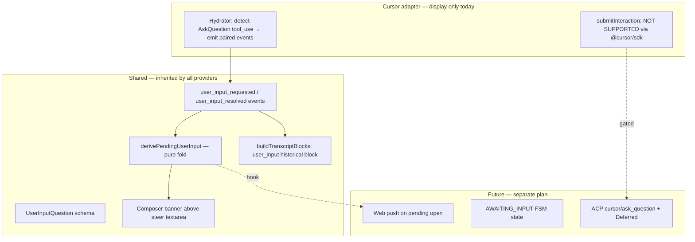

# Plan — Interactive Tools Display (AskQuestion & similar)

**Started:** 2026-06-29
**Status:** Draft — pending approval
**Branch:** `cursor/interactive-tools-display` (PR → `cursor-sdk`)

## Goal

Let Nuncio **display** tool calls that ask the user structured questions (Cursor `AskQuestion`, Claude `AskUserQuestion`, future Pi extension UI) — both in **imported handoff transcripts** (historical, answers visible) and in **live SDK runs** (today: rare/no-op via `@cursor/sdk`; future: live respond once SDK exposes it).

Today Nuncio renders every tool as a read-only collapsible row. AskQuestion gets the same generic treatment as `read`/`bash`, so the user sees a JSON blob instead of a questionnaire. This plan adds a **shared interaction event contract + composer banner UX** (Synara pattern) without forking the transcript pipeline per provider.

## Core decision (locked, post-verify 2026-06-29)

- **Shared contract inherited by all providers**: new event types `user_input_requested` / `user_input_resolved` + `UserInputQuestion` schema. Display and pending-state derivation are provider-agnostic.
- **UI placement: composer banner above the steer textarea** (Synara pattern), **not** interactive form inside `ToolCallBlock`. Historical questions render inline in the transcript as a read-only block; live pending questions render in the composer banner.
- **Answers are NOT extracted or lazy-loaded.** Verified finding: Cursor JSONL stores `tool_use` blocks **without `id`**, has **no `tool_result`** for AskQuestion, and user answers appear as **freeform text in the next user turn** — which is already in the event log as a `user_message`. So the questionnaire block shows questions + options only; the user's answer renders as the next user bubble (existing `UserBlock` component). No `CursorAnswersService`, no answers endpoint, no lazy-load state. This is a major simplification vs. the original lazy-load design.
- **Display-only historical path ships first** (handoff/import hydration + Phase 0 SDK adapter no-op). Live respond via `@cursor/sdk` is **not in scope** — verified the public `onDelta` schema has no `askQuestion` variant and `LocalAgentOptions` has no respond callback.
- **Provider execution is a separate optional interface** (`submitInteraction?`) — Cursor adapter declares no support until SDK exposes it; ACP refactor (Synara's path) is explicitly out of scope.
- **No new FSM state in this plan.** Pending state is a derived projection from the event log, not a session status. FSM changes (`AWAITING_INPUT`) are deferred to a future plan gated on a real execution path.
- **One PR, four commits (one per phase).** Single changeset fragment for the whole PR. Simplifies review — the phases are tightly coupled (shared event contract) and small enough (~2.5d total) to review together.

## Verification summary (facts, not speculation)

- **`@cursor/sdk@1.0.22`** (installed locally): `InteractionUpdateSchema` literals are `text-delta`, `tool-call-started/completed`, `thinking-*`, `partial-tool-call`, `turn-ended`, `step-*`, `summary-*`, `shell-output-delta`, `user-message-appended`, `token-delta`. Tool types in `tool-call-started`: `shell`, `read`, `write`, `edit`, `grep`, `glob`, `ls`, `delete`, `mcp`, `task`. **No `askQuestion`.** `LocalAgentOptions` has `autoReview`, `customTools`, `sandboxOptions` — no respond-to-user callback. Docs: *"There's no human-in-the-loop prompt in headless mode."*
- **Synara (verified on GitHub main 2026-06-29):** `user-input.requested` / `user-input.resolved` shared events; `UserInputQuestion` schema (`id`, `header`, `question`, `options`, `multiSelect`); `derivePendingUserInputs()` is a single pure fold over activities; UI is `ComposerInputBanners.tsx` (precedence: approval > user-input > plan > automation); **no AskQuestion renderer in the transcript timeline**. Blocking model uses in-memory `Deferred` (desktop realtime; doesn't fit Nuncio async mobile).
- **Cursor JSONL shape (verified 2026-06-29 on 3+ real transcripts):**
  - `tool_use` block has **NO `id` field** — only `{ type, name, input }`. Plan cannot rely on `tool_use.id` as `requestId`; must generate UUID at hydrate time.
  - **NO `tool_result` blocks** for AskQuestion. User answers appear as **freeform text in the next user turn** (with `<user_query>` wrapper), already captured as `user_message` events by the existing hydrator.
  - `input.questions` can be a **STRING** (JSON.stringify, when model emits malformed JSON) or an **ARRAY** (normal). `normalizeUserInput` must `JSON.parse` if string.
  - `options` have `{ id, label, description }` — `description` is optional but present in real data.
- **Nuncio today:** `events.types.ts` has `tool_start` / `tool_end` only; `cursor-transcript-hydrate.ts` emits paired `tool_start`+`tool_end` for every `tool_use` (including AskQuestion, no special handling); `tool-summary.ts` has no `askQuestion` branch; `session-detail.tsx` disables steer while `RUNNING`; `Transcript` is `memo()` with `useMemo(buildTranscriptBlocks)`.
- **No ACP module in Nuncio server** — Synara's `cursor/ask_question` ACP handler path would require a new integration layer (out of scope).

## Phases

| Phase | Focus | Effort | Plan |
|-------|-------|--------|------|
| 0 | Shared event contract + schema + hydrator mapping | 0.5d | [phase-00-shared-contract.md](./phase-00-shared-contract.md) |
| 1 | Historical display — render asked questions + options inline in transcript | 0.5d | [phase-01-historical-display.md](./phase-01-historical-display.md) |
| 2 | Pending-state derivation (pure) + composer banner UI shell (read-only) | 1d | [phase-02-pending-banner.md](./phase-02-pending-banner.md) |
| 3 | Provider execution interface stub + Cursor/Pi adapter declarations + docs/changeset | 0.5d | [phase-03-execution-stub.md](./phase-03-execution-stub.md) |

**Total:** ~2.5d sequential. **One PR, four commits** (one per phase). Single changeset fragment added in Phase 3 (covers the whole PR — user-visible change is the historical display from Phase 1).

## Dependency graph

```
P0 ──► P1 ──► P2 ──► P3
```

- P0 gates everything (event types + schema).
- P1 needs P0 to render historical blocks.
- P2 needs P0 events for derivation; UI is independent of P1's renderer.
- P3 wires the optional `submitInteraction` interface and ships docs.

## Lane ownership (per phase)

| Lane | Ownership |
|------|-----------|
| A — Backend | `apps/server/src/**` (except `*.spec.ts`) |
| B — Frontend | `apps/web/src/**` |
| C — Tests + Docs | `*.spec.ts`, `apps/server/test/**`, `README.md`, `AGENTS.md`, `plans/reports/`, `.changeset/` |

Strict file ownership — no overlapping edits. Tests own test files only; read implementation, never edit.

## Non-goals (this plan)

- **Live respond to AskQuestion from the phone** — blocked on `@cursor/sdk` not exposing a respond API; deferred until SDK changes or Nuncio adopts ACP.
- **ACP integration** (Synara's `cursor/ask_question` handler path) — large refactor of the Cursor provider; separate plan.
- **New FSM state `AWAITING_INPUT`** — pending state stays a derived projection. FSM change deferred until a real execution path exists.
- **Push notifications for pending questions** — Phase 5 (web push) of the main roadmap; this plan only exposes the derive hook.
- **Approval flows** (`shell` destructive, MCP sensitive) — Synara ships both `approval.*` and `user-input.*`; Nuncio starts with `user-input.*` only. Approval can be a follow-up plan reusing the same patterns.
- **SwitchMode confirm / other non-question interactive tools** — only AskQuestion-style questionnaire tools in scope.
- **Pi extension UI bridge** — Pi provider `ctx.ui.*` mapping is in Synara but Nuncio's Pi provider doesn't expose it today; deferred.

## Architecture (shared vs Cursor-specific)



**Principle:** display, contract, UI registry, and pending derivation are shared. Provider-specific work is (a) mapping native tool args → `UserInputQuestion` schema and (b) implementing `submitInteraction` if the provider supports live respond. Today only (a) ships, and only for handoff hydration; (b) is a stub.

## File impact summary

**New files (≈6):**
- `apps/server/src/sessions/domain/user-input.types.ts` — schema + helpers
- `apps/server/src/agents/tool-interaction.registry.ts` — tool name → interaction kind
- `apps/web/src/lib/derive-pending-user-input.ts` — pure fold
- `apps/web/src/components/pending-user-input-banner.tsx` — composer banner
- `apps/web/src/components/transcript-blocks/user-input-block.tsx` — historical renderer
- `apps/server/test/unit/sessions/user-input.types.spec.ts`
- `apps/server/test/unit/agents/tool-interaction.registry.spec.ts`
- Extend `apps/server/test/unit/cursor-local/cursor-transcript-hydrate.spec.ts` — AskQuestion mapping
- `apps/web/src/lib/derive-pending-user-input.spec.ts`
- `apps/web/src/components/transcript-blocks/user-input-block.spec.tsx`
- `apps/web/src/components/pending-user-input-banner.spec.tsx`

**Modified files (≈6):**
- `apps/server/src/sessions/domain/events.types.ts` — new event types + payloads
- `apps/server/src/cursor-local/cursor-transcript-hydrate.ts` — AskQuestion branch (emit requested + resolved, no answers)
- `apps/server/src/agents/agents.types.ts` — optional `submitInteraction` on `AgentProvider`
- `apps/server/src/sessions/api/sessions.controller.ts` — new `POST .../interactions/:requestId/respond` (Phase 3, returns 501)
- `apps/web/src/lib/transcript-build-blocks.ts` — handle new events
- `apps/web/src/components/session-transcript.tsx` — render `user_input` block
- `apps/web/src/components/session-detail.tsx` — mount `PendingUserInputBanner`
- `apps/web/src/lib/api.ts` — types for new events
- `README.md`, `AGENTS.md` — document contract + Cursor limitation
- `.changeset/*.md` — single user-facing release note (added in Phase 3, covers whole PR)

**No DB migration** — events table is schemaless on `payload`; new event types just append.

## Success criteria (whole plan)

1. **Historical:** an imported handoff transcript containing an AskQuestion tool_use renders as a structured questionnaire block with the questions, options, and (if present in JSONL) the recorded answers — not as a generic `Used AskQuestion` tool row.
2. **Pending (display shell):** if an event log contains an open `user_input_requested` without a matching `user_input_resolved`, the composer banner renders a read-only questionnaire (no submit button when no provider supports respond). `derivePendingUserInput()` is pure and unit-tested.
3. **Provider contract:** `AgentProvider` exposes optional `submitInteraction?`; Cursor and Pi adapters either omit it or throw `501 Not Implemented`. The interface is ready for a future SDK that exposes respond.
4. **No regression:** existing tool rows, transcript groups, steer flow, and handoff import are unchanged for non-AskQuestion tools. `bun run test`, `bun run --filter @nuncio/web test`, `bun run build`, `bun run lint` all green.
5. **Docs sync:** `README.md` + `AGENTS.md` describe the new event contract and explicitly call out the `@cursor/sdk` live-respond limitation. Changeset is a `patch` (display-only polish) — bump is `patch`, not `minor`, because no new user workflow lands (the workflow is "see questions that were asked", not "answer from phone").
6. **Code review pass** (code-reviewer agent or Bugbot) before commit.

## Risk assessment

| Risk | Likelihood | Mitigation |
|------|------------|------------|
| AskQuestion JSONL shape varies across Cursor versions | Medium | Parse defensively; fall back to existing `tool_start`+`tool_end` if `questions` field missing. Test fixture from a real exported transcript. |
| `derivePendingUserInput` runs on every event log change | Medium | Memoize at call site; the fold is O(n) over events but Nuncio sessions are short (3–5 concurrent, hundreds of events max). Synara pattern. |
| Banner conflicts with existing `machineActive` placeholder in `session-detail.tsx` | Low | Banner precedence: pending user input > `machineActive` > running > default. Documented in component. |
| Future SDK release exposes AskQuestion via `onDelta` | Low–Medium | Adapter is isolated; mapping function is a single switch case. Adding the live path later = one new branch + `submitInteraction` body, no contract change. |
| Pi provider later wants `ctx.ui.*` mapping | Low | `tool-interaction.registry.ts` is a flat map; adding Pi is one entry. Schema is already shared. |

## Decisions (locked with user, 2026-06-29)

1. **Event naming: snake_case** — `user_input_requested` / `user_input_resolved`, consistent with existing event types (`tool_start`, `user_message`). Not Synara's dot.case.
2. **Historical block placement: inline** — at the position the question was asked, preserving conversation flow. Matches Cursor IDE UX and Nuncio's "conversation is the source of truth" principle.
3. **Answers: NOT extracted or lazy-loaded.** Verified: Cursor JSONL has no `tool_use.id`, no `tool_result` for AskQuestion, and user answers appear as freeform text in the next user turn (already captured as `user_message` events). The questionnaire block shows questions + options only; the user's answer renders as the next user bubble via the existing `UserBlock` component. No `CursorAnswersService`, no answers endpoint, no lazy-load state.
4. **PR strategy: one PR, four commits** (one per phase). Single changeset fragment covers the whole PR.
5. **`UserInputOption` includes `description` (optional).** Real AskQuestion options have `{ id, label, description }` — description is important for UX (explains each option).

## Next steps (future roadmap, not this plan)

- **Live respond via `@cursor/sdk`** — gated on SDK exposing AskQuestion in `InteractionUpdate` + a respond API. Watch `@cursor/sdk` changelog.
- **ACP integration** — port Synara's `cursor/ask_question` handler path; unblocks live respond without SDK changes. Large refactor of `CursorAgentProvider`.
- **`AWAITING_INPUT` FSM state** — once live respond ships, promote pending from derived projection to first-class session status; enables push notifications and "skip" semantics.
- **Approval flows** — `approval_requested` / `approval_resolved` events + `autoReview` bridge; reuse the same composer banner precedence pattern.
- **Pi `ctx.ui.*` bridge** — map Pi extension UI calls to the same `user_input_*` contract.
- **Web push on pending open** — Phase 5 hook into `derivePendingUserInput`.
