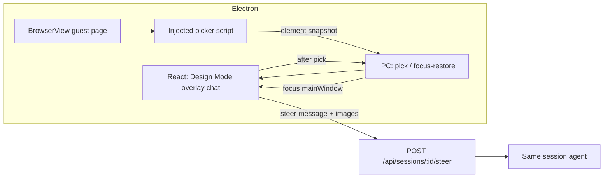

# Design Mode on Nuncio browser dock

**Status:** Slice 1 implemented (pending review / PR)  
**Brief:** [product-brief.md](./product-brief.md)  
**Branch suggestion:** `feat/design-mode-browser` from `origin/dev`

## Decision

Replicate Cursor Design Mode UX on the desktop Electron browser dock: overlay chat, click-to-insert `[component N]` chips, Send always steers the open session. Do not embed Cursor APIs or full DevTools.

## Architecture (Slice 1)



### Critical Electron constraint

`BrowserView` is a native layer above the React DOM — React cannot paint a chat bubble *on top of* the guest page. Slice 1 choices:

1. **Picker** lives *inside* the guest via injected script (`webContents.executeJavaScript` / debugger).
2. **Overlay chat** lives in React chrome **outside** BrowserView bounds (reserve bottom strip by shrinking `browser:resize` bounds when Design Mode is on) — Cursor-like “composer attached to the browser pane”.
3. After each pick IPC, main focuses the window webContents and renderer refocuses the overlay `<input>` / contenteditable so keyboard never “sticks” in the guest.

### Steer payload (provider-neutral)

Keep using existing image attachments (`MessageAttachment` / `AgentAttachment` kind `image`) plus prompt text with `[component N]` tokens.

For each picked component, append a structured block in the message body (agent-readable) and attach a crop PNG mapped to `[image N]` if helpful — **or** embed identity only in text and attach crops as images referenced by index. Prefer:

- Prompt text: user words + `[component N]` chips exactly as typed in overlay.
- Hidden/structured appendix (or clearly delimited section) with per-component identity JSON/YAML-ish lines — **decision in phase-02**: visible in transcript vs compact system appendix. Default recommendation: **visible compact block under the user sentence** so transcript review matches agent context (KISS; no new attachment kind in Slice 1).

Example wire text:

```text
move [component 1] to where [component 2]

---
[component 1]
tag: button
xpath: /html/body/...
cssPath: header > button.cta
bbox: 12,40 120x36
html: <button class="cta">Save</button>
styles: { fontSize, color, ...subset }

[component 2]
...
---
```

Plus image attachments: crop of each component (and optional full viewport once).

No new session create path from Design Mode.

## Scope vs out of scope

| In Slice 1 | Out |
|---|---|
| Desktop Design Mode toggle + overlay | DevTools panels |
| Injected hover/click pick | Fiber → file mapping |
| Inline chips + focus restore | Voice / draw |
| Steer open session only | Web/PWA Design Mode |
| Unit/UI tests for chip model + IPC contract | InAppBrowserBackend production wiring |

## Phases

| Phase | File | Owns |
|---|---|---|
| 01 | [phase-01-pick-bridge.md](./phase-01-pick-bridge.md) | Desktop IPC + guest picker injection + focus restore |
| 02 | [phase-02-overlay-steer.md](./phase-02-overlay-steer.md) | Overlay chat UI, chips, serialize → steer open session |
| 03 | [phase-03-tests-docs.md](./phase-03-tests-docs.md) | Specs, product-surfaces/AGENTS notes, changeset |

## Dependencies

- Existing dock: `apps/web/src/components/browser-panel.tsx`, `apps/desktop/src/main.js` / `preload.js`
- Existing steer: `session-detail.tsx` → `onSteer` → `POST /api/sessions/:id/steer` with attachments
- Image staging patterns: `use-message-attachments` / composer `[image N]` tokens

## Success criteria

See [product-brief.md](./product-brief.md). Gate: `bun run gate` green; Desktop manual smoke of two-chip spatial steer.

## Unresolved questions

1. ContentEditable vs tokenized input for chips (Backspace-as-token) — decide in phase-02; recommend contenteditable or chip-aware input modeled on existing attachment chips if any.
2. Max components per Send (suggest hard cap 8) and HTML snippet size cap — set in phase-02.
3. Whether Design Mode auto-opens browser dock if closed — recommend **yes, open dock** when toggled from session chrome.
